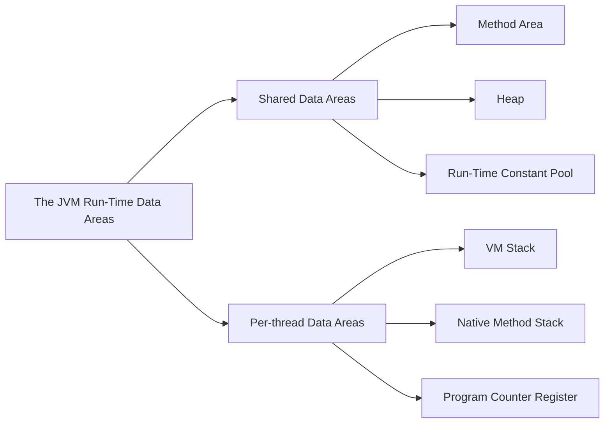

Owner: better

## 这块到底讲了什么——两个事

一个是（运行时数据区域）JVM 它使用的这块物理内存的数据区域是怎么划分的，每块区域是做什么的，放了什么，就是讲的 JVM 内存模型的情况。

二个是（HotSpot虚拟机对象探秘）这块就是 JVM 在堆中对象的分配、布局以及访问。

概念上介绍 Java 虚拟机内存的各个区域，讲解这些区域的作用、服务对象以及其中可能产生的问题

**Q: 什么是线程**

Ans 线程是进程内的执行单元，是 CPU 调度的最小单位。一个进程可以有多个线程，它们共享进程的内存空间和系统资源。线程之间可以并发执行，提高了程序的效率。

**这块内存区域规定了两类异常状态：**
1. 如果线程请求的栈深度大于虚拟机所允许的深度，将抛出 **StackOverflowError** 异常；
2. 如果 Java 虚拟机栈容量可以动态扩展，当栈扩展时无法申请到足够的内存会抛出 **OutOfMemoryError** 异常。

先说 JVM 内存模型 开局一张图

## 运行时数据区域

### JVM 运行时数据区的思维导图




### 由所有线程共享的数据区

#### 方法区 Method Area

方法区这块放JVM加载的类型信息、常量、静态变量、即时编译器编译后的代码缓存等数据

**Q: 啥是即时编译器？**

Ans 即时编译器（Just In Time Compiler，JIT Compiler）是一种编译器。它在程序运行时动态地将程序代码编译成机器码，从而提高程序的运行速度。

**Q: 类型信息是啥**

Ans 对象实例的元数据

#### 堆 Heap

Java 堆（Java Heap）这块是虚拟机管理的内存中最大的一块，在虚拟机启动时创建。此内存区域的唯一目的就是用来存放对象实例，**几乎**所有的对象实例数据都在堆分配内存。

> 《Java 虚拟机规范》中的原文：The heap is the runtime data area from which memory for all class instances and arrays is allocated.

所有线程共享的 Java 堆中可以划分出多个线程私有的分配缓冲区（Thread Local Allocation Buffer，TLAB），来提升**对象分配**时的效率。

**Q: 对象分配是啥意思**

Ans Object Allocation 新建一个对象，分配给它内存它要存储的地址

Java 堆既可以被实现成固定大小的，也可以是可扩展的，不过当前主流的 Java 虚拟机都是按照可扩展来实现的（通过参数 -Xmx 和 -Xms 设定）。如果在 Java 堆中没有内存完成实例分配，并且堆无法再扩展时，Java 虚拟机将会抛出 OutOfMemoryError 异常。

**Q: How to specify minimal and maximal heap size?**

```shell
-Xms<heap size>[unit] 
-Xmx<heap size>[unit]
# For example, if we want to assign minimum 2 GB and maximum 5 GB to JVM, we need to write:
-Xms2G -Xmx5G
```

Here, unit denotes the unit in which we’ll initialize the memory (indicated by heap size). We can mark units as ‘g’ for GB, ‘m’ for MB, and ‘k’ for KB.


#### 运行时常量池 Runtime Constant Pool

运行时常量池是方法区的一部分。在编译时期把一个 .class 类文件生成的一个信息是常量池表（Constant Pool Table），表中描述了各种字面量与符号引用，这部分内容将在类加载后存放到运行时常量池中。

**Q: 字面量是啥？**

Ans ***字面量***是指由字母，数字等构成的字符串或者数值，它只能作为右值出现(右值是指等号右边的值，如：int a=123这里的a为左值，123为右值) 。

**Q: 符号引用又是啥？**

Ans 编译时实际上不知道实际要访问的内存地址是什么，所有用符号引用来代替

> 符号引用（Symbolic References）：符号引用以一组符号来描述所引用的目标，符号可以是任何形式的字面量，只要使用时能够无歧义的定位到目标即可。例如，在 Class 文件中它以CONSTANT_Class_info、CONSTANT_Fieldref_info、CONSTANT_Methodref_info等类型的常量出现。符号引用与虚拟机的内存布局无关，引用的目标并不一定加载到内存中。在 Java 中，一个java类将会编译成一个 class 文件。**在编译时，Java 类并不知道所引用的类的实际地址，因此只能使用符号引用来代替。**比如 org.simple.People 类引用了 org.simple.Language 类，在编译时 People 类并不知道 Language 类的实际内存地址，因此只能使用符号 org.simple.Language（假设是这个，当然实际中是由类似于 CONSTANT_Class_info 的常量来表示的）来表示 Language 类的地址。各种虚拟机实现的内存布局可能有所不同，但是它们能接受的符号引用都是一致的，因为符号引用的字面量形式明确定义在 Java 虚拟机规范的 Class 文件格式中。

所以运行时常量池里面装的东西到底是啥 —> 符号引用和字面量

### 线程隔离的数据区

#### 虚拟机栈 VM Stack

虚拟机栈描述的是Java方法执行的线程内存模型：每个方法被执行的时候，Java虚拟机都会同步创建一个栈帧（Stack Frame）用于存储局部变量表、操作数栈、动态连接、方法出口等信息。每一个方法被调用直至执行完毕的过程，就对应着一个栈帧在虚拟机栈中从入栈到出栈的过程。

内存结构之栈区

- 栈用于存放程序运行过程当中所有的局部变量。一个运行的Java程序从开始到结束会有多次方法的调用
- JVM会为每一个方法的调用在栈中分配一个对应的空间，这个空间称为该方法的栈帧。一个栈帧对应一个正在调用中的方法，栈帧中存储了该方法的参数、局部变量等数据
- 当某一个方法调用完成后，其对应的栈帧将被清除

两种异常情况 一种是 StackOverflowError 另一种是 OutOfMemoryError

1. 线程请求的栈深度超出 JVM 允许的深度抛出 StackOverflowError
2. JVM栈容量能动态扩展的话，栈扩展申请不到足够的内存抛出 OutOfMemoryError

#### 本地方法栈 Native Method Stack

为 JVM 用到的本地方法来服务的

#### 程序计数器 PC Register

这是一块小的内存空间，相当于当前线程执行字节码的行号程序指示器。

字节码解释器工作的时候改变这个程序计数器的值选取下一条执行的字节码指令。

**Q: 线程私有是啥**

Ans 每条线程都有一个独立的程序计数器，各条线程之间互不影响，独立存储，称这类内存区域为线程私有的内存

### 直接内存 Direct Memory

下面是 《深入理解 Java 虚拟机 第三版》 2.2.7 小节，关于 Java 直接内存的描述。

直接内存（Direct Memory）并不是虚拟机运行时数据区的一部分，也不是《Java虚拟机规范》中定义的内存区域。但是这部分内存也被频繁地使用，而且也可能导致 OutOfMemoryError 异常出现，所以我们放到这里一起讲解。

在 JDK 1.4 中新加入了 NIO（New Input/Output）类，引入了一种基于通道（Channel）与缓冲区（Buffer）的 I/O 方式，它可以使用 Native 函数库直接分配堆外内存，然后通过一个存储在 Java 堆里面的 DirectByteBuffer 对象作为这块内存的引用进行操作。这样能在一些场景中显著提高性能，因为避免了在 Java 堆和 Native 堆中来回复制数据。

显然，本机直接内存的分配不会受到 Java 堆大小的限制，但是，既然是内存，则肯定还是会受到本机总内存（包括物理内存、SWAP 分区或者分页文件）大小以及处理器寻址空间的限制，一般服务器管理员配置虚拟机参数时，会根据实际内存去设置 -Xmx 等参数信息，但经常忽略掉直接内存，使得各个内存区域总和大于物理内存限制（包括物理的和操作系统级的限制），从而导致动态扩展时出现 OutOfMemoryError 异常。

## 对象的分配、布局和访问

Java 虚拟机内存中的数据的其他细节，它们是如何创建、如何布局以及如何访问。

以最常用的虚拟机 HotSpot 和最常用的内存区域 Java 堆为例，整理 HotSpot 虚拟机在 Java 堆中对象分配，布局和访问的全过程。

### 对象的创建

其实就是 Object Allocattion，人话就是创建一个对象，new 一个出来。实际上指的是**给对象分配内存空间**。

JVM 遇到一条**字节码 new 指令**时 ->

**Step 1 虚拟机检查在常量池中的符号引用**

会检查运行时常量池中的符号引用，这个符号引用代表着这个类是否已被加载、解析和初始化过，如果没有则先去执行类加载过程。

在类加载检查通过后 ->

**Step 2 虚拟机给新生对象分配内存**

类加载过程新生对象所需内存大小就被完全确定了，将分配到的内存初始化为零值。分配内存空间就是将内存中可用的一部分空闲空间划分出来。JVM 还维护着一个空闲列表 free list

**Step 3 给对象进行初始化操作**

再设置一些必要的信息，这些信息放在对象的对象头中 Object header

- 类的元数据信息
- 对象的哈希码（实际上对象的哈希码会延后到真正调用 `Object::hashCode()` 方法时才计算）
- 对象的 GC 分代年龄等

最后一步执行 `<init>()` 方法，按照程序员所写的意图进行初始化对象实例。

**至此一个能用的对象实例搞出来了！**

HotSpot 解释器代码片段（用以了解 HotSpot 的运作过程）

```c++
// 确保常量池中存放的是已解释的类
if (!constants->tag_at(index).is_unresolved_klass()) {
    // 断言确保是klassOop和instanceKlassOop（这部分下一节介绍）
    oop entry = (klassOop) *constants->obj_at_addr(index);
    assert(entry->is_klass(),"Should be resolved klass");
    klassOop k_entry = (klassOop)entry;
    assert(k_entry->klass_part()->oop_is_instance(), "Should be instanceKlass");
    instanceKlass * ik = (instanceKlass*)k_entry->klass_part();
    // 确保对象所属类型已经经过初始化阶段
    if (ik->is_initialized() && ik->can_be_fastpath_allocated())
    {
        // 取对象长度
        size_t obj_size = ik->size_helper();
        oop result = NULL;
        // 记录是否需要将对象所有字段置零值
        bool need_zero =! ZeroTLAB;
        // 是否在TLAB中分配对象
        if (UseTLAB) {
            result = (oop)THREAD->tlab().allocate(obj_size);
        }
        if (result == NULL){
            need_zero = true;
            // 直接在eden中分配对象
            retry:
            HeapWord * compare_to = *Universe:heap()->top_addr();
            HeapWord * new_top = compare_to+obj_size;
            /* cmpxchg是x86中的CAS指令，这里是一个C++方法，通过CAS方式分配空间，如果并发失败，
            转到retry中重试，直至成功分配为止 */
            if (new_top <= *Universe:heap()->end_addr()){
                if (Atomic:cmpxchg_ptr(new_top, Universe:heap()->top_addr(), compare_to) != compare_to){
                    goto retry;
                }
                result = (oop)compare_to;
            }
        }
        if (result != NULL){
            // 如果需要，则为对象初始化零值
            if (need_zero){
                HeapWord * to_zero = (HeapWord*)result + sizeof(oopDesc) / oopSize;
                obj_size -= sizeof(oopDesc) / oopSize;
                if (obj_size > 0){
                    memset(to_zero, 0, obj_size * HeapWordSize);
                }
            }
            // 根据是否启用偏向锁来设置对象头信息
            if (UseBiasedLocking){
                result->set_mark(ik->prototype_header());
            } else {
                result->set_mark(markOopDesc:prototype());
            }
            result->set_klass_gap(0);
            result->set_klass(k_entry);
            // 将对象引用入栈，继续执行下一条指令
            SET_STACK_OBJECT(result, 0);
            UPDATE_PC_AND_TOS_AND_CONTINUE(3, 1);
        }
    }
}
```

> 这个解释器实现很少有机会实际使用，大部分平台上都使用模板解释器了。
{: .prompt-warning }


### 对象的内存布局

在 Hotspot 虚拟机里，对象在堆内存的存储分布可以划分为三个部分**对象头（Header）、实例数据（Instance Data）、对齐填充（Padding）**

**对象头 Object Header**

存两类信息，一类存储对象自身运行时数据官方叫Mark Word（下表），另一类是是类型指针，即对象指向它的类型元数据的指针，Java虚拟机通过这个指针来确定该对象是哪个类的实例。

HotSpot 虚拟机对象头 Mark Word：

|存储内容|	标志位|	状态
|:---:|:---:|:---:|
|对象哈希码、对象分代年龄|	01|	未锁定
|指向锁记录的指针|	00|	轻量级锁定
|指向重量级锁的指针|	10|	膨胀（重量级锁定）
|空，不需要记录信息|	11|	GC标记
|偏向线程ID、偏向时间戳、对象分代年龄|	01|	可偏向


************实例数据 Instance Data************

存储真正用的上的数据，写代码的时候定义的各种字段的值

**对齐填充 Padding** 

非必然存储，无特别含义，补齐数据宽度的。

### 对象的访问定位

通过reference数据来操作堆上的对象实例，JVM规范 reference类型是指向一个对象实例的引用。

两种方式 A 句柄访问 B 直接指针访问

A 句柄访问

堆中会划分出一块内存来做句柄池，reference中存储的是对象的句柄地址，句柄中包含对象实例数据地址和对象类型数据地址

B 直接指针访问

Java堆中对象的内存布局就必须考虑如何放置访问类型数据的相关信息，reference中存储的直接就是对象地址，如果只是访问对象本身的话，就不需要多⼀次间接访问的开销。


优劣 Hotspot 虚拟机用的直接指针来访问

使用句柄来访问的最大好处就是reference中存储的是稳定句柄地址，在对象被移动（**垃圾收集时移动对象是非常普遍的行为**）时只会改变句柄中的实例数据指针，而reference本身不需要被修改。

使用直接指针来访问最大的好处就是速度更快，它节省了一次指针定位的时间开销，由于对象访问在Java中非常频繁，因此这类开销积少成多也是一项极为可观的执行成本

## OutOfMemoryError 异常

