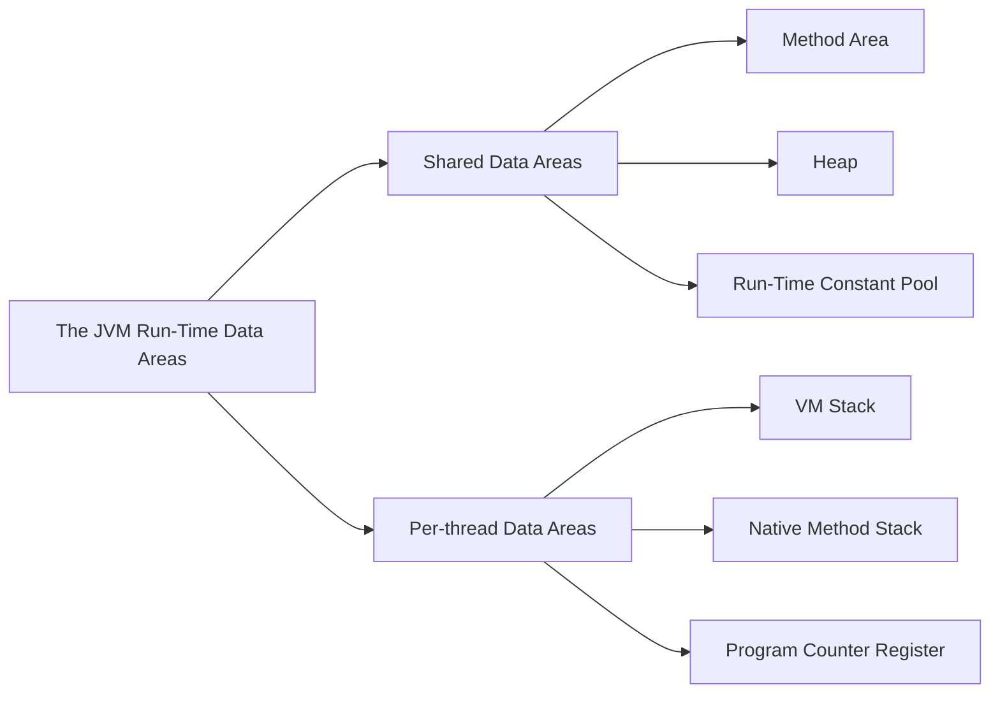

# ch2 JVM内存模型 & 对象分配布局访问

Owner: better

## 这块到底讲了什么——两个事

一个是（运行时数据区域）JVM它使用的这块物理内存的数据区域是怎么划分的，每块区域是做什么的，放了什么，就是讲的JVM内存模型的情况。

二个是（HotSpot虚拟机对象探秘）这块就是JVM在堆中对象的分配、布局以及访问。

概念上介绍Java虚拟机内存的各个区域，讲解这些区域的作用、服务对象以及其中可能产生的问题

Q 什么是线程

Ans 线程是进程内的执行单元，是CPU调度的最小单位。一个进程可以有多个线程，它们共享进程的内存空间和系统资源。线程之间可以并发执行，提高了程序的效率。

# 先说 JVM 内存模型 开局一张图

## 思维导图

### JVM 运行时数据区的思维导图

### **书上的图也同样贴在这里**

《深入理解Java虚拟机》书中的一张图

## 由所有线程共享的数据区

### 方法区 Method Area

方法区这块放JVM加载的类型信息、常量、静态变量、即时编译器编译后的代码缓存等数据

Q 啥是即时编译器？

Ans 即时编译器（Just In Time Compiler，JIT Compiler）是一种编译器。它在程序运行时动态地将程序代码编译成机器码，从而提高程序的运行速度。

Q 类型信息是啥

Ans 对象实例的元数据

### 堆 Heap

Java 堆这块占内存空间最大，JVM 启动时创建，就是用来存放对象实例数据，**几乎**所有的对象实例数据都在堆分配内存。

所有线程共享的 Java 堆中可以划分出多个线程私有的分配缓冲区（Thread Local Allocation Buffer，TLAB），来提升**对象分配**时的效率。

Q 对象分配是啥意思

Ans Object Allocation 新建一个对象，分配给它内存它要存储的地址

### 运行时常量池 Runtime Constant Pool

运行时常量池是方法区的一部分。在编译时期把一个 .class 类文件生成的一个信息是常量池表（Constant Pool Table），表中描述了各种字面量与符号引用，类加载后存放到运行时常量池中。

Q 字面量是啥？

Ans ***字面量***是指由字母，数字等构成的字符串或者数值，它只能作为右值出现,(右值是指等号右边的值，如：int a=123这里的a为左值，123为右值。) from Baidu

Q 符号引用又是啥？

Ans 编译时实际上不知道实际要访问的内存地址是什么，所有用符号引用来代替

> 符号引用（Symbolic References）：符号引用以一组符号来描述所引用的目标，符号可以是任何形式的字面量，只要使用时能够无歧义的定位到目标即可。例如，在Class文件中它以CONSTANT_Class_info、CONSTANT_Fieldref_info、CONSTANT_Methodref_info等类型的常量出现。符号引用与虚拟机的内存布局无关，引用的目标并不一定加载到内存中。在[Java](http://lib.csdn.net/base/javaee)中，一个java类将会编译成一个class文件。**在编译时，java类并不知道所引用的类的实际地址，因此只能使用符号引用来代替。**比如org.simple.People类引用了org.simple.Language类，在编译时People类并不知道Language类的实际内存地址，因此只能使用符号org.simple.Language（假设是这个，当然实际中是由类似于CONSTANT_Class_info的常量来表示的）来表示Language类的地址。各种虚拟机实现的内存布局可能有所不同，但是它们能接受的符号引用都是一致的，因为符号引用的字面量形式明确定义在Java虚拟机规范的Class文件格式中。
> 

所以运行时常量池里面装的东西到底是啥——符号引用和字面量

## 线程隔离的数据区

### 虚拟机栈 VM Stack

        虚拟机栈描述的是Java方法执行的线程内存模型：每个方法被执行的时候，Java虚拟机都会同步创建一个栈帧（Stack Frame）用于存储局部变量表、操作数栈、动态连接、方法出口等信息。每一个方法被调用直至执行完毕的过程，就对应着一个栈帧在虚拟机栈中从入栈到出栈的过程。

        内存结构之栈区

- 栈用于存放程序运行过程当中所有的局部变量。一个运行的Java程序从开 始到结束会有多次方法的调用
- JVM会为每一个方法的调用在栈中分配一个对应的空间，这个空间称为该 方法的栈帧。一个栈帧对应一个正在调用中的方法，栈帧中存储了该方法的参数、局部变量等数据
- 当某一个方法调用完成后，其对应的栈帧将被清除

两种异常情况 一种是 StackOverflowError 另一种是 OutOfMemoryError

1. 线程请求的栈深度超出 JVM 允许的深度抛出 StackOverflowError
2. JVM栈容量能动态扩展的话，栈扩展申请不到足够的内存抛出 OutOfMemoryError

### 本地方法栈 Native Method Stack

为 JVM 用到的本地方法来服务的

### 程序计数器 PC Register

这是一块小的内存空间，相当于当前线程执行字节码的行号程序指示器。

字节码解释器工作的时候改变这个程序计数器的值选取下一条执行的字节码指令。

Q 线程私又是啥

Ans 每条线程都有一个独立的程序计数器，各条线程之间互不影响，独立存储，称这类内存区域为线程私有的内存

# 第二个事 对象的分配、布局和访问

## 分配

其实就是Object Allocattion，人话就是创建一个对象，new 一个出来。实际上指的是**给对象分配内存空间**。

**Step 1 JVM 检查在常量池中的符号引用**

JVM 遇到一条字节码 **new 指令**时，会检查运行时常量池中的符号引用，这个符号引用代表着这个类是否被加载过了，没有则先去执行类加载过程。

**Step 2 JVM 给新生对象分配内存**

类加载过程新生对象所需内存大小就被确定了，将分配到的内存初始化为零值。分配内存空间就是将内存中可用的一部分空闲空间划分出来。JVM 还维护着一个空闲列表 free list

******************Step 3 给对象进行初始化操作******************

再设置一些必要的信息，这些信息放在对象的对象头中 Object header

- 类的元数据信息
- 对象的哈希码
- 对象的 GC 分代年龄

最后一步执行<init>()方法，按照程序员所写的意图进行初始化对象实例。

**至此一个能用的对象实例搞出来了！**

## 布局

在 Hotspot 虚拟机里，对象在堆内存的存储分布可以划分为三个部分**对象头（Header）、实例数据（Instance Data）、对齐填充（Padding）**

**对象头 Object Header**

存两类信息，一类存储对象自身运行时数据官方叫Mark Word（下表），另一类是是类型指针，即对象指向它的类型元数据的指针，Java虚拟机通过这个指针来确定该对象是哪个类的实例。

************实例数据 Instance Data************

存储真正用的上的数据，写代码的时候定义的各种字段的值

**对齐填充 Padding** 

非必然存储，无特别含义，补齐数据宽度的。

## 访问

通过reference数据来操作堆上的对象实例，JVM规范 reference类型是指向一个对象实例的引用。

两种方式 A 句柄访问 B 直接指针访问

A 句柄访问

堆中会划分出一块内存来做句柄池，reference中存储的是对象的句柄地址，句柄中包含对象实例数据地址和对象类型数据地址

B 直接指针访问

Java堆中对象的内存布局就必须考虑如何放置访问类型数据的相关信息，reference中存储的直接就是对象地址，如果只是访问对象本身的话，就不需要多⼀次间接访问的开销。

优劣 Hotspot 虚拟机用的直接指针来访问

使用句柄来访问的最大好处就是reference中存储的是稳定句柄地址，在对象被移动（**垃圾收集时移动对象是非常普遍的行为**）时只会改变句柄中的实例数据指针，而reference本身不需要被修改。

使用直接指针来访问最大的好处就是速度更快，它节省了一次指针定位的时间开销，由于对象访问在Java中非常频繁，因此这类开销积少成多也是一项极为可观的执行成本