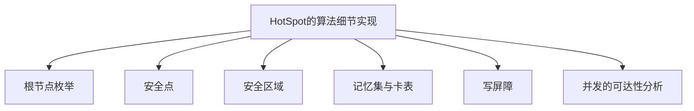

Owner: better

## 思维脉络


### 这块讲什么

1. 垃圾收集要完成的事情？
    * 哪些内存需要回收？
    * 什么时候回收？
    * 如何回收？
2. 怎么判断垃圾？
3. 垃圾收集的算法
4. 垃圾收集算法的具体实现——垃圾收集器

**Q:** 为什么还要去了解垃圾收集和内存分配？

Ans: 当需要排查各种内存溢出、内存泄漏问题时，当垃圾收集成为系统达到更高并发量的瓶颈时，就要对这些实施必要的监控和调节。

## 到底哪些是垃圾？怎么判断？

对象存活判定：

### 1. 引用计数法 Reference Counting
    
引用计数法说的是判断一个对象是否需要回收看这个对象的引用计数，给每一个对象添加一个引用计数器，当有一个地方引用它的时候，计数器就加一；当一个计数器值为零的时候就是这个对象不再被使用了，就变成了垃圾。
    
### 2. 可达性分析法 Reachability Analysis
    
通过一系列的 GC Roots 的跟对象作为起始节点集，从这些节点开始，根据引用关系向下搜索；当一个对象到 GC Roots 间没有任何引用链相连，或者用图论的话来说就是从 GC Roots 到这个对象不可达时，则证明了这个对象时不可能再被使用的，判定为可回收的对象。

**Q: 引用链是什么**

Ans: 从 GC Roots 出发，根据对象的引用关系向下搜索，搜索走过的路径称为引用链 Reference Chain

### Garbage Collection Roots[^ref_1]

- **System Class**: Class loaded by bootstrap/system class loader. For example, everything from the rt.jar like `java.util.*`.

- **JNI Local**: Local variable in native code, such as user-defined JNI code or JVM internal code.

- **JNI Global**: Global variable in native code, such as user-defined JNI code or JVM internal code.

- **Thread Block**: Object referred to from a currently active thread block.

- **Thread**: A started, but not stopped, thread.

- **Busy Monitor**: Everything that has called `wait()` or `notify()` or that is synchronized. For example, by calling `synchronized(Object)` or by entering a synchronized method. Static method means class, non-static method means object.

- **Java Local**: Local variable. For example, input parameters or locally created objects of methods that are still in the stack of a thread.

- **Native Stack**: In or out parameters in native code, such as user-defined JNI code or JVM internal code. This is often the case as many methods have native parts and the objects handled as method parameters become GC roots. For example, parameters used for file/network I/O methods or reflection.

- **Finalizable**: An object which is in a queue awaiting its finalizer to be run.

- **Unfinalized**: An object which has a finalize method, but has not been finalized and is not yet on the finalizer queue.

- **Unreachable**: An object which is unreachable from any other root, but has been marked as a root by MAT to retain objects which otherwise would not be included in the analysis.

- **Java Stack Frame**: A Java stack frame, holding local variables. Only generated when the dump is parsed with the preference set to treat Java stack frames as objects.

- **Unknown**: An object of unknown root type. Some dumps, such as IBM Portable Heap Dump files, do not have root information. For these dumps, the MAT parser marks objects which are have no inbound references or are unreachable from any other root as roots of this type. This ensures that MAT retains all the objects in the dump.

### 再谈引用


## 那么垃圾收集的算法整理

0 分代收集理论

1 标记-清除算法

2 标记-复制算法

3 标记-整理算法

### 0 分代收集理论

分代收集 Generational Collection

是一套符合大多是程序运行实际情况的经验法则，建立在两个分代假说之上：

1. 弱分代假说 Weak Generational Hypothesis 绝大多数对象是朝生夕灭
2. 强分代假说 Strong Generational Hypothesis 熬过越多次垃圾收集过程的对象就越难消亡
    
    把分代收集理论具体放到现在商用的 JVM 中，设计者一般至少会把 Java 堆划分为 新生代（Young Generation）和老年代（Old Generation）两个区域。
    
    至少存在一个明显的困难：对象不是孤立的，对象之间会存在跨代引用。
    
    解决这个问题添加了第三条经验法则：
    
3. 跨代引用假说 Intergenerational Reference Hypothesis 跨代引用相对于同代引用来说仅占极少数
    
    出来一个隐含的推论，存在相互引用关系的两个对象，是应该倾向于同时生存或者同时消亡的。
    
    依据这条假说只需在新生代上建立一个全局的数据结构（记忆集 Remembered Set），这个结构把老年代划分成若干小块，标识出老年代的哪一块内存会存在跨代引用。

!(Hotspot Heap Structure)[Hotspot_Heap_Structure.png]

JVM 将堆分成了二个大区新生代（Young）和老年代（Old），新生代又被进一步划分为 Eden（伊甸园空间）和 Survivor（幸存者空间）区，而Survivor 由 Survivor0 和 Survivor1 组成，也有些人喜欢用 FromSpace 和 ToSpace 来代替。

这里为什么要将 Young Generation 划分为 Eden、Survivor0、Survivor1 这三块，给出的解释是 Young 中的98%的对象都是死朝生夕死，所以将内存分为一块较大的 Eden 和两块较小的 Survivor0、Survivor1，JVM 默认分配是 8:1:1，每次调用 Eden 和其中的 Survivor0（FromSpace），当发生回收的时候，将 Eden 和 Survivor0（FromSpace）存活的对象复制到 Survivor2（ToSpace），然后直接清理掉 Eden 和 Survivor0 的空间。

**Q:** 为什么 Survivor 区分成两个？

**Ans** The reason for the HotSpot JVM's two survivor spaces is to reduce the need to deal with fragmentation. New objects are allocated in eden space. All well and good. When that's full, you need a GC, so kill stale objects and move live ones to a survivor space, where they can mature for a while before being promoted to the old generation. Still good so far. The next time we run out of eden space, though, we have a conundrum. The next GC comes along and clears out some space in both eden and our survivor space, but the spaces aren't contiguous.[^ref_2]

---

* **部分收集（Partial GC） ：**指目标不是完整收集整个 Java 堆的垃圾收集，其中又分为：
    - **新生代收集（Minor GC/Young GC）：**指目标只是新生代的垃圾收集。
    - **老年代收集（Major GC/Old GC）：**指目标只是老年代的垃圾收集。目前只有 CMS 收集器会有单独收集老年代的行为。另外请注意“Major GC”这个说法现在有点混淆，在不同资料上常有不同所指，读者需按上下文区分到底是指老年代的收集还是整堆收集。
    - **混合收集（Mixed GC）：**指目标是收集整个新生代以及部分老年代的垃圾收集。目前只有 G1 收集器会有这种行为。
* **整堆收集（Full GC）：**收集整个 Java 堆和方法区的垃圾收集。

---
    

### 1 标记 - 清楚算法 Mark-Sweep

- 具体解释为标记清楚两个阶段。首先标记出来所有需要回收的对象（标记过程就是判定为垃圾的过程），标记完成后，统一回收掉所有被标记的对象，也可以反过来，标记存活的对象，统一回收所有未被标记的对象。
- 两个缺点：1 执行效率不稳定 2 内存空间碎片化


### 2 标记 - 复制算法 Semispace Copying

- 为了解决 Mark-Sweep 算法面对大量可回收对象的执行效率低，将可用内存按容量划分为大小相等的两块，每次只是用其中的一块。当这块空间用完后，将还存活的对象复制到另一块去，然后把用过的这块一次性清理掉。
- 对于多数对象都是**存活**的情况，会产生大量的内存间复制的开销
- 对于多数对象都是**可回收**的情况，仅需复制少量存活对象，移动堆顶指针，按顺序分配。
- 一个缺点：可用空间缩小为了原来的一半，很浪费。


JVM实际实现中，则是将内存分为一块较大的 Eden 区和两块较小的 Survivor 空间，每次使用 Eden 和一块 Survivor，回收时，把存活的对象复制到另一块 Survivor

- 复制算法：HotSpot 默认的 Eden : Survivor = 8 : 1，也就是每次能用90%的新生空间；如果 Survivor 空间不够，就要依赖老年代进行分配担保，把放不下的对象直接进入老年代。
- 分配担保：当新生代进行垃圾回收后，新生代的存活区刚补下，需要把这些对象放到老年代去的策略，换句话说是老年代为新生代的GC做空间分配担保，步骤如下：
    1. 在发生 MinorGC 前，JVM 会检查老年代的最大可用的连续空间，是否大于新生代所有对象的总空间，如果大于，可以确保 MinorGC 是安全的
    2. 如果小于，那么 JVM 会检查是否设置了允许担保失败，如果允许，则继续检查老年代最大可用的连续空间，是否大于历次晋升到老年代对象的平均大小
    3. 如果大于，则尝试进行一次 MinorGC
    4. 如果不大于，则改做一次Full GC

### 3 标记 - 整理算法 Mark-Compact

- 标记过程与标记清除算法一样，但后续步骤不是可回收对象进行清理，而是让所有的存活对象向内存空间一端移动，然后**清理掉边界以外的内存。**


对象移动操作**必须全程暂停用户应用程序才能进行 Stop-The-World**

- STW是Java中一种全局暂停的现象，多半由于GC引起的。所谓全局暂停，就是所有的Java代码停止运行，Native代码可以执行，但不能和JVM交互
- 危害：长时间服务停止无响应；对于HA系统，可能引起主备切换，严重危害生产环境。

---

## HotSpot 的算法细节实现

### 思维脉络



### 枚举根节点

1. 根节点枚举
    
    我们以可达性分析算法中从 GC Roots 集合找出引用链这个操作作为介绍虚拟机高效实现的第一个例子。在 HotSpot 的解决方案里，是使用一组称为 OopMap 的数据结构来达到这个目的。一旦类加载动作完成的时候，HotSpot 就会把对象内什么偏移量上是什么类型的数据计算出来，在即时编译过程中，一会再**特定的位置**记录下栈里和寄存器里哪里位置是引用。这样收集器在扫描时就可以直接得知这些信息了，并不需要真正一个不漏地从方法区等 GC Roots 开始查找。

### 安全点 Safepoint
    
2. 安全点 Safepoint
    
    在 OopMap 的协助下，HotSpot 可以快速准确的完成 GC Roots 枚举，实际上 HotSpot 也的确没有为每条指令都生成 OopMap，前面已经提到，只是在“特定的位置”记录了这些信息，这些位置被称为**安全点。**有了安全点的设定，也就决定了用户程序执行时并非在代码指令流的任意位置都能够停顿下来开始垃圾收集，而是强制要求必须执行到达安全点后才能够暂停。
    
3. 记忆集与卡表
    1. 记忆集 Remembered Set 一种用于记录从非收集区域指向收集区域的指针集合的抽象数据结构
    2. 字长精度 每个记录精确到一个机器字长，该字包含跨代指针
    3. 对象精度 每个记录精确到一个对象，该对象里有字段含有跨代指针
    4. 卡精度 每个记录精确到一块内存区域，该区域有对象含有跨代指针
    5. 卡表 Card Table 是记忆集的一种具体实现，定义了记忆集的记录精度与堆内存的映射关系等
    6. 卡表的每个元素都对应着其标识的内存区域中一块特定大小的内存块，这个内存块称为 卡页 Card Page
4. 写屏障 Write Barrier
    
    在 HotSpot 虚拟机里是通过写屏障技术维护卡表状态的。写屏障可以看作在虚拟机层面对“引用类型字段赋值”这个动作的 AOP 切面，在引用对象赋值时会产生一个环形 Around 通知，供程序执行额外的动作，也就是说赋值的前后都在写屏障的覆盖范畴内。在赋值前的部分的写屏障叫做写前屏障 Pre-Write Barrier，在赋值后的则叫做写后屏障 Post-Write Barrier。HotSpot 虚拟机的许多收集器中都有使用到写屏障，但直至 G1 收集器出现之前，其他收集器都只用到了写后屏障。
    
5. 并发的可达性分析
    
    我们要解决并发扫描时的对象消失问题，只需破坏这两个条件的任意⼀个即可。由此分别 产⽣了两种解决⽅案:增量更新(Incremental Update)和原始快照(Snapshot At The Beginning， SATB ) 。
    
    增量更新要破坏的是第⼀个条件，当⿊⾊对象插⼊新的指向⽩⾊对象的引⽤关系时，就将这个新插⼊的引⽤记录下来，等并发扫描结束之后，再将这些记录过的引⽤关系中的⿊⾊对象为根，重新扫描⼀次。这可以简化理解为，⿊⾊对象⼀旦新插⼊了指向⽩⾊对象的引⽤之后，它就变回灰⾊对象了。
    
    原始快照要破坏的是第⼆个条件，当灰⾊对象要删除指向⽩⾊对象的引⽤关系时，就将这个要删除的引⽤记录下来，在并发扫描结束之后，再将这些记录过的引⽤关系中的灰⾊对象为根，重新扫描⼀次。这也可以简化理解为，⽆论引⽤关系删除与否，都会按照刚刚开始扫描那⼀刻的对象图快照来进⾏搜索。
    以上⽆论是对引⽤关系记录的插⼊还是删除，虚拟机的记录操作都是通过写屏障实现的。在HotSpot虚拟机中，增量更新和原始快照这两种解决⽅案都有实际应⽤，譬如，CMS是基于增量更新来做并发标记的，G1、Shenandoah则是⽤原始快照来实现。
    

## 经典垃圾收集器

如果说收集算法是内存回收的方法论，那么垃圾收集器就是内存回收的具体实现。

HotSpot 虚拟机包含的所有的收集器：


### Serial 收集器

在新生代。单线程工作的收集器，他进行垃圾收集的时候，必须暂停其他所有工作线程，直到它收集结束。Stop The World


简单高效，是所有收集器里额外内存消耗（Memory Footprint）最小的。

### ParNew 收集器

实际上是 Serial 收集器的多线程并行版本。


jdk7之前，只有它可以能与CMS收集器配合工作。

- 两个概念
    - 并行 Parallel 并行描述的是多条垃圾收集器线程之间的关系，说明同一时间有多条这样的线程在协同工作，通常默认此时用户线程是处于等待状态。
    - 并发 Concurrent 并发描述的是垃圾收集器线程与用户线程之间的关系，说明同一时间垃圾收集器线程与用户线程都在运行。

### Parallel Scavenge 收集器

新生代收集器，基于标记-复制算法实现的收集器。这个收集器目标是达到一个可控制的吞吐量（Throughput）。

**Q: 吞吐量 Throughput 是什么意思**

Ans 就是处理器用于运行用户代码时间与处理器总消耗时间的比值，即 吞吐量=(运行用户代码时间)/(运行用户代码时间 + 运行垃圾收集时间)

提供了两个参数用于精确控制吞吐量 —XX:MaxGCPauseMillis 控制最大垃圾收集停顿时间 —XX:GCTimeRatio 直接设置吞吐量大小

### Serial Old 收集器

Serial 收集器的老年代版本，单线程收集器，使用标记-整理算法。这个收集器的意义在于提供客户端模式下的 HotSpot 虚拟机使用。

如果是在服务端模式下，它也有两种用途，一个是在jdk5之前的版本中与 Parallel Scavenge 收集器搭配使用。另一种则是作为 CMS 收集器发生失败时的后备预案，在并发收集发生 Concurrent Mode Failure 时使用。


### Parallel Old 收集器

Parallel Scavenge 收集器的**老年代版本**，支持多线程并行收集，基于标记-整理算法实现。

### CMS 收集器

CMS Concurrent Mark Sweep 收集器，是一种以获取最短回收停顿时间为目标的收集器。

整个过程分为四个步骤：

1. 初始标记 CMS initial mark
2. 并发标记 CMS concurrent mark
3. 重新标记 CMS remark
4. 并发清除 CMS concurrent sweep

三个明显缺点：

1. CMS 收集器对处理器资源非常敏感
2. CMS 收集器无法处理“浮动垃圾” Floating Garbage，有可能出现“Concurrent Mode Failure”失败进而导致另一次完全“Stop The World”的 Full GC 的产生。
3. CMS 收集器是基于“标记-清除”算法实现的，收集结束会产生大量的空间碎片

### Garbage First 收集器

被 Oracle 官方称为全功能的垃圾收集器 Fully-Featured Garbage Collector，面向服务端应用的。

G1 可以⾯向堆内存任何部分来组成回收集(Collection Set，⼀般简称 CSet)进⾏回收，衡量标准不再是它属于哪个分代，⽽是哪块内存中存放的垃圾数量最多，回收收益最⼤，这就是G1收集器的Mixed GC模式。


G1 收集器运行过程的四个步骤：

1. **初始标记 Initial Marking**
    
    仅仅只是标记⼀下 GC Roots 能直接关联到的对象，并且修改 TAMS 指针的值，让下⼀阶段⽤户线程并发运⾏时，能正确地在可⽤的 Region 中分配新对象。这个阶段需要停顿线程，但耗时很短，⽽且是借⽤进⾏Minor GC的时候同步完成的，所以 G1 收集器在这个阶段实际并没有额外的停顿。
    
2. **并发标记 Concurrent Marking**
    
    从GC Root开始对堆中对象进⾏可达性分析，递归扫描整个堆⾥的对象图，找出要回收的对象，这阶段耗时较⻓，但可与⽤户程序并发执⾏。当对象图扫描完成以后，还要重新处理SATB记录下的在并发时有引⽤变动的对象。
    
3. **最终标记 Final Marking**
    
    对⽤户线程做另⼀个短暂的暂停，⽤于处理并发阶段结束后仍遗留下来的最后那少量的SATB记录。
    
4. **筛选回归 Live Data Counting and Evacuation**
    
    负责更新 Region 的统计数据，对各个 Region 的回收价值和成本进⾏排序，根据⽤户所期望的停顿时间来制定回收计划，可以⾃由选择任意多个 Region 构成回收集，然后把决定回收的那⼀部分 Region 的存活对象复制到空的 Region 中，再清理掉整个旧 Region 的全部空间。这⾥的操作涉及存活对象的移动，是必须暂停⽤户线程，由多条收集器线程并⾏完成的。

## 收集器的权衡

衡量垃圾收集器的三项最重要的指标

1. 内存占用 Footprint
2. 吞吐量 Throughout
3. 延迟 Latency

- 应⽤程序的主要关注点是什么?
    
    如果是数据分析、科学计算类的任务，⽬标是能尽快算出结果，那吞吐量就是主要关注点; 如果是 SLA 应⽤，那停顿时间直接影响服务质量，严重的甚⾄会导致事务超时，这样延迟就是主要关注点; ⽽如果是客户端应⽤或者嵌⼊式应⽤，那垃圾收集的内存占⽤则是不可忽视的。
    
- 运⾏应⽤的基础设施如何?
    
    譬如硬件规格，要涉及的系统架构是 x86-32/64、SPARC 还是 ARM /Aarch64; 处理器的数量多少，分配内存的⼤⼩; 选择的操作系统是 Linux、Solaris 还是 Windows 等。
    
- 使⽤ JDK 的发⾏商是什么? 版本号是多少?
    
    是 ZingJDK/Zulu、OracleJDK、Open-JDK、OpenJ9 抑或是其他公司的发⾏版？该 JDK 对应了《Java 虚拟机规范》的哪个版本?
    

## 实战：内存分配与回收策略

Java 技术体系的自动内存管理，最根本的目标是自动化解决两个问题：

1. 自动给对象**分配**内存；
2. 自动**回收**分配给对象的内存。

**大对象直接进入老年代**  大对象就是指需要大量连续内存空间的Java对象，最典型的大对象便是那种很长的字符串，或者元素数量很庞大的数组。—XX:PretenureSizeThreshold

**长期存活的对象进入老年代**  虚拟机给每个对象定义了⼀个对象年龄(Age)计数器，存储在对象头中(详⻅第2章)。对象通常在Eden区⾥诞⽣，如果经过第⼀次Minor GC后仍然存活，并且能被Survivor容纳的话，该对象会被移动到Survivor空间中，并且将其对象年龄设为1岁。对象在Survivor区中每熬过⼀次Minor GC，年龄就增加1岁，当它的年龄增加到⼀定程度(默认为15)，就会被晋升到⽼年代中。对象晋升⽼年代的年龄阈值，可以通过参数-XX:MaxTenuringThreshold设置。

**动态对象年龄判断**  为了能更好地适应不同程序的内存状况，HotSpot虚拟机并不是永远要求对象的年龄必须达到 -XX: MaxTenuringThreshold 才能晋升⽼年代，如果在Survivor空间中相同年龄所有对象⼤⼩的总和⼤于Survivor空间的⼀半，年龄⼤于或等于该年龄的对象就可以直接进⼊⽼年代，⽆须等到 -XX: MaxTenuringThreshold 中要求的年龄。

**空间分配担保**  在发⽣Minor GC之前，虚拟机必须先检查⽼年代最⼤可⽤的连续空间是否⼤于新⽣代所有对象总空间，如果这个条件成⽴，那这⼀次Minor GC可以确保是安全的。如果不成⽴，则虚拟机会先查看-XX: HandlePromotionFailure参数的设置值是否允许担保失败(Handle Promotion Failure); 如果允许，那会继续检查⽼年代最⼤可⽤的连续空间是否⼤于历次晋升到⽼年代对象的平均⼤⼩，如果⼤于，将尝试进⾏⼀次Minor GC，尽管这次Minor GC是有⻛险的; 如果⼩于，或者-XX: HandlePromotionFailure设置不允许冒险，那这时就要改为进⾏⼀次Full GC。

### 对象优先在 Eden 分配

大多数情况下，对象在新生代 Eden 区中分配。当 Eden 区没有足够空间进行分配时，虚拟机将发起一次 Minor GC。

下面代码尝试分配三个 2MB 大小和一个 4MB 大小的对象。

**配置虚拟机参数：**

1. **-verbose:gc** 在控制台输出GC情况
2. **-Xmx20M -Xmx20M -Xmn10M** 限制java堆大小为20MB，不可扩展，其中10MB分配给新生代，剩下10MB分配给老年代
3. **-XX:+PrintGCDetails** 在控制台输出详细的GC情况
4. **-XX:SurvivorRatio=8** 决定了新生代中Eden区与一个Survivor区的空间比例是8:1

```java
public class AllocationTest {

    private static final int _1MB = 1024 * 1024;

    public static void main(String[] args) {
        byte[] allocation1, allocation2, allocation3, allocation4;
        allocation1 = new byte[2 * _1MB];
        allocation2 = new byte[2 * _1MB];
        allocation3 = new byte[2 * _1MB];
        allocation4 = new byte[4 * _1MB];
    }
}
```

Output:

```console
/usr/lib/jvm/java-11-openjdk-amd64/bin/java -verbose:gc -Xms20M -Xmx20M -Xmn10M -XX:+PrintGCDetails -XX:SurvivorRatio=8 -Dfile.encoding=UTF-8 -classpath /home/risk/ideaProject/Java-learning/out/production/JVM AllocationTest
[0.000s][warning][gc] -XX:+PrintGCDetails is deprecated. Will use -Xlog:gc* instead.
[0.002s][info   ][gc,heap] Heap region size: 1M
[0.003s][info   ][gc     ] Using G1
[0.003s][info   ][gc,heap,coops] Heap address: 0x00000000fec00000, size: 20 MB, Compressed Oops mode: 32-bit
[0.003s][info   ][gc,cds       ] Mark closed archive regions in map: [0x00000000fff00000, 0x00000000fff6bff8]
[0.003s][info   ][gc,cds       ] Mark open archive regions in map: [0x00000000ffe00000, 0x00000000ffe47ff8]
[0.020s][info   ][gc,start     ] GC(0) Pause Young (Concurrent Start) (G1 Humongous Allocation)
[0.020s][info   ][gc,task      ] GC(0) Using 2 workers of 13 for evacuation
[0.022s][info   ][gc,phases    ] GC(0)   Pre Evacuate Collection Set: 0.0ms
[0.022s][info   ][gc,phases    ] GC(0)   Evacuate Collection Set: 1.4ms
[0.022s][info   ][gc,phases    ] GC(0)   Post Evacuate Collection Set: 0.1ms
[0.022s][info   ][gc,phases    ] GC(0)   Other: 0.2ms
[0.022s][info   ][gc,heap      ] GC(0) Eden regions: 1->0(9)
[0.022s][info   ][gc,heap      ] GC(0) Survivor regions: 0->1(2)
[0.022s][info   ][gc,heap      ] GC(0) Old regions: 2->2
[0.022s][info   ][gc,heap      ] GC(0) Humongous regions: 6->6
[0.022s][info   ][gc,metaspace ] GC(0) Metaspace: 155K(4864K)->155K(4864K) NonClass: 150K(4352K)->150K(4352K) Class: 5K(512K)->5K(512K)
[0.022s][info   ][gc           ] GC(0) Pause Young (Concurrent Start) (G1 Humongous Allocation) 7M->6M(20M) 1.708ms
[0.022s][info   ][gc,cpu       ] GC(0) User=0.00s Sys=0.00s Real=0.00s
[0.022s][info   ][gc           ] GC(1) Concurrent Cycle
[0.022s][info   ][gc,marking   ] GC(1) Concurrent Clear Claimed Marks
[0.022s][info   ][gc,marking   ] GC(1) Concurrent Clear Claimed Marks 0.003ms
[0.022s][info   ][gc,marking   ] GC(1) Concurrent Scan Root Regions
[0.022s][info   ][gc,marking   ] GC(1) Concurrent Scan Root Regions 0.288ms
[0.022s][info   ][gc,marking   ] GC(1) Concurrent Mark (0.022s)
[0.022s][info   ][gc,marking   ] GC(1) Concurrent Mark From Roots
[0.022s][info   ][gc,task      ] GC(1) Using 3 workers of 3 for marking
[0.023s][info   ][gc,marking   ] GC(1) Concurrent Mark From Roots 0.883ms
[0.023s][info   ][gc,marking   ] GC(1) Concurrent Preclean
[0.023s][info   ][gc,marking   ] GC(1) Concurrent Preclean 0.038ms
[0.023s][info   ][gc,marking   ] GC(1) Concurrent Mark (0.022s, 0.023s) 0.945ms
[0.023s][info   ][gc,start     ] GC(1) Pause Remark
[0.023s][info   ][gc,stringtable] GC(1) Cleaned string and symbol table, strings: 3 processed, 0 removed, symbols: 14 processed, 0 removed
[0.023s][info   ][gc            ] GC(1) Pause Remark 15M->15M(20M) 0.222ms
[0.023s][info   ][gc,cpu        ] GC(1) User=0.00s Sys=0.00s Real=0.00s
[0.023s][info   ][gc,marking    ] GC(1) Concurrent Rebuild Remembered Sets
[0.023s][info   ][gc,marking    ] GC(1) Concurrent Rebuild Remembered Sets 0.197ms
[0.023s][info   ][gc,start      ] GC(1) Pause Cleanup
[0.023s][info   ][gc            ] GC(1) Pause Cleanup 15M->15M(20M) 0.029ms
[0.023s][info   ][gc,cpu        ] GC(1) User=0.00s Sys=0.00s Real=0.00s
[0.024s][info   ][gc,marking    ] GC(1) Concurrent Cleanup for Next Mark
[0.024s][info   ][gc,marking    ] GC(1) Concurrent Cleanup for Next Mark 0.127ms
[0.024s][info   ][gc            ] GC(1) Concurrent Cycle 2.052ms
[0.024s][info   ][gc,heap,exit  ] Heap
[0.024s][info   ][gc,heap,exit  ]  garbage-first heap   total 20480K, used 15320K [0x00000000fec00000, 0x0000000100000000)
[0.024s][info   ][gc,heap,exit  ]   region size 1024K, 2 young (2048K), 1 survivors (1024K)
[0.024s][info   ][gc,heap,exit  ]  Metaspace       used 156K, capacity 4486K, committed 4864K, reserved 1056768K
[0.024s][info   ][gc,heap,exit  ]   class space    used 5K, capacity 386K, committed 512K, reserved 1048576K

Process finished with exit code 0
```

### 大对象直接进入老年代

大对象就是指需要大量连续内存空间的 Java 对象，最典型的大对象便是那种很长的字符串，或者元素数量很庞大的数组，本节例子中的 byte[] 数组就是典型的大对象。

大对象对虚拟机的内存分配来说就是一个不折不扣的坏消息，比遇到一个大对象更加坏的消息就是遇到一群“朝生夕灭”的“短命大对象”，我们写程序的时候应注意避免。在 Java 虚拟机中要避免大对象的原因是，在分配空间时，它容易导致内存明明还有不少空间时就提前触发垃圾收集，以获取足够的连续空间才能安置好它们，而当复制对象时，大对象就意味着高额的内存复制开销。HotSpot 虚拟机提供了`-XX：PretenureSizeThreshold`参数，指定大于该设置值的对象直接在老年代分配，这样做的目的就是避免在 Eden 区及两个 Survivor 区之间来回复制，产生大量的内存复制操作。

虚拟机参数配置：

1. -verbose:gc
2. -Xms20M
3. -Xmx20M
4. -Xmn10M
5. -XX:+UseSerialGC
6. -XX:+PrintGCDetails
7. -XX:SurvivorRatio=8
8. -XX:PretenureSizeThreshold=3145728

```java
public class PretenureSizeThresholdTest {

    private static final int _1MB = 1024 * 1024;

    public static void main(String[] args) {
        byte[] allocation;
        allocation = new byte[4 * _1MB];
    }
}
```

output:

```console
/usr/lib/jvm/java-11-openjdk-amd64/bin/java -verbose:gc -Xms20M -Xmx20M -Xmn10M -XX:+UseSerialGC -XX:+PrintGCDetails -XX:SurvivorRatio=8 -XX:PretenureSizeThreshold=3145728 -Dfile.encoding=UTF-8 -classpath /home/risk/ideaProject/Java-learning/out/production/JVM PretenureSizeThresholdTest
[0.000s][warning][gc] -XX:+PrintGCDetails is deprecated. Will use -Xlog:gc* instead.
[0.002s][info   ][gc] Using Serial
[0.002s][info   ][gc,heap,coops] Heap address: 0x00000000fec00000, size: 20 MB, Compressed Oops mode: 32-bit
[0.022s][info   ][gc,heap,exit ] Heap
[0.022s][info   ][gc,heap,exit ]  def new generation   total 9216K, used 1147K [0x00000000fec00000, 0x00000000ff600000, 0x00000000ff600000)
[0.022s][info   ][gc,heap,exit ]   eden space 8192K,  14% used [0x00000000fec00000, 0x00000000fed1ee98, 0x00000000ff400000)
[0.022s][info   ][gc,heap,exit ]   from space 1024K,   0% used [0x00000000ff400000, 0x00000000ff400000, 0x00000000ff500000)
[0.022s][info   ][gc,heap,exit ]   to   space 1024K,   0% used [0x00000000ff500000, 0x00000000ff500000, 0x00000000ff600000)
[0.022s][info   ][gc,heap,exit ]  tenured generation   total 10240K, used 4096K [0x00000000ff600000, 0x0000000100000000, 0x0000000100000000)
[0.022s][info   ][gc,heap,exit ]    the space 10240K,  40% used [0x00000000ff600000, 0x00000000ffa00010, 0x00000000ffa00200, 0x0000000100000000)
[0.022s][info   ][gc,heap,exit ]  Metaspace       used 177K, capacity 4486K, committed 4864K, reserved 1056768K
[0.022s][info   ][gc,heap,exit ]   class space    used 5K, capacity 386K, committed 512K, reserved 1048576K

Process finished with exit code 0
```

### 长期存活的对象将进入老年代


### 动态对象年龄判定


### 空间分配担保


## Reference

[^ref_1]: [Garbage Collection Roots](https://help.eclipse.org/latest/index.jsp?topic=%2Forg.eclipse.mat.ui.help%2Fconcepts%2Fgcroots.html&cp=37_2_3)
[^ref_2]: [Java GC: why two survivor regions?](https://stackoverflow.com/questions/10695298/java-gc-why-two-survivor-regions)