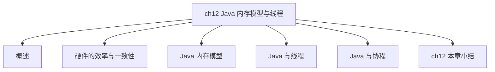
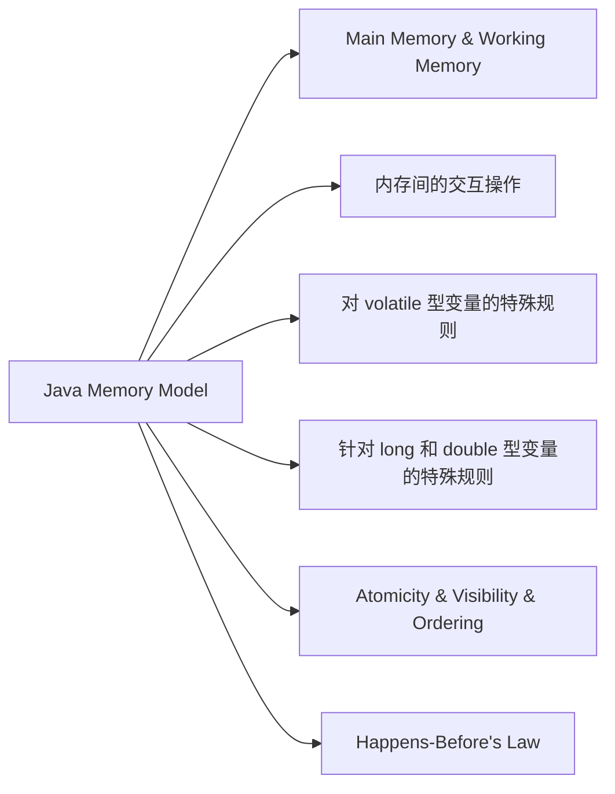

## 1 概述

- Amdahl 定律：通过系统中并行化与串行化的比重来描述多处理器能获得的运算加速能力
- 摩尔定律：用于描述处理器晶体管数量与运行效率之间的发展关系

[【解释】Amdahl's Law & Moore's Law](https://www.notion.so/Amdahl-s-Law-Moore-s-Law-d2a60839a68c4a55b5b254370eead96a?pvs=21)

- 每秒事务处理数是一个衡量服务性能的高低好坏的指标 Transactions Per Second, TPS ，代表1秒内服务端平均水平能响应的请求总数。

## 2 硬件的效率与一致性

在理解 Java 虚拟机的并发相关知识前要了解下物理计算机中的并发问题。

处理器执行运算任务需要与内存交互（如读取运算数据、存储运算结果），处理器与内存两者之间的 I/O 操作是不可避免的（并不能只靠寄存器来完成所有运算任务）。

但计算机的存储设备与处理器的运算速度有着几个数量级的差距，现代计算机系统加入了一层或多层读写速度尽可能接近处理器运算速度的高速缓存（Cache）来作为内存与处理器之间的缓冲：将运算需要使用的数据复制到缓存中，让运算能快速进行，当运算结束后再从缓存同步回内存之中，这样处理器就无需等待缓慢的内存读写了。

很好，这引入了一个新问题：**缓存一致性**（Cache Coherence）。

- 共享内存多核系统（Shared Memory Multiprocessors System） 解释：在多路处理器系统中，每个处理器都有自己的高速缓存，而它们又共享同一主内存（Main Memory）

**有问题**：当多个处理器的运算任务都设及同一块主内存区域时，将可能导致各自的缓存数据不一致。所以，同步回到主内存时该以谁的缓存数据为准嘞？

**解决一致性的问题：** 需要各个处理器访问缓存时都遵循一些协议，在读写时要根据协议来进行操作，这类协议有 MSI、MESI（Illinois Protocol）、MOSI、Synapse、Firefly 及 Dragon Protocol 等。

处理器、高速缓存、主内存间的交互关系

内存模型： 可以理解为在特定的操作协议下，对特定的内存或高速缓存进行读写的过程抽象。不同架构的物理可以拥有不一样的内存模型，而 Java 虚拟机也有自己的内存模型。

乱序执行（Out-Of-Order Execution）优化：让处理器内部的运算单元能尽量被充分利用，对输入的代码进行乱序执行优化，再将优化后的结果重组，**保证该结果与顺序执行的结果是一致的**

1. 不保证程序中各个语句计算的先后顺序与输入代码的顺序一致
2. 那么假设某个计算任务依赖另外一个计算任务的中间结果，则其顺序性并不能靠代码的先后顺序来保证。

指令重排（Instruction Reorder）优化： Java 虚拟机的即时编译器中的指令重排优化。

## 3 Java 内存模型（Java Memory Model JMM ）

- Java 内存模型主要目的是定义程序中各种变量的访问规则，即关注
    - 在虚拟机中把变量值存储到内存
    - 和从内存中取出变量值这样的细节

此处描述的变量（Variables）包括了实例字段、静态字段和构成数组对象的元素，但不包括局部变量与方法参数（线程私有，不会被共享，自然不会存在竞争问题）

### 主内存与工作内存 （Main Memory & Working Memory）

Java 内存模型规定

- 所有的变量都存储在**主内存**（Main Memory）（与上一小节的物理硬件提到的主内存名字一样，两者也可以类比，但**物理上它仅是虚拟机的一部分**）
- **工作内存**（Working Memory），每个线程还有自己的工作内存，可以与上一小节讲的处理器高速缓存类比；
    - 线程的工作内存中保存了被该线程使用的变量的主内存副本。
    - 线程对变量的所有操作（读取、赋值等）都必须在工作内存中进行，而不能直接读写主内存中的数据。
    - 不同的线程之间也无法直接访问对方工作内存中的变量，线程间变量值的传递均需要通过主内存来完成。
- 三者关系如图

线程、主内存、工作内存三者的交互关系

> 这里讲的主内存、工作内存与Java 运行时数据区的内存不是同一个层次的对内存的划分，二者无任何关系
> 

### 内存间的交互操作

关于主内存与工作内存之间具体的交互协议，即一个变量如何从主内存拷贝到工作内存、如何从工作内存同步回主内存

Java 内存模型中定义了以下**八种操作**来完成

1. lock（锁定） 作用于主内存的变量，它把一个变量标识为一条线程独占的状态。
2. unlock（解锁） 作用于主内存的变量，它把一个处于锁定状态的变量释放出来，释放后的变量才可以被其它线程锁定。
3. read（读取） 作用于主内存的变量，它把一个变量的值从主内存传输到线程的工作内存中，以便随后的 load 动作使用。
4. load（载入） 作用于工作内存的变量，它把 read 操作从主内存中得到的变量值放入工作内存的变量副本中。
5. use（使用） 作用于工作内存的变量，它把工作内存中一个变量的值传递给执行引擎，每当虚拟机遇到一个需要使用变量的值的字节码指令时将会执行这个操作。
6. assign（赋值） 作用于工作内存的变量，它把一个从执行引擎接收的值赋给工作内存的变量，每当虚拟机遇到一个变量赋值的字节码指令时执行这个操作
7. store（存储） 作用于工作内存的变量，它把工作内存中一个变量的值传送到主内存中，以便随后的 write 操作使用。
8. write（写入） 作用于主内存的变量，它把 store 操作从工作内存中得到的变量的值放入主内存的变量中。

Java 内存模型只要求变量在主内存和工作内存的同步操作必须按顺序执行，但不要求连续执行。

- 一个变量从主内存拷贝到工作内存，顺序执行 read 和 load 操作
- 把变量从工作内存同步回主内存，顺序执行 store 和 write 操作

所以 read 与 load 之间、 store 与 write 之间是可以插入其它指令的。比如可能出现的顺序 read a, read b, load b, load a

**Java 内存模型还规定了在执行上述 8 种操作时必须满足如下规则：**

1. 不允许 read 和 load、store 和 write 操作之一单独出现，即不允许一个变量从主内存读取了但工作内存不接受，或者工作内存发起回写了但主内存不接受的情况出现。
2. 不允许一个线程丢弃它最近的 assign 操作，即变量在工作内存中改变了之后必须把该变化同步回主内存。
3. 不允许一个线程无原因地（没有发生过任何 assign 操作）把数据从线程地工作内存同步回主内存中。
4. 一个新的变量只能在主内存中“诞生”，不允许在工作内存中直接使用一个未被初始化（load 或 assign）的变量，换句话说就是对一个变量实施 use、store 操作之前，必须先执行 assign 和 load 操作。
5. 一个变量在同一个时刻只允许一条线程对其进行 lock 操作，但 lock 操作可以被同一条线程重复多次，多次执行 lock 后，只有执行相同次数的 unlock 操作，变量才会被解锁。
6. 如果对一个变量执行 lock 操作，那将会清空工作内存中此变量的值，在执行引擎使用这个变量前，需要重新执行 load 或 assign 操作以初始化变量的值。
7. 如果一个变量事先没有被 lock 操作锁定，那就不允许对它执行 unlock 操作，也不允许去 unlock 一个被其它线程锁定的变量。
8. 对一个变量执行 unlock 操作之前，必须先把此变量同步回主内存中（执行 store、write 操作）。

### 对 volatile 型变量的特殊规则

当一个变量被定义为 volatile 之后，它将具备两项特性：

1. 保证此变量对所有线程的可见性
    
    这里可见指的是当一个线程修改了这个变量的值，新值对于其它线程来说是可以立即得知的；
    
    普通变量做不到，它在线程间传递时均需要通过主内存来完成。
    
    **但在以下两种规则的运算场景中，仍然需要通加锁来（使用 synchronized、java.util.concurrent 中的锁或原子类）保证原子性**
    
    - 运算结果并不依赖变量的当前值，或者能够确保只有单一线程修改变量的值
    - 变量不需要与其它的状态变量共同参与不变约束
2. 禁止指令重排序优化
    
    普通的变量仅会保证在该方法的执行过程中所有依赖赋值结果的地方都能获取到正确的结果，而不能保证变量赋值操作的顺序与程序代码中的执行顺序一致。
    
    在同一个线程的方法执行过程中无法感知这一点。这里描述的即所谓“线程内表现为串行的语义”（Within-Thread As-If-Serial Semantics）
    

一个原则：volatile 变量读操作的性能消耗与普通变量几乎没有什么差别；但是写操作则可能会慢上一些，因为它需要在本地代码中插入许多内存屏障指令来保证处理器不发生乱序执行。

volatile 与锁的选择：仅判断 volatile 的语义能否满足使用场景的需求。

**Java 内存模型中对 volatile 变量定义的特殊规则的定义**

首先假定 T 表示一个线程，V 和 W 分别表示两个 volatile 型变量，那么在进行 read, load, use, assign, store, write 操作时需满足如下规则：

1. 在工作内存中，每次**使用 V** 前都必须先从主内存刷新最新的值，用于保证能看见其它线程对变量 V 所做的修改
    1. 只有当线程 T 对变量 V 执行的前一个动作是 load 的时候，线程 T 才能对变量 V 执行 use 动作；
    2. 并且，只有当线程 T 对变量 V 执行的后一个动作是 use 的时候，线程 T 才能对变量 V 执行 load 操作。
    3. 线程 T 对变量 V 的 use 动作可以认为是和线程 T 对变量 V 的 load, read 动作相关联的，必须连续且一起出现。
2. 在工作内存中，每次**修改 V** 后都必须立刻同步回主内存中，用于保证其它线程可以看到自己对变量 V 所做的修改
    1. 只有当线程 T 对变量 V 执行的前一个动作是 assign 的时候，线程 T 才能对变量 V 执行 store 动作；
    2. 并且，只有当线程 T 对变量 V 执行的后一个动作是 store 的时候，线程 T 才能对变量 V 执行 assign 动作。
    3. 线程 T 对变量 V 的 assign 动作可以认为是和线程 T 对变量 V 的 store, write 动作相关联的，必须连续且一起出现。
3. 要求 volatile 修饰的变量不会被指令重排序优化，从而保证代码的执行顺序与程序的顺序相同
    1. 假定动作 A 是线程 T 对变量 V 实施的 use 或 assign 动作，假定动作 F 是和动作 A 相关联的 load 或 store 动作，假定动作 P 是和动作 F 相应的对**变量 V** 的 read 或 write 动作；
    2. 与此类似，假定动作 B 是线程 T 对变量 W 实施的 use 或 assign 动作，假定动作 G 是和动作 B 相关联的 load 或 store 动作，假定动作 Q 是和动作 G 相应的对**变量 W** 的 read 或 write 动作。
    3. **如果 A 先于 B，那么 P 先于 Q**

**人话就是**，作用于不同变量 V 和 W 的，两个动作 A 和 B（use or assign），和相关联的另外两个动作 F 和 G （load or store），再相关联的两个动作 P 和 Q （read or write）

- A[T use or assign **V**], **F**[load or store] associated with A, P[read or write **V**] associated with **F**
- B[T use or assign **W**], **G**[load or store] associated with B, Q[read or write **W**] associated with **G**

有如下关系 **如果 A 先于 B，那么 P 先于 Q**

### 针对 long 和 double 型变量的特殊规则

long 和 double 的非原子性协定（Non-Atomic Treatment of double and long Variables）

允许虚拟机将没有被 volatile 修饰的 64 位数据的读写操作划分为两次 32 位的操作来进行，即允许虚拟机实现自行选择是否要保证 64 位数据类型的 load, store, read, write 这四个操作的原子性

> 实际开发中，除非该数据有明确可知的线程竞争，一般不因为这个原因刻意将 long 和 double 声明为 volatile
> 

### 原子性 & 可见性 & 有序性

Java 内存模型是围绕着并发过程中如何处理原子性、可见性和有序性这三个特征来建立的。

1. 原子性 Atomicity
    1. 基本数据类型的访问、读写都是具备原子性的
    2. 例外就是 long 和 double 的非原子性协定
    3. 如果应用场景需要更大范围的原子性保证，Java 内存模型还提供了 lock 和 unlock 操作来满足（VM 未直接开放给用户使用）
    4. 虚拟机提供了更高层次的字节码指令 monitorenter 和 monitorexit 来隐式地使用这两个操作
    5. 反映到 Java 代码就是同步块 synchronized 关键字（即在 synchronized 块之间地操作也具备原子性）
2. 可见性 Visibility
    1. 可见性就是一个线程修改了共享变量的值时，其他线程能够立即得知这个修改
    2. 关键字 volatile 保证了多线程操作时变量的可见性，而普通变量则不能保证这一点（详见[对 volatile 型变量的特殊规则](https://www.notion.so/volatile-0b8389b22cc84e038a539dc8645052bb?pvs=21) ）
    3. 关键字 synchronized 和 final 同样可以实现可见性
    4. synchronized 同步块的可见性是由规则“对一个变量执行 unlock 操作之前，必须先把此变量同步回主内存中（执行 store、write 操作）”实现
    5. 被 final 修饰的字段在构造器中一旦被初始化完成，并且构造器没有把“this”的引用传递出去，那么在其它线程中就能看到 final 字段的值。
3. 有序性 Ordering
    1. 如果在本线程内观察，所有的操作都是有序的；“线程内似表现为串行的语义”（Within-Thread As-If-Serial Semantic）
    2. 如果在一个线程中管程另一个线程，所有的操作都是无序的。“指令重排序”现象和“工作内存与主内存同步延迟”现象
    3. Java 语言提供了 volatile 和 synchronized 两个关键字来保证线程之间操作的有序性
        1. volatile 关键字本身就包含了禁止指令重排序的语义
        2. synchronized 则是由“一个变量在同一个时刻只允许一条线程对其进行 lock 操作”这条规则获得的，这条规则决定了持有同一个锁的两个同步块只能串行地进入

### 先行发生原则

先行发生原则，判断数据是否存在竞争，线程是否安全。

**指的是什么？**先行发生是 Java 内存模型中定义地两项操作之间地偏序关系。

1. 操作 A 先行发生于操作 B，其实就是说在发生操作 B 之前，操作 A 产生地影响能被操作 B 观察到。
2. “影响”包括修改了内存中共享变量的值、发送了消息、调用了方法等

Java 内存模型中“天然的”先行发生关系，这些先行发生关系无需任何同步器协助就已经存在，可以在编码中直接使用。

如果两个操作之间的关系不在此列，并且无法从**下列规则**推导出来，则它们就没有顺序性保障，虚拟机可以对它们随意地进行重排序。

1. 程序次序规则（Program Order Rule）：在一个线程内，按照控制流顺序，书写在前面的操作先行发生于写在后面的操作。注意，这里说的是控制流顺序而不是程序代码顺序，因为要考虑分支、循环等结果。
2. 管程锁定规则（Monitor Lock Rule）：一个 unlock 操作先行发生于后面对同一个锁的 lock 操作。这里必须强调的是“同一个锁”，而“后面”是指时间上的先后。
3. volatile 变量规则（Volatile Variable Rule）：对一个 volatile 变量的写操作先行发生于后面对这个变量的读操作，这里的“后面”同样是指时间上的先后。
4. 线程启动规则（Thread Start Rule）：Thread 对象的 start() 方法先行发生于此线程的每一个动作。
5. 线程终止规则（Thread Termination Rule）：线程中的所有操作都先行发生于对此线程的终止检测，我们可以通过 Thread::join() 方法是否结束、Thread::isAlive() 的返回值等手段检测线程是否已经终止执行。
6. 线程中断规则（Thread Interruption Rule）：对线程 interrupt() 方法的调用先行发生于被中断线程的代码检测到中断事件的发生，可以通过 Thread::interrupted() 方法检测到是否有中断发生。
7. 对象终结规则（Finalizer Rule）：一个对象的初始化完成（构造函数执行结束）先行发生于它的 finalize() 方法的开始。
8. 传递性（Transitivity）：如果操作 A 先行发生于操作 B ，操作 B 先行发生于操作 C ，那就可以得出操作 A 先行发生于操作 C 的结论。

**Java 语言无需任何同步手段保障就能成立的先行发生规则有且只有上面这些。**

一个操作“时间上的先发生”不代表这个操作会是“先行发生”。那如果一个操作“先行发生”，是否就能推导出这个操作必定是“时间上的先发生”呢？**不能，**典型例子“指令重排序”

<aside>
💡 **证明得出结论：**

1. 时间先后顺序与先行发生原则之间基本没有因果关系
2. 衡量并发安全问题的时候不要受时间顺序的干扰，一切必须以先行发生原则为准
</aside>

## 4 Java 与线程

三部分 线程的实现、Java 线程调度、状态转换

### 线程实现

线程是比进程更轻量级的调度执行单位，线程的引入，可以把一个进程的资源分配和执行调度分开，各个线程既可以共享进程资源（内存地址、文件 I/O等），又可以独立调度。目前线程是 Java 里面进行处理器资源调度的最基本单位。

Java 语言则提供了在不同硬件和操作系统平台下对线程操作的统一处理，每个已经调用过 start() 方法且还未结束的 java.lang.Thread 类的实例就代表着一个线程。

Thread 类的大部分的 API 都是 Native 方法（此方法没有使用或无法使用平台无关的手段来实现，也有可能是为了执行效率而使用 Native 方法）

实现线程主要有三种方式：使用内核线程实现（1:1实现），使用用户线程实现（1:N实现），使用用户线程更加轻量级进程混合实现（N:M实现）。

轻量级进程与内核线程之间 1:1 的关系

1. **内核线程实现**

使用内核线程实现的方式也被称为1:1实现。

内核线程（Kernel-Level Thread, KLT）就是直接由操作系统内核（Kernel）支持的线程，这种线程由内核来完成线程切换，内核通过操纵调度器（Scheduler）对线程进行调度，并负责将线程的任务映射到各个处理器上。

每个内核线程可以视为内核的一个分身，这样操作系统就有能力同时处理多件事情，支持多线程的内核就称为多线程内核（Multi-Thread Kernel）

程序一般不会直接使用内核线程，而是使用内核线程的一种高级接口——轻量级进程（Light Weight Process, LWP），轻量级进程就是我们通常意义上讲的线程，由于每个轻量级进程都由一个内核线程支持，因此只有先支持内核线程，才能由轻量级进程。这种轻量级进程与内核线程之间1:1的关系称为一对一的线程模型。

每个轻量级进程都成为一个独立的调度单元，即使其中某一个轻量级进程在系统调用中阻塞了，也不会影响整个进程继续工作。

<aside>
💡 局限性：

1. **系统占用 CPU 会增加**；由于是基于内核线程实现的，所以各种线程，如创建、析构及同步，都需要进行系统调用。而系统调用的代价相对较高，需要在用户态（User Mode）和内核态（Kernel Mode）中来回切换。
2. 每个轻量级进程都需要有一个内核线程的支持，轻量级进程还要**消耗一定的内核资源**（如内核线程的栈空间）

所以，一个系统支持轻量级进程的数量是有限的

</aside>

进程与用户线程之间 1:N 的关系

1. **用户线程实现**

这种实现方式称为 1:N 实现。

广义上来讲，一个线程只要不是内核线程，都可以认为是用户线程（User Thread, UT）的一种。

而狭义上的用户线程指的是完全建立在用户空间的线程库上，系统内核不能感知到用户线程的存在及如何实现的。

用户线程的建立、同步、销毁和调度完全在用户态中完成，不需要内核的帮助，程序实现得当，不需要切到内核态，因此操作可以是非常快速且低消耗的，也能够支持更大的线程数量。

优势： 不需要系统内核支援

劣势：没有系统内核的支援，所有线程操作都需要用户程序自己去处理。

用户线程

1. **混合实现**

这种实现方式称为 N:M 实现。

也就是既存在用户线程，也存在轻量级进程。

用户线程完全建立在用户空间中，操作系统支持的轻量级进程则作为用户线程和内核线程之间的桥梁，这样就可以使用内核提供的线程调度功能及处理器映射，并且用户线程的系统调用要通过轻量级进程来完成，大大降低了整个进程被完全阻塞的风险。

混合模式中，用户线程与轻量级进程的数量比是不定的，是 N:M 的关系，就是多对多线程模型

### Java 线程的实现

Java线程如何实现并**不受Java虚拟机规范的约束**，这是一个与具体虚拟机相关的话题。

### Java 线程调度

线程调度是指系统为线程分配处理器使用权的过程。

主要方式分两种：**协同式线程调度**（Cooperative Threads-Scheduling）、**抢占式线程调度**（Preemptive Threads-Scheduling）

- 协同式线程调度 Cooperative Threads-Scheduling

协同式调度的多线程系统，线程执行时间由线程本身来控制，把自己的工作执行完后，要主动通知系统切换到另外一个线程上去。

好处： 实现简单、线程要把自己的事情才会进行线程切换，切换操作是对自己是可知的，一般没有什么线程同步问题。

坏处： 线程执行时间不可控（问题代码一直不告知系统进行线程切换，就会一直阻塞）

- 抢占式协程调度 Preemptive Threads-Scheduling

抢占式调度的多线程系统，每个线程将由系统来分配执行时间，线程的切换不由线程本身来决定。Java 使用的线程调度方式就是抢占式调度。

好处： 线程的执行时间可控，不会有一个线程导致整个进程甚至整个系统的阻塞问题。

### 状态转换

Java 定义了 6 种线程状态，在任意一个时间点中，一个线程只能有且只有其中的一种状态，并且可以通过特定的方法在不同状态之间转换。

线程状态转换关系

- 新建 （NEW） 创建后尚未启动的线程处于此状态
- 运行（RUNNABLE） 包括操作系统线程状态中的 RUNNING 和 READY ，也就是处于此状态的线程有可能正在执行，也有可能正在等待操作系统为它分配执行时间
- 无限期等待（WAITING） 处于这种相同的线程不会被分配处理器时间，它们要等待被其它线程显式的唤醒。以下方法会让线程陷入 WAITING 状态
    - 没有设置 Timeout 参数的 Object::wait() 方法
    - 没有设置 Timeout 参数的 Thread::join() 方法
    - LockSupport::park() 方法
- 限期等待（TIMED_WAITING） 处于这种状态的线程也不会被分配处理器执行时间，不过无需等待被其它线程显式唤醒，在一定时间之后它们会由系统自动唤醒。以下方法会让线程进入 TIMED_WAITING 状态
    - Thread::sleep() 方法
    - 设置了 Timeout 参数的 Object::wait() 方法
    - 设置了 Timeout 参数的 Thread::join() 方法
    - LockSupport::parkNanos() 方法
    - LockSupport::parkUntil() 方法
- 阻塞（Blocked） 线程被阻塞了
    
    “阻塞状态”与“等待状态”的区别
    
    “阻塞状态”在等待着获取到一个排它锁，这个事件将在另外一个线程放弃这个锁的时候发生；而“等待状态”则是在等待一段时间，或者唤醒动作的发生。在程序等待进入同步区域的时候，线程将进入这种状态。
    
- 结束（Terminated） 已终止线程的线程状态，线程已经结束执行

上述6种状态在遇到特定事件发生的时候将会互相转换

## 5 Java 与协程

略

## 6 本章小结

[【解释】计算任务的顺序性](https://www.notion.so/51c9e1c747964299957e5eaa4e7a31b3?pvs=21)