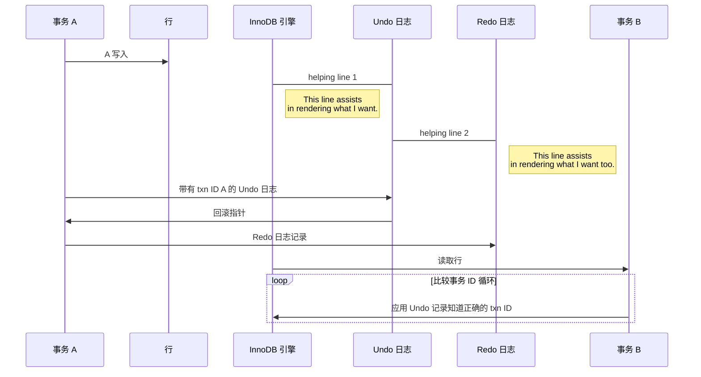

ch1 MySQL架构

MySQL 可以分为 Server 层和存储引擎层两部分

## MySQL 的逻辑架构


_这个图是5.7，下面那个是8.x的_

MySQL 可以分为 Server 层和存储引擎层两部分

- Server 层
    - 连接器 → 管理链接，权限验证
    - 查询缓存 → <font color='red' style='font-weight:bold'>8.0 后整块功能就删掉了，大部分是在 memcached 或 Redis 中缓存数据</font>
    - 分析器 → 词法分析，语法分析
    - 优化器 → 执行计划生成，索引选择
    - 执行器 → 与存储引擎交互，返回结果

- 存储引擎层：服务器通过 API 与存储引擎进行通信
    - InnoDB (default)
    - MyISAM
    - Memory
    - ...


_MySQL Architecture with Pluggable Storage Engines_

可以看出MySQL是由**连接池、管理工具和服务、SQL接口、解析器、优化器、缓存、存储引擎、文件系统**组成。

### 连接管理与安全性

**连接池**

由于每次建立建立需要消耗很多时间，连接池的作用就是将这些连接缓存下来，下次可以直接用已经建立好的连接，提升服务器性能。

默认情况下，每个客户端连接都会在服务器进程中拥有一个线程，该连接的查询只会在这个单独的线程中执行，该线程驻留在一个内核或者CPU上。服务器维护了一个缓存区，用于存放已就绪的线程，因此不需要为每个新的连接创建或者销毁线程。

当客户端(应用)连接到MSQL服务器时，服务器需要对其进行身份验证。身份验证基于用户名、发起的主机名和密码。如果以跨传输层安全(TLS)的方式连接，还可以使用X.509证书认证。客户端连接成功后，服务器会继续验证该客户端是否具有其发出的每个查询的权限(例如，是否允许客户端对world数据库中的Country表执行SELECT语句)。

**SQL接口**

接受用户的 SQL 命令，并且返回用户需要查询的结果。比如 select ... from 就是调用SQL接口

**解析器**

SQL命令传递到解析器的时候会被解析器验证和解析。解析器主要功能：1、将SQL语句分解成数据结构（解析树），后续步骤的传递和处理就是基于这个结构的。2、将SQL语句分解成数据结构，后续步骤的传递和处理就是基于这个结构的。

**优化器**

查询优化器，SQL语句在查询之前会使用查询优化器对查询进行优化。

比如重写查询、决定表的读取顺序，以及选择合适的索引等。用户可以通过特殊关键字向优化器传递提示，从而影响优化器的决策过程。也可以请求服务器解释优化过程的各个方面，使用户可以知道服务器是如何进行优化决策的，并提供一个参考点，便于用户重构查询和schema、修改相关配置，使应用尽可能高效地运行。

**缓存器 query cache**

查询缓存，如果查询缓存有命中的查询结果，查询语句就可以直接去查询缓存中取数据。这个缓存机制是由一系列小缓存组成的。比如表缓存，记录缓存，key缓存，权限缓存等。

在旧版本中，MySQL可以使用内部查询缓存（query cache）来查看是否可以直接提供结果。

一个流行的设计模式是在memcached或Redis中缓存数据。

**存储引擎**

存储引擎负责 MySQL 中数据的存储和提取。和 GNU/Linux 下的各种文件系统一样，每种存储引擎都有其优势和劣势。服务器通过存储引擎API进行通信。这些API屏蔽了不同存储引擎之间的差异，使得它们对上面的査询层基本上是透明的。存储引擎层还包含几十个底层函数用于执行诸如“开始一个事务"或者“根据主键提取一行记录”等操作。但存储引擎不会去解析 SQL 不同存储引擎之间也不会相互通信，而只是简单地响应服务器的请求。

不同的数据文件在磁盘的不同组织形式。服务器通过 API 与存储引擎进行通信。
1. InnoDB 支持事务，MyISAM 不支持
2. InnoDB 支持外键，MyISAM 不支持
3. InnoDB 支持表锁和行锁，但是 MyISAM 支持表锁
4. InnoDB 在 5.6 版本之后支持全文索引
5. InnoDB 索引的叶子节点直接存放数据，而 MyISAM 存放地址

文件系统 File System

---

## 并发控制

数据库锁设计的初衷是处理并发问题。作为多用户共享的资源，当出现并发访问的时候，数据库需要合理地控制资源的访问规则。而锁就是用来实现这些访问规则的重要数据结构。


在处理并发读或者写的时候，可以通过实现一个由两种类型的锁组成的锁系统来解决问题。通常称之为**共享锁（shared lock）**和**排他锁（exclusive lock）**，也叫读锁（read lock）和写锁（write lock）。

### 具体描述读写锁的概念

1. 资源上的读锁是共享的，或者说是互相不阻塞的
  
    多个客户在同一时刻可以同时读取同一个资源，而互不干扰。
    
2. 写锁是排他的，一个写锁会阻塞其他的写锁和读锁
  
    写锁这种安全策略，才可以确保在给定的时间里，只有一个用户能执行写入，并防止其他用户读取正在写入的同一资源。
    

提高共享资源并发性：尽量只锁定需要修改的部分数据，而不是所有资源。

更理想的方式是，只对会修改的数据片段进行精确的锁定。锁定的数据量越少，则系统的并发程度越高，只要互相之间不发生冲突就行。

锁的各种操作也会增加系统开销：获得锁、检查锁是否已经解除、释放锁等

在锁的开销和数据的安全性之间平衡一下的锁的策略就是一般都是在表上施加行级锁（row-level lock）

### 锁的粒度

### 表锁（table lock）

1. 表锁是开销最小的策略，是 MySQL 中最基本的锁策略。
2. 锁定整张表，一个用户在对表进行写操作（插入、删除、更新等）前，都要先获得**写锁**，这阻塞了其他用户对这张表的读写操作。
3. 没有写锁时，其他读的用户才能获得读锁，读锁之间时不互相阻塞的。
4. 写锁比读锁有更高的优先级，因此写锁请求可能会被插入到锁队列中读锁的前面，反之不可以。

### 行级锁（row lock）

1. 行级锁可以最大程度地支持并发处理，同时带来了最大的锁开销。
2. 行级锁只在存储引擎层实现，MyISAM 引擎就不支持行锁。
3. **在InnoDB事务中，行锁是在需要的时候才加上的，但并不是不需要了就立刻释放，而是要等到事务结束时才释放。这个就是两阶段锁协议。事务持有的记录的锁都是在 commit 的时候才释放。**

### 全局锁

全局锁就是对整个数据库实例加锁。MySQL提供了一个加全局读锁的方法，命令是 `Flush tables with read lock (FTWRL)`

当你需要让整个库处于只读状态的时候，可以使用这个命令，之后其他线程的以下语句会被阻塞：数据更新语句（数据的增删改）、数据定义语句（包括建表、修改表结构等）和更新类事务的提交语句。**全局锁的典型使用场景是，做全库逻辑备份。**也就是把整库每个表都select出来存成文本。

---

## 事务 Transaction

我们知道 MySQL 是一个客户端／服务器架构的软件，对于同一个服务器来说，可以有若干个客户端与之连接，每个客户端与服务器连接上之后，就可以称之为一个会话（Session）。每个客户端都可以在自己的会话中向服务器发出请求语句，一个请求语句可能是某个事务的一部分，也就是对于服务器来说可能同时处理多个事务。

1. ~~基础概念介绍~~
2. ~~隔离级别~~
3. ~~死锁~~
4. ~~事务日志~~
5. ~~MySQL 中的事务~~

### 基础概念介绍

1. 事务就是一组原子性的 SQL 查询，或者说一个独立的工作单元。事务内的语句要么全部执行成功，要么全部执行失败。
2. 事务的 AICD 特性
    - 原子性 atomicity
      
        一个事务就被视为一个不可分割的最小工作单元，其所有操作要么全部提交成功，要么全部失败回滚。不能只执行其中的一部分。
        
    - 一致性 consistency
      
        数据库总是从一个一致性的状态转换到另外一个一致性的状态。
        
    - 隔离性 isolation
      
        通常来说，一个事务所做的修改在最终提交以前，对其他事务时不可见的。不仅要保证这些操作以原子性的方式执行完成，而且要保证其它的状态转换不会影响到本次状态转换，这个规则被称之为隔离性。
        
    - 持久性 durability
      
        事务一旦提交，则其所做的修改就会永久保存到数据库中。
    
3. 在 MySQL 中，事务支持是在引擎层实现的。MySQL 原生的 MyISAM 引擎就不支持事务。

```sql
START TRANSACTION;
SELECT balance FROM checking WHERE customer_id = 10233276;
UPDATE checking SET balance = balance - 200.00 WHERE customer_id = 10233276;
UPDATE savings SET balance = balance + 200.00 WHERE customer_id = 10233276;
COMMIT;
```

### 隔离级别 isolation level
  
当数据库上有多个事务同时执行的时候，就可能出现脏读（dirty read）、不可重复读（non-repeatable read）、幻读（phantom read）的问题，所以就有了隔离级别的概念。
    
**ANSI SQL 的隔离级别**

| isolation level | 脏读可能性 | 不可重复读可能性 | 幻读可能性 | 加锁读 |
| --- | --- | --- | --- | --- |
| READ UNCOMMITTED | Yes | Yes | Yes | No |
| READ COMMITTED | No | Yes | Yes | No |
| REPEATABLE READ | No | No | Yes | No |
| SERIALIZABLE | No | No | No | Yes |

1. READ UNCOMMITTED （未提交读）
  
    读未提交是指，一个事务还没提交时，它做的变更就能被别的事务看到。
    
    事务中的修改，即使没有提交，对其他事务也都是可见的。<font color='red' style='font-weight:bold'>读取到未提交的数据，称之为脏读（Dirty Read）。</font>一般不用此隔离级别
    
2. READ COMMITTED （提交读）
  
    读提交是指，一个事务提交之后，它做的变更才会被其他事务看到。
    
    大多数 DBMS 的默认级别（如 Oracle）。**但 MySQL 不是。**此级别可以满足 AICD 中的隔离性，一个事务从开始到提交之前，所做的任何修改对其他事务都是不可见的。有时候这个级别也叫做不可重复读（nonrepeatable read），因为两次执行同样的查询，可能会得到不一样的结果。
    
3. REPEATABLE READ （可重复读）
  
    可重复读是指，一个事务执行过程中看到的数据，总是跟这个事务在启动时看到的数据是一致的。当然在可重复读隔离级别下，未提交变更对其他事务也是不可见的。
    
    解决了脏读的问题。该级别保证了**在同一个事务多次读取同样的记录的结果是一致的，**换句话说就是事务在执行期间看到的数据前后必须是一致的。但理论上无法解决另外一个幻读（phantom read）的问题。所谓幻读，指的是当某个事务在读取某个范围内的记录时，会产生幻行（phantom row）。InnoDB 和 XtraDB 存储引擎通过多版本并发控制（MVCC，Multiversion Concurrency Control）解决了幻读的问题。
    
    <font color='red' style='font-weight:bold'>可重复读是 MySQL 的默认事务隔离级别。</font>
    
4. SERIALIZABLE （可串行化）
  
    串行化，顾名思义是对于同一行记录，“写”会加“写锁”，“读”会加“读锁”。当出现读写锁冲突的时候，后访问的事务必须等前一个事务执行完成，才能继续执行。
    
    最高的隔离执行。它强制事务串行执行，避免了幻读问题。它会在读取的每一行数据上都加锁，可能会导致超时和锁竞争的问题。
    
    实际开发很少用，非常需要确保数据的一致性时且可以接受没有并发的情况，才考虑。

    > 只要涉及到金钱都给我串行化去处理
    {: .prompt-warning }
    

在实现上，数据库里面会创建一个视图，访问的时候以视图的逻辑结果为准。在“可重复读”隔离级别下，这个视图是在事务启动时创建的，整个事务存在期间都用这个视图。在“读提交”隔离级别下，这个视图是在每个SQL语句开始执行的时候创建的。这里需要注意的是，“读未提交”隔离级别下直接返回记录上的最新值，没有视图概念；而“串行化”隔离级别下直接用加锁的方式来避免并行访问。

#### 隔离级别的设置

- 修改事务的隔离级别

```sql
SET [GLOBAL|SESSION] TRANSACTION ISOLATION LEVEL level;
```

其中的level可选值有4个：

```sql
level: {
    REPEATABLE READ
   | READ COMMITTED
   | READ UNCOMMITTED
   | SERIALIZABLE
}
```

设置事务的隔离级别的语句中，在 SET 关键字后可以放置 GLOBAL 关键字、SESSION 关键字或者什么都不放，这样会对不同范围的事务产生不同的影响，具体如下：

**使用GLOBAL关键字（在全局范围影响）：**

比方说这样：

```sql
SET GLOBAL TRANSACTION ISOLATION LEVEL SERIALIZABLE;
```

则： 只对执行完该语句之后产生的会话起作用。当前已经存在的会话无效。

**使用SESSION关键字（在会话范围影响）：**

比方说这样：

```sql
SET SESSION TRANSACTION ISOLATION LEVEL SERIALIZABLE;
```

则：对当前会话的所有后续的事务有效

该语句可以在已经开启的事务中间执行，但不会影响当前正在执行的事务。

如果在事务之间执行，则对后续的事务有效。

**上述两个关键字都不用（只对执行语句后的下一个事务产生影响）：**

比方说这样：

```sql
SET TRANSACTION ISOLATION LEVEL SERIALIZABLE;
```

则：只对当前会话中下一个即将开启的事务有效。下一个事务执行完后，后续事务将恢复到之前的隔离级别。该语句不能在已经开启的事务中间执行，会报错的。

如果我们在服务器启动时想改变事务的默认隔离级别，可以修改启动参数transaction-isolation的值，比方说我们在启动服务器时指定了--transaction-isolation=SERIALIZABLE，那么事务的默认隔离级别就从原来的REPEATABLE READ变成了SERIALIZABLE。

- 看下当前会话默认的隔离级别

```sql
show variables like 'transaction_isolation';
```

#### 事务基本语法

**事务开始**

1. begin
2. START TRANSACTION（推荐）
3. begin work

**事务回滚**

rollback

**事务提交**

commit

**保存点**

如果你开启了一个事务，执行了很多语句，忽然发现某条语句有点问题，你只好使用ROLLBACK语句来让数据库状态恢复到事务执行之前的样子，然后一切从头再来，但是可能根据业务和数据的变化，不需要全部回滚。所以MySQL里提出了一个保存点（英文：savepoint）的概念，就是在事务对应的数据库语句中打几个点，我们在调用ROLLBACK语句时可以指定会滚到哪个点，而不是回到最初的原点。定义保存点的语法如下：

SAVEPOINT 保存点名称;

当我们想回滚到某个保存点时，可以使用下边这个语句（下边语句中的单词WORK和SAVEPOINT是可有可无的）：

```
ROLLBACK TO [SAVEPOINT] 保存点名称;
```

不过如果ROLLBACK语句后边不跟随保存点名称的话，会直接回滚到事务执行之前的状态。

如果我们想删除某个保存点，可以使用这个语句：

```
RELEASE SAVEPOINT 保存点名称;
```

| 隔离级别            | 描述               | 脏读   | 不可重复读 | 幻读   |
|-------------------|--------------------|--------|------------|--------|
| READ UNCOMMITTED  | 未提交读            | 可能   | 可能        | 可能   |
| READ COMMITTED    | 已提交读            | 不可能 | 可能        | 可能   |
| REPEATABLE READ   | 可重复读            | 不可能 | 不可能      | 可能   |
| SERIALIZABLE      | 可串行化            | 不可能 | 不可能      | 不可能 |

### 死锁

死锁是指两个或者**多个事务在同一资源上相互占用，并请求锁定对方占用的资源**，从而导致恶性循环的现象。

1. InnoDB 存储引擎，能检测到死锁的循环依赖，并立即返回一个错误。
2. InnoDB 处理死锁的办法是，将持有最少行级排他锁的事务进行回滚（这是相对简单的死锁回滚算法）
3. 死锁产生有双重原因：
    - 有些是因为真正的数据冲突
    - 有些则是完全由于存储引擎的实现方式导致的
4. 如何处理死锁，大多数情况下只需要重新执行因死锁回滚的事务即可。

### 事务日志 redo log

1. 事务日志采用的是追加的方式，写日志的操作是磁盘上一小块区域的顺序 I/O （追加写）
2. 事务日志持久化以后，内存中被修改的数据在后台可以慢慢地刷回到磁盘——预写式日志（Write-Ahead Logging），修改数据需要写两次磁盘

### MySQL 中的事务

1. 自动提交（AUTOCOMMIT）
    1. MySQL 默认采用的是自动提交模式，如果不是显式的开始一个事务，则每个查询都被当做一个事务执行提交操作。
    2. 查看：`show variables like 'autocommit';` 启用：`set autocommit = 1;`
    3. 对于非事务型的表，如 MyISAM 或内存表，不会有任何影响。
2. 在事务中混合使用存储引擎
    1. 在事务中混合使用存储引擎不可靠！
    2. 在事务中混合使用了事务型和非事务型的表（InnoDB 和 MyISAM 表），如果需要回滚则会发生警告，某些非事务型的表上的变更不能被回滚
3. 隐式和显式锁定
    1. InnoDB 采用的时两阶段锁定协议（two-phase locking protocol）
    2. 在事务执行过程中，随时都可以执行锁定，锁只有在执行 commit 或者 rollback 的时候才会释放，并且所有的锁是在同一时刻被释放。这里描述的锁定都是隐式锁定，InnoDB 会根据隔离级别在需要的时候自动加锁
    3. InnoDB 的显示锁定
        1. `SELECT … LOCK IN SHARE MODE`
        2. `SELECT … FOR UPDATE`

当我们使用 START TRANSACTION 或者 BEGIN 语句开启了一个事务，或者把系统变量autocommit的值设置为OFF时，事务就不会进行自动提交，但是如果我们输入了某些语句之后就会悄悄的提交掉，就像我们输入了COMMIT语句了一样，这种因为某些特殊的语句而导致事务提交的情况称为隐式提交，这些会导致事务隐式提交的语句包括：

- 执行DDL

定义或修改数据库对象的数据定义语言（Datadefinition language，缩写为：DDL）。

所谓的数据库对象，指的就是数据库、表、视图、存储过程等等这些东西。当我们使用CREATE、ALTER、DROP等语句去修改这些所谓的数据库对象时，就会隐式的提交前边语句所属于的事务，就像这样：

```sql
BEGIN;
SELECT ... # 事务中的一条语句
UPDATE ... # 事务中的一条语句
... # 事务中的其它语句
CREATE TABLE ...
```

**此语句会隐式的提交前边语句所属于的事务**

- 隐式使用或修改mysql数据库中的表

当我们使用ALTER USER、CREATE USER、DROP USER、GRANT、RENAME USER、REVOKE、SET PASSWORD等语句时也会隐式的提交前边语句所属于的事务。

- 事务控制或关于锁定的语句

当我们在一个会话里，一个事务还没提交或者回滚时就又使用START TRANSACTION或者BEGIN语句开启了另一个事务时，会隐式的提交上一个事务，比如这样：

```sql
BEGIN;
SELECT ... # 事务中的一条语句
UPDATE ... # 事务中的一条语句
... # 事务中的其它语句
BEGIN; # 此语句会隐式的提交前边语句所属于的事务
```

或者当前的autocommit系统变量的值为 OFF，我们手动把它调为 ON 时，也会隐式的提交前边语句所属的事务。

或者使用 LOCK TABLES、UNLOCK TABLES 等关于锁定的语句也会隐式的提交前边语句所属的事务。

- 加载数据的语句

比如我们使用LOAD DATA语句来批量往数据库中导入数据时，也会隐式的提交前边语句所属的事务。

- 关于MySQL复制的一些语句

使用 START SLAVE、STOP SLAVE、RESET SLAVE、CHANGE MASTER TO 等语句时也会隐式的提交前边语句所属的事务。

- 其它的一些语句

使用 ANALYZE TABLE、CACHE INDEX、CHECK TABLE、FLUSH、 LOAD INDEX INTO CACHE、OPTIMIZE TABLE、REPAIR TABLE、RESET 等语句也会隐式的提交前边语句所属的事务。

---

## 多版本并发控制 MVCC

Multi-Version Concurrency Control，可以认为是行级锁的一个变种，但是它在很多情况下避免了加锁操作，因此开销更低。实现了非阻塞的读操作，写操作也只锁定必要的行。

MVCC 的实现，是通过**保存数据在某个时间点的快照**来实现的。不管需要执行多长时间，每个事物看到的数据都是一致的。根据事务开始的时间不同，每个事务对同一张表，同一时刻看到的数据可能是不一样的。


_跨不同事务处理同一行多个版本的序列图_

通过 InnoDB 简化版行为说明 MVCC 是如何工作的：

InnoDB 的 MVCC，是通过在每行后面保存两个隐藏的列来实现的。一个保存了行的创建时间，一个保存行的过期时间（或删除时间）。当然存储的并不是实际的时间值，而是系统版本号（system version number）。每开始一个新的事务，系统版本号都会自动递增。事务开始时刻的系统版本号会作为事务的版本号，用来和查询到的每行记录的版本号进行比较。

InnoDB通过为每个事务在启动时分配一个事务ID来实现MVCC。该ID在事务首次读取任何数据时分配。在该事务中修改记录时，将向Undo日志写入一条说明如何恢复该更改的Undo记录，并且事务的回滚指针指向该Undo日志记录。这就是事务如何在需要时执行回滚的方法。
   
**必须要知道的概念（每个版本链针对的一条数据）：**

我们知道，对于使用InnoDB存储引擎的表来说，它的聚簇索引记录中都包含两个必要的隐藏列（row_id并不是必要的，我们创建的表中有主键或者非NULL的UNIQUE键时都不会包含row_id列）：
trx_id：每次一个事务对某条聚簇索引记录进行改动时，都会把该事务的事务id赋值给trx_id隐藏列。
roll_pointer：每次对某条聚簇索引记录进行改动时，都会把旧的版本写入到undo日志中，然后这个隐藏列就相当于一个指针，可以通过它来找到该记录修改前的信息。

（补充点：undo日志：为了实现事务的原子性，InnoDB存储引擎在实际进行增、删、改一条记录时，都需要先把对应的undo日志记下来。**一般每对一条记录做一次改动，就对应着一条undo日志**，但在某些更新记录的操作中，也可能会对应着2条undo日志。一个事务在执行过程中可能新增、删除、更新若干条记录，也就是说需要记录很多条对应的undo日志，这些undo日志会被从0开始编号，也就是说根据生成的顺序分别被称为第0号undo日志、第1号undo日志、...、第n号undo日志等，这个编号也被称之为undo no。）

对该记录每次更新后，都会将旧值放到一条undo日志中，就算是该记录的一个旧版本，随着更新次数的增多，所有的版本都会被roll_pointer属性连接成一个链表，我们把这个链表称之为版本链，版本链的头节点就是当前记录最新的值。另外，每个版本中还包含生成该版本时对应的事务id。**于是可以利用这个记录的版本链来控制并发事务访问相同记录的行为，那么这种机制就被称之为多版本并发控制(Mulit-Version Concurrency Control MVCC)。**

在 REPEATABLE READ 隔离级别下，MVCC 具体是如何操作的？

**SELECT**

InnoDB 会根据以下两个条件检查每行记录：

1. InnoDB 只查找版本早于当前事务版本的数据行（也就是，行的系统版本号小于或等于事务的系统版本号），这样可以确保事务读取的行，要么是在事务开始前已经存在，要么是事务自身插入或修改过的。
2. 行的删除版本要么未定义，要么大于当前事务版本号。这样可以确保事务读取到的行，在事务开始之前未被删除。

只有符合上述两个条件的记录，才能返回作为查询结果。

**INSERT**

InnoDB 为新插入的每一行保存当前系统版本号作为行版本号。

**DELETE**

InnoDB 为删除的每一行保存当前系统版本号作为行删除标识。

**UPDATE**

InnoDB 为插入一行新纪录，保存当前系统版本号作为行版本号，同时保存当前系统版本号到原来的行作为行删除标识。

保存这两个额外系统版本号，使大多数读操作都可以不用加锁。

MVCC 只在 REPEATABLE READ 和 READ COMMITTED 两个隔离级别下工作。

READ UNCOMMITTED 总是读取最新的数据行，而不是符合当前事务版本的数据行

SERIALIZABLE 则会对所有读取的行都加锁

---

## MySQL 的存储引擎

看我的MySQL现在已提供什么存储引擎:

```sql
show engines;
```

看我的MySQL当前默认的存储引擎:

```sql
show variables like '%storage_engine%';
```

### InnoDB 存储引擎

InnoDB 是 MySQL 的默认事务型引擎。被设计用来处理大量短期（short-lived）事务，MySQL数据库OLTP(Online Transaction Processing在线事务处理）应用中使用最广泛的存储引擎。

InnoDB 的数据存储在表空间（tablespace）中，表空间是由 InnoDB 管理的一个黑盒子，由一系列的数据文件组成。

InnoDB 采用 MVCC 来支持高并发，并且实现了四个标准的隔离级别。

默认级别是 REPEATABLE READ（可重复读），并且通过间隙锁策略防止幻读的出现。间隙锁还会对索引中的间隙进行锁定，以防止幻影行的插入。

InnoDB 表是基于聚簇索引建立的。

聚簇索引对主键查询有很高的性能，不过它的二级索引（secondary index，非主键索引）中必须包含主键列

InnoDB 内部做了很多优化。包括从磁盘读取数据时采用的可预测性预读，能够自动在内存中创建 hash 索引以加速读操作的自适应哈希索引（adaptive hash index），以及能够加速插入操作的插入缓冲区（insert buffer）等

### MyISAM 存储引擎

MySQL 5.1 及之前的版本，MyISAM 是默认的存储引擎。提供了大量的特性，包括全文索引、压缩、空间函数（GIS）等，但不支持事务和行级锁，而且有一个毫无疑问的缺陷就是崩溃后无法安全恢复。

存储

MyISAM 会将表存储在两个文件中：数据文件（.MYD）和索引文件（.MYI）。MyISAM 表可以包含动态或者静态（长度固定）行。

MyISAM 特性

1. 加锁于并发
  
    加锁对整张表加锁，而不是针对行。读取时会对需要读到的所有表加共享锁，写入时则对表加排他锁。但是在表有读取查询的同时，也可以往表中插入新的记录（称为并发插入，CONCURRENT INSERT）
    
2. 修复
  
    对于 MyISAM 表，MySQL 可以手工或者自动执行检查和修复操作。`check table mytable;` `repair table mytable;`
    
3. 索引特性
  
    对于 MyISAM 表，即使是 BLOB 和 TEXT 等长字段，也可以基于其前 500 个字符创建索引。也支持全文索引，是基于分词创建的索引。
    
4. 延迟更新索引键（Delayed Key Write）
  
    创建 MyISAM 表的时候，如果指定了 DELAY_KEY_WRITE 选项，在每次修改执行完成时，不会立刻将修改的索引的数据写入磁盘，而是会写到内存中的键缓冲区（in-memory key buffer），只有在清理键缓冲区或者关闭表的时候才会将对应的索引块写入到磁盘。

### Others

#### Archive 引擎

Archive 存储引擎只支持 INSERT 和 SELECT 操作。

Archive 引擎会缓存所有的写并利用 zlib 对插入的行进行压缩，所有比 MyISAM 表的磁盘 I/O 更少。但是每次 SELECT 查询都需要执行全表扫描，所以 Archive 表适合日志和数据采集类应用。

Archive 引擎支持行级锁和专用的缓冲区，所以可以实现高并发的插入。

在一个查询开始直到返回表中存在的所有行数之前，Archive 引擎会阻止其他的 SELECT 执行，以实现一致性读。也实现了批量插入在完成之前对读操作时不可见的。

Archive 引擎是一个针对高速插入和压缩做了优化的简单引擎。

#### Blackhole 引擎

没有实现任何的存储机制，它会丢弃所有插入的数据，不做任何保存。但是服务器会记录 Blackhole 表的日志，所以可以用于复制数据到备库，或者只是简单地记录日志。

#### CSV 引擎

不支持索引，可以作为一种数据交换地机制，非常有用。

#### Federated 引擎

Federated 引擎是访问其他 MySQL 服务器地一个代理，它会创建一个到远程 MySQL 服务器地客户端连接，并将查询传输到远程服务器执行，然后提取或者发送需要的数据。

#### Memory 引擎

快速的访问数据，并且这些数据不会被修改，重启一行丢失也没有关系，使用 Memory 表是非常有用的。至少比 MyISAM 表要快一个数量级。数据都保存在内存中，不需要进行磁盘 I/O，Memory 表结构在重启后会保留，但数据丢失。

支持 Hash 索引。是表级锁，并发写入性能低。

1. 用于查找（lookup）或映射（mapping）表
2. 用于缓存周期性聚合数据（periodically aggregated data）的结果
3. 用于保存数据分析中产生的中间数据

#### Merge 引擎

MyISAM 引擎的一个变种，Merge 表是由多个 MyISAM 表合并而来的虚拟表。

#### NDB 集群引擎

MySQL 服务器、NDB 集群存储引擎，以及分布式的、share-nothing 的、容灾的、高可用的 NDB 数据库的组合，被称为 MySQL 集群（MySQL Cluster）

### 选择合适的引擎

大部分情况下，InnoDB 都是正确的选择。

除非需要用到某些 InnoDB 不具备的特性，并且没有其他办法可以替代，否则都应该优先选择 InnoDB 引擎。

考虑因素：事务、备份、崩溃恢复、特有的特性

### 转换表的引擎

1. ALTER TABLE
  
    `alter table mytable engine = InnoDB;`
    
2. 导出与导入：还可以使用mysqldump工具将数据导出到文件，然后修改文件中CREATE TABLE语句的存储引擎选项，注意同时修改表名，因为同一个数据库中不能存在相同的表名，即使它们使用的是不同的存储引擎。
3. 创建与查询（CREATE 和 SELECT）
  
    ```sql
    create table innoda_table like myisam_table;
    alter table innodb_table engine=innodb;
    insert into innodb_table select * from myisam_table;
    
    start transaction;
    insert into innodb_table select * from myisam_table where id between x and y;
    commit;
    ```
    如果数据量很大，则可以考虑做分批处理，针对每一段数据执行事务提交操作。

---

## 日志文件

在服务器运行过程中，会产生各种各样的日志，比如常规的查询日志、错误日志、二进制日志、redo日志、Undo日志等等，日志文件记录了影响MySQL数据库的各种类型活动。

常见的日志文件有：错误日志（error log）、慢查询日志（slow query log）、查询日志（query log）、二进制文件（bin log）。

**错误日志**

错误日志文件对MySQL的启动、运行、关闭过程进行了记录。遇到问题时应该首先查看该文件以便定位问题。该文件不仅记录了所有的错误信息，也记录一些警告信息或正确的信息

用户可以通过下面命令来查看错误日志文件的位置：

```shell
show variables like 'log_error'\G;
```

当MySQL不能正常启动时，第一个必须查找的文件应该就是错误日志文件，该文件记录了错误信息。

**慢查询日志**

慢查询日志可以帮助定位可能存在问题的SQL语句，从而进行SQL语句层面的优化。

我们已经知道慢查询日志可以帮助定位可能存在问题的SQL语句，从而进行SQL语句层面的优化。但是默认值为关闭的，需要我们手动开启。

```sql
show VARIABLES like 'slow_query_log';
```

```sql
set GLOBAL slow_query_log=1;
```

开启1，关闭0

但是多慢算慢？MySQL中可以设定一个阈值，将运行时间超过该值的所有SQL语句都记录到慢查询日志中。long_query_time参数就是这个阈值。默认值为10，代表10秒。

```sql
show VARIABLES like '%long_query_time%';
```

当然也可以设置

```sql
set global long_query_time=0;
```

默认10秒，这里为了演示方便设置为0

同时对于运行的SQL语句没有使用索引，则MySQL数据库也可以将这条SQL语句记录到慢查询日志文件，控制参数是：

```sql
show VARIABLES like '%log_queries_not_using_indexes%';
```

开启1，关闭0（默认）

```sql
show VARIABLES like '%slow_query_log_file%';
```

**查询日志**

查看当前的通用日志文件是否开启

```sql
show variables like '%general%'
```

- 开启通⽤⽇志查询： set global general_log = on;
- 关闭通⽤⽇志查询：set global general_log = off;

查询日志记录了所有对MySQL数据库请求的信息，无论这些请求是否得到了正确的执行。

默认文件名：主机名.log

**二进制日志（binlog）**

二进制日志记录了所有的DDL和DML语句（除了数据查询语句select），以事件形式记录，还包含语句所执⾏的消耗的时间，MySQL的⼆进制⽇志是事务安全型的

**二进制日志的几种作用：**

恢复（recovery）：某些数据的恢复需要二进制日志，例如，在一个数据库全备文件恢复后，用户可以通过二进制文件进行point-in-time的恢复

复制（replication）：其原理与恢复类似，通过复制和执行二进制日志使一台远程的MySQL数据库（一般称为slave或standby）与一台MySQL数据库（一般称为master或primary）进行实时同步

审计（audit）：用户可以通过二进制日志中的信息来进行审计，判断是否有对数据库进行注入的攻击

log-bin参数该参数用来控制是否开启二进制日志，默认为关闭

如果想要开启二进制日志的功能，可以在MySQL的配置文件中指定如下的格式：

“name”为二进制日志文件的名称

如果不提供name，那么数据库会使用默认的日志文件名（文件名为主机名，后缀名为二进制日志的序列号），且文件保存在数据库所在的目录（datadir下）

--启用/设置二进制日志文件(name可省略)

log-bin=name;

配置以后，就会在数据目录下产生类似于：bin_log.00001即为二进制日志文件；bin_log.index为二进制的索引文件，用来存储过往产生的二进制日志序号，通常情况下，不建议手动修改这个文件。

二进制日志文件在默认情况下并没有启动，需要手动指定参数来启动。开启这个选项会对 MySQL 的性能造成影响，但是性能损失十分有限。根据MySQL官方手册中的测试指明，开启二进制日志会使性能下降1%。

查看binlog是否开启

```sql
show variables like 'log_bin';
```

mysql安装目录下修改my.cnf

```sql
log_bin=mysql-bin
binlog-format=ROW
server-id=1
expire_logs_days =30
```