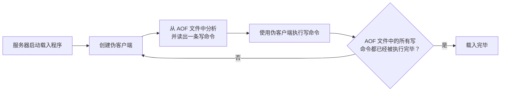

## 数据库

### 服务器中的数据库

```c
struct redisServer {

    // ...

    // 一个数组，保存着服务器中的所有数据库
    redisDb *db;

    // ...

    // 服务器的数据库数量，默认16个
    int dbnum;

    // ...

};
```

初始化服务器，会根据 dbnum 属性来决定创建多少个数据库

dbnum 属性的值由服务器配置的 database 选项决定，默认情况下，该选项的值为16，所以 Redis 服务器默认会创建 16 个数据库。

### 切换数据库

客户端切换0号数据库命令 `SELECT 0`

```c
typedef struct redisClient {

    // ...
    // 记录客户端当前正在使用的数据库
    redisDb *db;

    // ...

} redisClient;
```
redisClient.db 指针指向 redisServer.db 数组中的其中一个元素，就是客户端的目标数据库。

通过修改 redisClient.db 指针，让它指向服务器中的不同数据库，从而实现切换目标数据库的功能——这就是 SELECT命令的实现原理。

### 数据库键空间

Redis 是一个键值对（key-value pair）数据库服务器，服务器中的每个数据库都由 1 个 redis.h/redisDb 结构表示，其中，redisDb 结构的 dict 字典保存了数据库中的所有键值对，我们将这个字典称为键空间（key space）：

```c
typedef struct redisDb {

    // ...

    // 数据库键空间，保存着数据库中的所有键值对
    dict *dict;

    // ...

} redisDb;
```
redisDb 结构的 dict 字典保存了数据库中的所有键值对，我们称之为键空间（key space）；键空间和用户所见的数据库是直接对应的：

- 键空间的键也就是数据库的键，每个键都是一个字符串对象。
- 键空间的值就是数据库的值，每个值可以是任意一种 Redis 对象（字符串对象、列表对象、哈希表对象、集合对象和有序集合对象）。

因为数据库的键空间是一个字典，所以所有针对数据库的操作，比如添加一个键值对到数据库，或者从数据库中删除一个键值对，又或者在数据库中获取某个键值对等，实际上都是通过对键空间字典进行操作来实现的。

**添加、删除、更新、取值等操作的实现原理**

1. 添加新键：实际就是将一个新键值对添加到键空间字典中（键是字符串对象，值是任意一种 Redis 对象） `SET`
2. 删除键：就是删除键空间的键值对对象 `DEL`
3. 更新键：对键空间里面键所对应的值对象进行更新，根据值对象的类型不同，更新的具体方法也会有所不同。 `SET`
4. 取值： 在键空间中取出键所对应的值对象，根据值对象的类型不同，具体的取值方法也会有所不同。 `GET`
5. 清空整个数据库：删除键空间所有的键值对`FLUSHDB`
6. 随机返回数据库中某个键：`RANDOMKEY`
7. 返回数据库键数量： 返回键空间中包含的键值对的数量 `DBSIZE` 
8. EXISTS, RENAME, KEYS 等等

### 设置键的生存时间或过期时间

`EXPIRE`或者`PEXPIRE`，客户端可以以秒或者毫秒精度为数据库中的某个键设置生存时间（Time To Live，TTL），经过TTL之后，服务器就会自动删除生存时间为0的键；

`EXPIREAT`或者`PEXPIREAT`以秒或毫秒给数据库的某个键设置过期时间（expire time），过期时间是一个 UNIX 时间戳，当键的过期时间来临时，服务器就会自动从数据库删除这个键。

`TTL`和`PTTL`检查键的剩余生存时间，返回距离被服务器自动删除还有多长时间。

`PERSIST`移除一个键的过期时间，在过期字典中查找给定的键，并解除键和值（过期时间）在过期字典中的关联。

**那么过期键如何判定：**

   1. 检查键是否存在于过期字典：如果存在，那么取得键的过期时间。
   2. 检查当前 UNIX 时间戳是否大于键的过期时间：如果是的话，那么键已经过期；否则未过期。

### 过期键删除策略

1. **定时删除：**在设置键的过期时间的同时，创建一个定时器，让定时器在过期时间来临时，立即执行对键的删除操作。
2. **惰性删除：**放任过期不管，但是每次从键空间获取键时，都检查取得的键是否过期，如果过期的话，就删除该键；如果没有过期，就返回该键。
3. **定期删除：**每隔一段时间，程序就对数据库进行一次检查，删除里面的过期键。至于要删除多少过期键，以及要检查多少个数据库，则由算法决定。

#### 定时删除

定时删除策略对内存是最友好的：通过使用定时器，定时删除策略可以保证过期键会尽可能快地被删除，并释放过期键所占用的内存。

另一方面，定时删除策略的缺点是，它对 CPU 时间是最不友好的：在过期键比较多的情况下，删除过期键这一行为可能会占用相当一部分 CPU 时间，在内存不紧张但是 CPU 时间非常紧张的情况下，将 CPU 时间用在删除和当前任务无关的过期键上，无疑会对服务器的响应时间和吞吐量造成影响。

#### 定期删除

Redis 默认会每秒进行十次过期扫描，过期扫描不会遍历过期字典中所有的 key，而是采用了一种简单的贪心策略。

1. 从过期字典中随机 20 个 key；
2. 删除这 20 个 key 中已经过期的 key；
3. 如果过期的 key 比率超过 1/4，那就重复步骤 1；

设想一个大型的 Redis 实例中所有的 key 在同一时间过期了，会出现怎样的结果？

毫无疑问，Redis 会持续扫描过期字典 (循环多次)，直到过期字典中过期的 key 变得稀疏，才会停止 (循环次数明显下降)。这就会导致线上读写请求出现明显的卡顿现象。导致这种卡顿的另外一种原因是内存管理器需要频繁回收内存页，这也会产生一定的 CPU 消耗。

所以业务开发人员一定要注意过期时间，如果有大批量的 key 过期，要给过期时间设置一个随机范围，而不能全部在同一时间过期。

#### 惰性删除

所谓惰性策略就是在客户端访问这个key的时候，redis对key的过期时间进行检查，如果过期了就立即删除，不会给你返回任何东西。

定期删除可能会导致很多过期key到了时间并没有被删除掉。所以就有了惰性删除。假如你的过期 key，靠定期删除没有被删除掉，还停留在内存里，除非你的系统去查一下那个 key，才会被redis给删除掉。这就是所谓的惰性删除，即当你主动去查过期的key时,如果发现key过期了,就立即进行删除,不返回任何东西.

<font color='red' style='font-weight:bold'>总结：定期删除是集中处理，惰性删除是零散处理。</font>

### Redis 的过期键删除策略

Redis 使用的时惰性删除和定期删除两种策略。

#### lazyfree

使用 DEL 命令删除体积较大的键， 又或者在使用
FLUSHDB 和 FLUSHALL 删除包含大量键的数据库时，造成redis阻塞的情况；另外redis在清理过期数据和淘汰内存超限的数据时，如果碰巧撞到了大体积的键也会造成服务器阻塞。

为了解决以上问题， redis 4.0 引入了lazyfree的机制，它可以将删除键或数据库的操作放在后台线程里执行， 从而尽可能地避免服务器阻塞。

lazyfree的原理不难想象，就是在删除对象时只是进行逻辑删除，然后把对象丢给后台，让后台线程去执行真正的destruct，避免由于对象体积过大而造成阻塞。redis的lazyfree实现即是如此，下面我们由几个命令来介绍下lazyfree的实现。

4.0 版本引入了 unlink 指令，它能对删除操作进行懒处理，丢给后台线程来异步回收内存。

UNLINK的实现中，首先会清除过期时间，然后调用dictUnlink把要删除的对象从数据库字典摘除，再判断下对象的大小（太小就没必要后台删除），如果足够大就丢给后台线程，最后清理下数据库字典的条目信息。

主线程将对象的引用从「大树」中摘除后，会将这个 key 的内存回收操作包装成一个任务，塞进异步任务队列，后台线程会从这个异步队列中取任务。任务队列被主线程和异步线程同时操作，所以必须是一个线程安全的队列。

Redis 提供了 flushdb 和 flushall 指令，用来清空数据库，这也是极其缓慢的操作。Redis 4.0 同样给这两个指令也带来了异步化，在指令后面增加 async 参数就会进入后台删除逻辑。

Redis4.0 为这些删除点也带来了异步删除机制，打开这些点需要额外的配置选项。

1、slave-lazy-flush 从库接受完 rdb 文件后的 flush 操作

2、lazyfree-lazy-eviction 内存达到 maxmemory 时进行淘汰

3、lazyfree-lazy-expire key 过期删除

4、lazyfree-lazy-server-del rename 指令删除 destKey

### AOF、RDB 和复制功能对过期键的处理

1. 生成 ADB 文件：执行 `SAVE`或者`BGSAVE`创建一个新的 RDB 文件时 ，程序会对数据库中的键进行检查，已过期的键不会被保存到新创建的 RDB 文件中。
2. 载入 RDB 文件：
   1. 主服务器模式运行：载入 RDB 文件时，会检查保存的键，未过期的会被载入，过期的则忽略。
   2. 从服务器模式运行：载入 RDB文件时，不论过期都载入。
3. AOF 文件写入：AOF 持久化模式运行时，键过期但没被删除，不会影响 AOF 文件；但是过期被删除后，程序会向 AOF 文件追加一条 `DEL`命令，来显示地记录该键已被删除。
4. AOF 重写：执行 AOF 重写过程中，程序会检查的，过期的键不会保存到重写后的 AOF 文件中。
5. 复制：由主服务器来控制从服务器统一地删除过期键，保证主从服务器数据的一致性。

### 数据库通知

当 Redis 命令对数据库进行修改之后，服务器会根据配置向客户端发送数据库通知。

1. 键空间通知（key-space notification） 某个键执行了什么命令
2. 键事件通知（key-event notification） 某个命令被什么键执行了

## RDB 持久化

Redis 是一个键值对数据库服务器，服务器中通常包含着任意个非空数据库，而每个非空数据库中又可以包含任意个键值对，为了方便起见，我们将服务器中的非空数据库以及它们的键值对统称为数据库状态。

问题：一旦服务器进程退出，服务器中的数据库状态也会消失不见。。

为了解决这个问题，Redis 提供了 RDB 持久化功能，这个功能可以将 Redis 在内存中的数据库状态保存到磁盘里面，避免数据意外丢失。

RDB 持久化功能所生成的 RDB 文件是一个经过压缩的二进制文件，通过该文件可以还原生成 RDB 文件时的数据库状态。

### RDB 文件的创建与载入

有两个 Redis 命令可以用于生成 RDB 文件，一个是`SAVE`，另一个是`BGSAVE`。

`SAVE`命令会阻塞 Redis 服务器进程，直到 RDB 文件创建完毕为止，在服务器进程阻塞期间，服务器不能处理任何命令请求。

`BGSAVE`命令会派生出一个子进程，然后由子进程负责创建 RDB 文件，服务器进程（父进程）继续处理命令请求。

`SAVE`和`BGSAVE`可以用于生成 RDB 文件。

`SAVE`会阻塞 Redis 服务器进程，直到 RDB 文件创建完毕为止，**在阻塞期间，服务器不能处理任何命令请求；**

`BGSAVE`会派生出一个子进程，由子进程负责创建 RDB 文件，服务器进程（父进程）继续处理命令请求。

```python
def SAVE():

   # 创建 RDB 文件
   rdbSave()

def BGSAVE():

   # 创建子进程
   pid = fork()

   if pid == 0:
      # 子进程负责创建 RDB 文件
      rdbSave()
      # 完成之后向父进程发送信号
      signal_parent()
   elif pid > 0:
      # 父进程继续处理命令请求，并通过轮询等待子进程的信号
      handle_request_and_wait_signal()
   else:
      # 处理出错情况
      handle_fork_error()
```

**RDB 文件的载入**工作是在服务器启动时自动执行的，所以 Redis 并没有专门用于载入RDB文件的命令，只要Redis 服务器在启动时检测到 RDB 文件存在，它就会自动载人 RDB 文件。

因为 AOF 文件的更新频率通常比 RDB 文件的更新频率高，所以：

1. 如果服务器开启了AOF持久化功能，那么服务器会优先使用 AOF 文件来还原数据库状态。
2. 只有在 AOF 持久化功能处于关闭状态时，服务器才会使用 RDB 文件来还原数据库状态。

| 过程                  | 服务器状态                                                                                                                                                   |
|----------------------|-------------------------------------------------------------------------------------------------------------------------------------------------------------|
| `SAVE`/`BGSAVE` 执行时   | `SAVE`: 服务器被阻塞，客户端命令被拒绝。<br>`BGSAVE`: 服务器可以处理命令请求，但不允许同时执行两个 `SAVE`/`BGSAVE` 命令以避<br>免竞争条件。<br>`BGREWRITEAOF`/`BGSAVE`: 不能同时执行。 |
| RDB 文件载入时       | 服务器在载入 RDB 文件期间一直处于阻塞状态，直到载入工作完成。                                                                                                |

| 过程                            | 服务器状态                                                                                                            |
|--------------------------------|----------------------------------------------------------------------------------------------------------------------|
| SAVE 命令执行时                 | Redis 服务器被阻塞，客户端发送的所有命令请求都会被拒绝。只有在服务器执行<br>完 SAVE 命令、重新开始接受命令请求之后，客户端发送的命令才会被处理。|
| BGSAVE 命令执行时               | Redis 服务器仍然可以继续处理客户端的命令请求。<br>1. 在 BGSAVE 命令执行期间，客户端发送的 SAVE 命令会被服务器拒绝，服务器禁止`SAVE`<br>命令和 BGSAVE 命令同时执行是为了避免父进程(服务器进程)和子进程同时<br>执行两个 rdbSave 调用，防止产生竞争条件。<br>2. 在 BGSAVE 命令执行期间，客户端发送的 BGSAVE 命令会被服务器拒绝，因为同时执行<br>两个 BGSAVE 命令也会产生竞争条件。<br>3. BGREWRITEAOF 和 BGSAVE 两个命令不能同时执行。a) 如果 BGSAVE 命令正在执行，那么<br>客户端发送的 BGREWRITEAOF 命令会被延迟到 BGSAVE 命令执行完毕之后执行。b) 如果<br>`BGREWRITEAOF`命令正在执行，那么客户端发送的 BGSAVE 命令会被服务器拒绝。（不让它俩同时执行是源于性能考虑）                |
| RDB 文件载入时                  | 服务器在载入 RDB 文件期间，会一直处于阻塞状态，直到载入工作完成为止。                                                 |

This table outlines the server status for each process/command in Redis, including the behavior during SAVE, BGSAVE, and RDB file loading processes.


### 自动间隔性保存

因为 BGSAVE 命令可以在不阻塞服务器进程的情况下执行，所以 Redis 允许用户通过设置服务器配置的 save 选项，让服务器每隔一段时间自动执行一次 BGSAVE 命令。用户可以通过 save 选项设置多个保存条件，但只要其中任意一个条件被满足，服务器就会执行 BGSAVE 命令。

配置 save 选项的保存条件，自动执行 `BGSAVE`命令。

默认的是 

```yml
save 900 1
save 300 10
save 60 10000
```

`struct saveparam *saveparams;`数组，每个元素都保存一个 save 选项设置的保存条件；

`long long dirty;`计数器记录距离上次成功执行 save 或 bgsave 命令之后，服务器对数据库状态（服务器中的所有的数据库）进行了多少次修改；

`time_t lastsave;`UNIX 时间戳，记录了服务器上一次成功执行 save 或 bgsave 的事件。

Redis 服务器周期性操作函数 serverCron 默认每隔 100 ms就会执行一次，检查 save 选项所设置的保存条件是否满足，满足则执行 bgsave；

### RDB 文件结构

各个部分如下
`REDIS`、`db_version`、`databases`、`EOF`、`check_sum`

1. `REDIS`5字节保存“REDIS”五个字符，在载入文件时，快速检查是否为 RDB 文件；
2. `db_version`4字节，记录 RDB 文件的版本号；
3. `databases`包含0或任意多个数据库，以及各个数据库中的键值对数据；
   1. 组成：`SELECTDB`、`db_number`、`key_value_pairs`
   2. `SELECTDB`1字节标志接下来读入的时一个数据库号码
   3. `db_number`1/2/5字节，调用 select 命令，切换数据库
   4. `key_value_pairs`保存了所有的键值对
4. `EOF`1字节，这个常量标志RDB文件正文内容介绍，读入程序到这，所有的键值对都载入完毕；
5. `check_sum`8字节无符号整数，保存一个校验和，对前面四部分的内容计算出来的，检查出错或者损坏情况。

### 分析 RDB 文件

我们使用`od`命令来分析 Redis 服务器产生的 RDB 文件，该命令可以用给定的格式转存(dump)并打印输人文件。比如说，给定 -c 参数可以以 ASCI 编码的方式打印输人文件给定 -x 参数可以以十六进制的方式打印输入文件，诸如此类，具体的信息可以参考`od`命令的文档。

```bash
# -c 以 ASCII 编码的方式打印 RDB 文件
od -c dump.rdb
# -cx 同时以 ASCII 编码和十六进制格式打印 RDB 文件
od -cx dump.rdb
```

另外 Redis 本身带有 RDB 文件检查工具 redis-check-dump。

## AOF 持久化

<font color='red' style='font-weight:bold'>AOF 持久化（Append Only File）通过保存 Redis 服务器所执行的写命令来记录数据库状态的。</font>

以独立日志的方式记录每次写命令，重启时再重新执行 AOF 文件中的命令达到恢复数据的目的。AOF 的主要作用是解决了数据持久化的实时性,目前已经是 Redis 持久化的主流方式。

1. AOF 功能分命令追加（append）、文件写入、文件同步（sync）三个步骤
   1. 命令追加：服务器执行完一个写命令之后，会以协议格式将被执行的写命令追加到服务器状态的 `aof_buf`缓冲区的末尾；
   2. 写入与同步：不同 appendfsync 值会删除不同的持久化行为
      1. always 将 aof_buf 缓冲区中的所有内容写入并同步到 AOF 文件
      2. everysec 将 aof_buf 缓冲区中的所有内容写入到 AOF 文件，如果上次同步 AOF 文件事件距离现在超过1s，那么再对 AOF 文件进行同步，并且这个同步操作时由一个线程专门负责执行的。
      3. no 将 aof_buf 缓冲区中的所有内容写入到 AOF 文件，但不对 AOF 文件进行同步，何时同步由操作系统来决定。
2. AOF 文件的载入与数据还原
3. AOF 重写：解决 AOF 文件体积膨胀的文件，Redis 提供了 AOF 文件重写功能；是通过读取数据库中的键值对来实现的，程序无需对现有 AOF 文件进行任何读入、分析或者写入操作。
4. 在执行 `BGREWRITEAOF`命令时，Redis 服务器会维护一个 AOF 重写缓冲区，该缓冲区会在子进程创建新 AOF 文件期间，记录服务器执行的所有写命令。当子进程完成创建新 AOF 文件的工作之后，服务器会将重写缓冲区中的所有内容追加到新 AOF 文件的末尾，使得新旧两个 AOF 文件所保存的数据库状态一致。最好，服务器用新的 AOF 文件替换旧的 AOF 文件，以此来完成 AOF 文件重写操作。

### AOF 持久化的实现


| appendfsync 选项 | flushAppendOnlyFile 函数行为                                                                                                                                                             |
|------------------|--------------------------------------------------------------------------------------------------------------------------------------------------------------------------------------------|
| always           | 将 aof_buf 缓冲区中的所有内容写入并同步到 AOF 文件。                                                                                                                                       |
| everysec         | 将 aof_buf 缓冲区中的所有内容写入到 AOF 文件。如果上次同步 AOF 文件的时间距离现在<br>超过一秒钟，那么再次对 AOF 文件进行同步，并且这个同步操作是由一个线程专门负责执<br>行的。         |
| no               | 将 aof_buf 缓冲区中的所有内容写入到 AOF 文件，但不对 AOF 文件进行同步。何时同步由<br>操作系统来决定。                                                                                              |

### AOF 文件的载入与数据还原



Redis 读取 AOF 文件并还原数据库状态的详细步骤如下：

1. 创建一个不带网络连接的伪客户端（fake client）：因为 Redis 的命令只能在客户端上下文中执行，而载入 AOF 文件时所使用的命令直接来源于AOF文件而不是网络连接，所以服务器使用了一个没有网络连接的伪客户端来执行 AOF 文件保存的写命令，伪客户端执行命令的效果和带网络连接的客户端执行命令的效果完全一样。
2. 从 AOF 文件中分析并读取出一条写命令。
3. 使用伪客户端执行被读出的写命令。
4. 一直执行步骤 2. 和步骤 3.，直到 AOF文件中的所有写命令都被处理完毕为止。

### AOF 重写

随着服务器运行时间的流逝，AOF文件中的内容会越来越多，文件的体积也会越来越大

AOF 文件重写并不需要对现有的AOF 文件进行任何读取、分析或者写人操作，这个功能是**通过读取服务器当前的数据库状态来实现的。**

原理就是：首先从数据库中读取键现在的值，然后用一条命令去记录键值对，代替之前记录这个键值对的多条命令，这就是 AOF 重写功能的`aof_rewrite`实现原理。因为`aof_rewrite`函数生成的新 AOF 文件只包含还原当前数据库状态所必须的命令，所以新 AOF 文件不会浪费任何硬盘空间。

但是，因为这个函数会进行大量的写人操作，所以调用这个函数的线程将被长时间阻塞因为 Redis 服务器使用单个线程来处理命令请求，所以如果由服务器直接调用`aof_rewrite`函数的话，那么在重写 AOF 文件期间，服务期将无法处理客户端发来的命令请求。

为了解决这种数据不一致问题，Redis服务器设置了一个 AOF 重写缓冲区，这个缓冲区在服务器创建子进程之后开始使用，当 Redis 服务器执行完一个写命令之后，它会同时将这个写命令发送给 AOF 缓冲区和 AOF 重写缓冲区。

这也就是说，在子进程执行 AOF 重写期间，服务器进程需要执行以下三个工作：

1. 执行客户端发来的命令。
2. 将执行后的写命令追加到 AOF 缓冲区。
3. 将执行后的写命令追加到 AOF 重写缓冲区。

**这样一来可以保证：**

- AOF缓冲区的内容会定期被写人和同步到AOF文件，对现有AOF文件的处理工作会如常进行。
- 从创建子进程开始，服务器执行的所有写命令都会被记录到 AOF 重写缓冲区里面。

当子进程完成 AOF 重写工作之后，它会向父进程发送一个信号，父进程在接到该信号之后，会调用一个信号处理函数，并执行以下工作:

1. 将 AOF 重写缓冲区中的所有内容写人到新 AOF 文件中，这时新 AOF 文件所保存的数据库状态将和服务器当前的数据库状态一致。
2. 对新的 AOF 文件进行改名，原子地（atomic）覆盖现有的 AOF 文件，完成新旧两个 AOF 文件的替换。这个信号处理函数执行完毕之后，父进程就可以继续像往常一样接受命令请求了。在整个 AOF后台重写过程中，只有信号处理函数执行时会对服务器进程（父进程）造成阻塞，在其他时候，AOF 后台重写都不会阻父进程，这将 AOF 重写对服务器性能造成的影响降到了最低。

## 事件

Redis 服务器时一个事件驱动程序，服务器需要处理以下两类事件：

1. **文件事件（file event）**：Redis 服务器通过套接字与客户端（或者其他 Redis 服务器）进行连接，而文件事件就是服务器对套接字操作的抽象。服务器与客户端（或者其他服务器）的通信会产生相应的文件事件，而服务器则通过监听并处理这些事件来完成一系列网络通信操作。
2. **时间事件（time event）**：Redis 服务器中的一些操作（比如 serverCron 函数）需要在给定的事件点执行，而时间事件就是服务器对这类定时操作的抽象。

### 文件事件

文件事件处理器（file event handler）：Redis 基于 Reactor 模式开发了自己的网络事件处理器（file event handler）；

1. 使用 I/O 多路复用（multiplexing）程序来同时监听多个套接字，并根据套接字目前执行的任务来为套接字关联不同的事件处理器。
2. 当被监听的套接字准备好执行连接应答（accept）、读取（read）、写入（write）、关闭（close）等操作时，与操作相对应的文件事件就会产生，这时文件事件处理器就会调用套接字之间关联好的事件处理器来处理这些事件。

#### 文件事件处理器构成

文件事件处理器由套接字、I/O多路复用程序、文件事件分派器(dispatcher)，以及事件处理器四个组成部分

文件事件是对套接字操作的抽象，每当一个套接字准备好执行连接应答(accept)、写人、读取、关闭等操作时,就会产生一个文件事件。因为一个服务器通常会连接多个套接字，所以多个文件事件有可能会并发地出现。

I/O 多路复用程序负责监听多个套接字，并向文件事件分派器传送那些产生了事件的套接字。


_文件事件处理器的四个组成部分_

#### I/O 多路复用程序的实现

都是通过包装常见的 select、epoll、evport 和 kqueue 这些 I/O 多路复用函数库来实现的。

因为 Redis 为每个 I/O 多路复用函数库都实现了相同的 API，所以 I/O 多路复用程序的底层实现是可以互换的。

问？[套接字是什么玩意](https://zh.wikipedia.org/wiki/%E7%B6%B2%E8%B7%AF%E6%8F%92%E5%BA%A7)

#### 文件事件处理器

Redis 为文件事件编写了多个处理器，这些事件处理器分别用于实现不同的网络通信需求；

1. **连接应答处理器：**对连接服务器的各个客户端进行应答
2. **命令请求处理器：**接收客户端传来的命令请求
3. **命令回复处理器：**向客户端返回命令的执行结果
4. **复制处理器：**主服务器和从服务器进行复制

### 时间事件

**Redis 的时间事件分为以下两类：**

1. 定时事件：让一段程序在指定的时间之后执行一次，当前时间的 30 秒后执行一次
2. 周期性事件：让一段程序每隔指定时间执行一次，每隔 30ms 执行一次

**一个时间事件主要由以下三个属性组成：**

1. `id`服务器为时间事件创建的全局唯一ID（标识号）
2. `when`毫秒精度的 UNIX 时间戳，记录时间事件的到达（arrive）时间
3. `timeProc`时间事件处理器，一个函数。当时间事件到达时，服务器就会调用相应的处理器来处理事件。

**时间事件处理器返回值：**

- 如果事件处理器返回 ae.h/AE_NOMORE，那么这个事件为定时事件：该事件在达到一次之后就会被删除，之后不再到达。
- 如果事件处理器返回一个非 AE_NOMORE 的整数值，那么这个事件为周期性时间：当一个时间事件到达之后，服务器会根据事件处理器返回的值，对时间事件的 when 属性进行更新，让这个事件在一段时间之后再次到达，并以这种方式一直更新并运行下去。比如说，如果一个时间事件的处理器返回整数值 30，那么服务器应该对这个时间事件进行更新，让这个事件在 30 毫秒之后再次到达。

#### 实现

Redis 服务器将所有时间事件都放在一个**无序链表**中，每当时间事件执行器运行时，就遍历整个链表，查找所有已到达的时间事件，并调用相应的事件处理器。


_用链表连接起来的三个时间事件_

注意，我们说保存时间事件的链表为无序链表，指的不是链表不按ID排序，而是说，该链表不按 when 属性的大小排序。正因为链表没有按 when 属性进行排序，所以当时间事件执行器运行的时候，它必须遍历链表中的所有时间事件，这样才能确保服务器中所有已到达的时间事件都会被处理。

#### serverCron 函数

时间事件应用实例：`serverCron` 函数

持续运行的 Redis 服务器需要定期对自身的资源和状态进行检查和调整，从而确保服务器可以长期、稳定地运行，这些定期操作由 redis.c/servercron 函数负责执行，它的主要工作包括：

1. 更新服务器的各类统计信息，比如时间、内存占用、数据库占用情况等。
2. 清理数据库中的过期键值对。
3. 关闭和清理连接失效的客户端。
4. 尝试进行 AOF 或 RDB 持久化操作。
5. 如果服务器是主服务器，那么对从服务器进行定期同步。
6. 如果处于集群模式，对集群进行定期同步和连接测试。

Redis 服务器以周期性事件的方式来运行 serverCron 函数，在服务器运行期间，每隔一段时间，servercron 就会执行一次，直到服务器关闭为止。


## 事件的调度与执行

服务器中同时存在文件事件和时间事件，事件调度执行由 `ae.c/aeProcessEvents` 函数负责，事件处理角度下的服务器运行流程：

`ae.c/aeProcessEvents `简单描述：

1. 拿到到达时间离当前时间最接近的时间事件 `time_event`
2. 计算出 `time_event` 距离到达还有多少毫秒 `remaind_ms`
3. 如果 `time_event` 已经到达了，那么 `remaind_ms`的值可能为负数，设定为 0
4. 根据`remaind_ms`的值，创建 `timeval` 结构
5. 堵塞并等待文件事件产生，最大阻塞事件 由 `timeval`结构决定，如果`remaind_ms`的值为0，那么这里的`aeApiPoll`执行完立马返回，不阻塞
6. 然后处理所有已产生的文件事件`processFileEvents()`
7. 然后处理所有已到达的时间事件`processTimeEvents()`


文件事件和时间事件是合作关系，服务器会轮流处理这两种事件，并且处理事件的过程中不会进行抢占。

时间事件的实际处理时间通常会比设定的到达时间晚一些。

## 客户端

Redis 服务器是典型的**一对多**服务器程序：一个服务器可以与多个客户端建立网络连接，每个客户端可以向服务器发送命令请求，而服务器则接收并处理客户端发送的命令请求，并向客户端返回命令回复。
使用** I/O 多路复用技术**实现的文件事件处理器，**单线程单进程**的方式处理命令请求，并与多个客户端进行网络通信。

```c
struct redisServer {
    // ...
    // 一个链表，保存了所有客户端状态
    list *clients;
    // ...
}
```

Redis 服务器状态结构的 clients 属性是一个**链表**，保存了所有与服务器链接的客户端的状态结构。

### 客户端属性

客户端状态包含的属性可以分两类：一类是比较通用的属性，另一类是和特定功能相关的属性

```c
typedef struct redisClient {
    // ...
    int fd;
    robj *name;
    // 记录客户端的角色
    int flags;
    // 输入缓冲区，最大不超过1GB，否则关闭该Client
    // Client 发送到Server的命令放在这里
    sds querybuf;
    // 分析出来的命令参数和个数
    robj **argv;
    int argc;
    // 命令的实现函数
    struct redisCommand *cmd;
    // 输出缓冲区，固定的输出缓冲区
    char buf[REDIS_REPLY_CHUNK_BYTES];
    int bufpos;
    // 可变大小的输出缓冲区
    list *reply;
    // 身份验证，0未通过，1通过
    int authenticated;
    // 时间相关属性
    time_t ctime;
    time_t lastinteraction;
    time_t obuf_soft_limit_reached_time;
    // ...
} redisClient;
```

### 客户端的创建与关闭

1. **创建普通客户端：**Client 通过网络与服务器连接，在客户端使用`connect`函数连接服务器，服务器调用连接事件处理器并为客户端创建相应的客户端状态，然后把这个新的客户端状态添加到**服务器状态结构**`**clients**`**链表的末尾。**
2. **关闭普通客户端：**。。。
3. **lua 脚本的伪客户端：**`redisClient *lua_client;`伪客户端在服务器运行的整个生命周期一直存在，直到服务器关闭，才关闭。
4. **AOF 文件的伪客户端：**服务器在载入 AOF 文件时，会创建一个伪客户端，载入完成就关闭。

## 服务器

Redis 服务器作用：

1. 负责与多个客户端建立网络连接
2. 处理命令请求
3. 在数据库中保存执行命令所产生的数据，并通过资源管理来维持服务器自身运转

### 命令请求的执行过程

1. 客户端将命令请求发送给服务器；
   1. 用户键入一个命令请求到客户端
   2. 客户端将命令请求转换成协议格式，发送到服务器
2. 服务器读取命令请求，并分析出命令参数；
   1. 因为客户端写入，客户端与服务端的连接套接字变得可读
   2. 读取套接字中协议格式的命令请求，并将其保存到客户端状态的输入缓冲区
   3. 对输入缓冲区的命令请求进行分析，提取其中的命令参数和参数个数，分别保存到客户端状态的 `argv` 和 `argc` 属性中
   4. 调用命令执行器，执行客户端指定的命令
3. 命令执行器根据参数查找命令的实现函数，然后执行实现函数并得出命令回复；
   1. 命令执行器：根据客户端状态的 `argv[0]` 参数，在命令表中查找参数所指定的命令，并保存到客户端状态的`cmd`属性中；命令表是一个字典，键是命令名字，值是一个个 `redisCommand` 结构，`cmd` 指向的就是 `redisCommand` 结构
   2. 命令执行器：执行预备操作验证，检查等等
   3. 命令执行器：调用命令的实现函数 `client->cmd->proc(client);`
   4. 命令执行器：执行后续工作，写日志，ROF 持久化，复制等
4. 服务器将命令回复返回给客户端。
   1. 命令实现函数将命令回复保存到客户端输出缓冲区
   2. 为客户端的套接字关联命令回复处理器
   3. 在客户端套接字可写时，服务器执行命令回复处理器，将客户端缓冲区中的命令回复（协议格式）发送给客户端。
   4. 协议格式`+OK\r\n`

### serverCron 函数

这个函数默认每隔100ms执行一次，管理服务器资源，保持服务器自身运转良好。
一些函数执行的操作和有关属性

1. 更新服务器时间缓存
2. 更新LRU时钟
3. 更新服务器每秒执行命令次数：抽样计算的方式，估算并记录服务器在最近一秒钟处理的命令请求数量
4. 更新服务器内存峰值记录 `stat_peak_memory`
5. 处理`SIGTERM`信号
6. 管理客户端资源：两个检查1连接是否超时2输入缓冲区是否过大
7. 管理数据库资源：删除过期键，收缩字典等待
8. 执行被延迟的`BGREWRITEAOF`
9. 检查持久化操作的运行状态
10. 将 AOF 缓冲区的内容写入 AOF 文件
11. 关闭异步客户端
12. 增加 `cronloops`计数器的值

### 初始化服务器

服务器从启动到能够处理客户端命令请求还要以下步骤

1. 初始化服务器状态
2. 载入服务器配置
3. 初始化服务器数据结构
4. 还原数据库状态
   1. 有 AOF 持久化功能，则先用 AOF 文件还原
   2. 否，用 RDB 文件还原数据库状态
5. 执行事件循环
