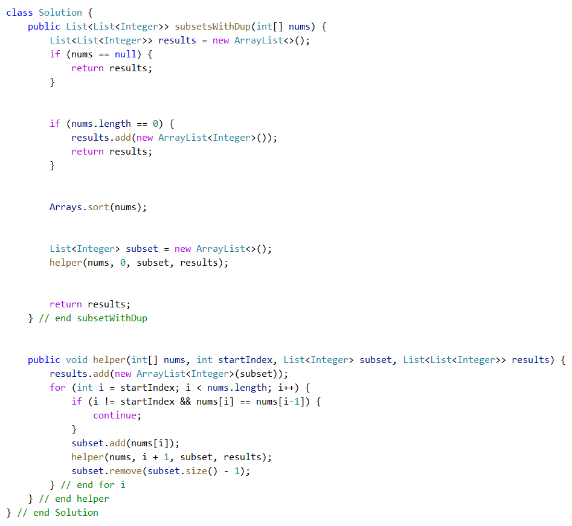

## Outline

- Linear Data Structure

  - Queue

  - Stack

  - Hash

- Tree Data Structure
  - Heap

## What is Data Structure?

Data Structure is a way to organize data.

It provides some methods to handle data stream, 

e.g. insert, delete, etc.

## Queue

Operations

- O(1) Push
- O(1) Pop
- O(1) Top


Core data structure for BFS!

### java.util.Queue<E>

- `boolean add(E element)`
- `boolean offer(E element)` 如果队列没有满，将给定的元素添加到这个队列的队尾并返回 true。如果队列已满，第一个方法将抛出一个 IllegalStateException，而第二个方法返回 false。
- `E remove()`
- `E poll()` 假如队列不为空，删除并返回这个队列队头的元素。如果队列是空的，第一个方法抛出 NoSuchElementException，而第二个方法返回 null。
- `E element()`
- `E peek()` 如果队列不为空，返回这个队列队头的元素，但不删除。如果队列空，第一个方法将抛出一个 NoSuchElementException，而第二个方法返回 null。


## Stack

Operations:

- O(1) Push
- O(1) Pop
- O(1) Top


### java.util.Stack<E>

- `E push(E item)` 将 item 压入栈并返回 item。
- `E pop()` 弹出并返回栈顶的 item。如果栈为空，不要调用这个方法。
- `E peek()` 返回栈顶元素，但不弹出。如果栈为空，不要调用这个方法。


### Min Stack

Lintcode https://www.lintcode.com/problem/min-stack/

Leetcode https://leetcode.com/problems/min-stack/

Solution https://www.jiuzhang.com/solutions/min-stack/

#### Description

Design a stack that supports push, pop, top, and retrieving the minimum element in constant time.

Implement the MinStack class:

- MinStack() initializes the stack object.
- void push(int val) pushes the element val onto the stack.
- void pop() removes the element on the top of the stack.
- int top() gets the top element of the stack.
- int getMin() retrieves the minimum element in the stack.

You must implement a solution with O(1) time complexity for each function.


**Example 1:**

Input ["MinStack","push","push","push","getMin","pop","top","getMin"] [[],[-2],[0],[-3],[],[],[],[]] 

Output [null,null,null,null,-3,null,0,-2] 

Explanation MinStack 

minStack = new MinStack(); 

minStack.push(-2); 

minStack.push(0); 

minStack.push(-3); 

minStack.getMin(); // return -3 

minStack.pop(); 

minStack.top();    // return 0 

minStack.getMin(); // return -2 


**Constraints:**

- -231 <= val <= 231 - 1
- Methods pop, top and getMin operations will always be called on **non-empty** stacks.
- At most 3 * 104 calls will be made to push, pop, top, and getMin.

#### Solutions

使用两个仅支持 pop 和 push 的栈就可以完成, stack 储存压入的数据, minStack 储存最小值.

- push 直接把元素压入 stack, 对于 minStack, 如果它为空则直接压入, 反之压入当前元素与 minStack 栈顶的最小值
- pop 两个栈都弹出一个元素, 返回 stack 弹出的元素
- min 返回 minStack 的栈顶

还可以令 minStack 为单调栈, 即push时只有元素更小的时候才放入这个栈, 而pop时只有栈顶与stack栈顶相同时才弹出

这样可以节约一定的空间, 但是实质上空间复杂度仍然是 O(n), 且多了一些判断, 并不一定更优

version 1:

```java
public class MinStack {
    private Stack<Integer> stack;
    private Stack<Integer> minStack;
    public MinStack() {
        stack = new Stack<Integer>();
        minStack = new Stack<Integer>();
    }

    public void push(int number) {
        stack.push(number);
        if (minStack.isEmpty()) {
            minStack.push(number);
        } else {
            minStack.push(Math.min(number, minStack.peek()));
        }
    }

    public int pop() {
        minStack.pop();
        return stack.pop();
    }

    public int min() {
        return minStack.peek();
    }
}
```

version 2, save more space. but space complexity doesn't change.

```java
public class MinStack {
    private Stack<Integer> stack; 
    private Stack<Integer> minStack;

    public MinStack() {
        stack = new Stack<Integer>();
        minStack = new Stack<Integer>();
    }

    public void push(int number) {
        stack.push(number);
        if (minStack.empty() == true)
            minStack.push(number);
        else if (minStack.peek() >= number) // 这里考虑的相等的情况也会继续push
            minStack.push(number);
    }

    public int pop() {
        if (stack.peek().equals(minStack.peek()))
            minStack.pop();
        return stack.pop();
    }

    public int min() {
        return minStack.peek();
    }
}
```

### Implement Queue by Two Stacks

面试官一般就说一句话“你用栈实现一个队列”

（可以用两个！！）

Lintcode https://www.lintcode.com/problem/implement-queue-by-two-stacks/

Leetcode https://leetcode.com/problems/implement-queue-using-stacks/

SoluLtion https://www.jiuzhang.com/solutions/implement-queue-by-two-stacks/

#### Description

Implement a first in first out (FIFO) queue using only two stacks. The implemented queue should support all the functions of a normal queue (push, peek, pop, and empty).

Implement the MyQueue class:

- void push(int x) Pushes element x to the back of the queue.
- int pop() Removes the element from the front of the queue and returns it.
- int peek() Returns the element at the front of the queue.
- boolean empty() Returns true if the queue is empty, false otherwise.

**Notes:**

- You must use **only** standard operations of a stack, which means only push to top, peek/pop from top, size, and is empty operations are valid.
- Depending on your language, the stack may not be supported natively. You may simulate a stack using a list or deque (double-ended queue) as long as you use only a stack's standard operations.


**Example 1:**

Input ["MyQueue", "push", "push", "peek", "pop", "empty"] [[], [1], [2], [], [], []] 

Output [null, null, null, 1, 1, false] 

Explanation 

MyQueue myQueue = new MyQueue(); 

myQueue.push(1); // queue is: [1] 

myQueue.push(2); // queue is: [1, 2] (leftmost is front of the queue) 

myQueue.peek(); // return 1 

myQueue.pop(); // return 1, queue is [2] 

myQueue.empty(); // return false 


**Constraints:**

- 1 <= x <= 9
- At most 100 calls will be made to push, pop, peek, and empty.
- All the calls to pop and peek are valid.


**Follow-up:** Can you implement the queue such that each operation is [amortized](https://en.wikipedia.org/wiki/Amortized_analysis) O(1) time complexity? In other words, performing n operations will take overall O(n) time even if one of those operations may take longer.

#### Solutions

push加入到栈中 top即从A栈出到B栈，执行完之后，B栈push出栈顶元素，作为返回值，然后继续入站栈，最后B栈出，返回A栈。 pop即从A栈出到B栈，执行完之后，B栈push出栈顶元素，然后B栈依次出，返回A栈。

```java
public class MyQueue {
    private Stack<Integer> stack1;
    private Stack<Integer> stack2;

    public MyQueue() {
        stack1 = new Stack<Integer>();
        stack2 = new Stack<Integer>();
    }

    private void stack2ToStack1(){
        while(! stack2.isEmpty()){
            stack1.push(stack2.pop());
        }
    }

    public void push(int element) {
        stack2.push(element);
    }

    public int pop() {
        if(stack1.empty() == true){
            this.stack2ToStack1();
        }
        return stack1.pop();
    }

    public int top() {
        if(stack1.empty() == true){
            this.stack2ToStack1();
        }
        return stack1.peek();
    }
}
```

### Largest Rectangle in Histogram

直方图的最大子矩阵

一道题经典的栈的运用。

Lintcode https://www.lintcode.com/problem/largest-rectangle-in-histogram/

Leetcode https://leetcode.com/problems/largest-rectangle-in-histogram/

Solution https://www.jiuzhang.com/solutions/largest-rectangle-in-histogram/

#### Description

Given an array of integers heights representing the histogram's bar height where the width of each bar is 1, return *the area of the largest rectangle in the histogram*.


**Example 1:**


Input: heights = [2, 1, 5, 6, 2, 3] 

Output: 10 

Explanation: The above is a histogram where width of each bar is 1. The largest rectangle is shown in the red area, which has an area = 10 units. 

**Example 2:**


Input: heights = [2, 4] 

Output: 4 


**Constraints:**

- 1 <= heights.length <= 10^5
- 0 <= heights[i] <= 10^4


#### Solutions


递增栈 / 递减栈

单调栈

单调栈专门就是来解决 O(n^2) => O(n) / O(nlogn)

而DP解决的是 => O(2^n) => O(n^2) 就是指数级到多项式


O(nlogn)

1. 排序，nlogn，n*二分
2. 借助一个logn的数据结构 heap / priority queue


单调栈的核心思想，是及时去掉无用数据。


用九章算法强化班中讲过的单调栈(stack)。维护一个单调递增栈，逐个将元素 push 到栈里。push 进去之前先把 >= 自己的元素 pop 出来。 每次从栈中 pop 出一个数的时候，就找到了往左数比它小的第一个数（当前栈顶）和往右数比它小的第一个数（即将入栈的数）， 从而可以计算出这两个数中间的部分宽度 * 被pop出的数，就是以这个被pop出来的数为最低的那个直方向两边展开的最大矩阵面积。 因为要计算两个数中间的宽度，因此放在 stack 里的是每个数的下标。

考点：单调栈	很tricky

```java
public class Solution {
    public int largestRectangleArea(int[] height) {
        if (height == null || height.length == 0) {
            return 0;
        }
        
        Stack<Integer> stack = new Stack<Integer>();  //维护单调递增
        int max = 0;
        for (int i = 0; i <= height.length; i++) {
            int curt = (i == height.length) ? -1 : height[i];
            while (!stack.isEmpty() && curt <= height[stack.peek()]) {	//如果栈顶高度大于当前高度	            
                int h = height[stack.pop()];		//保存栈顶元素信息
                int w = stack.isEmpty() ? i : i - stack.peek() - 1;		//如果栈已经为空，宽度为i，否则i-s.top()-1
                max = Math.max(max, h * w);
            }
            stack.push(i);				//压入栈中
        }
        
        return max;
    }
}
```

### Max Tree

Lintcode https://www.lintcode.com/problem/max-tree/

Leetcode https://leetcode.com/problems/maximum-binary-tree/

Solution https://www.jiuzhang.com/solutions/max-tree/

#### Description

You are given an integer array nums with no duplicates. A **maximum binary tree** can be built recursively from nums using the following algorithm:

1. Create a root node whose value is the maximum value in nums.
2. Recursively build the left subtree on the **subarray prefix** to the **left** of the maximum value.
3. Recursively build the right subtree on the **subarray suffix** to the **right** of the maximum value.

Return *the* ***maximum binary tree\*** *built from* nums.


**Example 1:**


Input: nums = [3,2,1,6,0,5] Output: [6,3,5,null,2,0,null,null,1] 

Explanation: The recursive calls are as follow: 

- The largest value in [3,2,1,6,0,5] is 6. Left prefix is [3,2,1] and right suffix is [0,5].     

  - The largest value in [3,2,1] is 3. Left prefix is [] and right suffix is [2,1].         

    - Empty array, so no child.

    - The largest value in [2,1] is 2. Left prefix is [] and right suffix is [1].             
      - Empty array, so no child.
        - Only one element, so child is a node with value 1.     

- The largest value in [0,5] is 5. Left prefix is [0] and right suffix is [].         

  - Only one element, so child is a node with value 0.         

  - Empty array, so no child. 

**Example 2:**


Input: nums = [3, 2, 1] 

Output: [3, null, 2, null, 1] 


**Constraints:**

- 1 <= nums.length <= 1000
- 0 <= nums[i] <= 1000
- All integers in nums are **unique**.


#### Solutions

考点：

- 数据结构设计
- 树的调整
- 单调栈

题解： 利用数组实现基本数据结构的调整，当前遍历到的数字比stk中的最后一个大时，将stk中的最后一个数字转变为当前节点的左子树，循环调整至stk为空或者stk中的最后节点值大于新节点的值。如果stk不为空，说明stk中的最后一个节点值大于新节点值，则将新节点设为stk中的最后一个节点的右子树，将新节点存入stk。

```java
/**
 * Definition of TreeNode: public class TreeNode { public int val; public
 * TreeNode left, right; public TreeNode(int val) { this.val = val; this.left =
 * this.right = null; } }
 */
public class Solution {
  /**
   * @param A
   *            : Given an integer array with no duplicates.
   * @return: The root of max tree.
   */
  public static TreeNode maxTree(int[] A) {
    // write your code here
    Stack<TreeNode> stack = new Stack<TreeNode>();	 //申请栈存放节点		
    TreeNode root = null;                            
    for (int i = 0; i <= A.length; i++) {
      TreeNode right = i == A.length ? new TreeNode(Integer.MAX_VALUE) //如果i==length,新建节点设置值为无穷大，否则值为A[i]
          : new TreeNode(A[i]);
      while (!stack.isEmpty()) {        //如果栈不为空
        if (right.val > stack.peek().val) {			//如果新建节点的值比栈顶大
          TreeNode nodeNow = stack.pop();          //临时保存栈顶节点并弹出
          if (stack.isEmpty()) {                   //如果栈为空
            right.left = nodeNow;                  //临时保存的栈顶的节点是当前新建节点的左子树
          } else {
            TreeNode left = stack.peek();
            if (left.val > right.val) {            
              right.left = nodeNow;                //新建节点的左子树为临时保存节点
            } else {
              left.right = nodeNow;                //当前栈顶的节点的右子树为新建节点
            }
          }
        } else
          break;
      }
      stack.push(right);                          //将新建节点压入栈中
    }
    return stack.peek().left;
  }
}
/**
 * Definition of TreeNode:
 * public class TreeNode {
 *     public int val;
 *     public TreeNode left, right;
 *     public TreeNode(int val) {
 *         this.val = val;
 *         this.left = this.right = null;
 *     }
 * }
 */
public class Solution {
    /**
     * @param A: Given an integer array with no duplicates.
     * @return: The root of max tree.
     */
    public TreeNode maxTree(int[] A) {
        // write your code here
        int len = A.length;
        TreeNode[] stk = new TreeNode[len];
        for (int i = 0; i < len; ++i)
            stk[i] = new TreeNode(0);			//新建节点
        int cnt = 0;
        for (int i = 0; i < len; ++i) {
            TreeNode tmp = new TreeNode(A[i]);
            while (cnt > 0 && A[i] > stk[cnt-1].val) {		//如果stk中的最后一个节点比新节点大
                tmp.left = stk[cnt-1];						//当前新节点的左子树为stk的最后一个节点
                cnt --;
            }
            if (cnt > 0)									//如果stk不为空
                stk[cnt - 1].right = tmp;					//将新节点设为stk最后一个节点的右子树
            stk[cnt++] = tmp;
        }
        return stk[0];
    }
}
```

## Hash

如果你用到了 HashMap，面试官就有可能追问

1. HashMap 的具体实现是什么？
2. 你能不能自己写一个 HashMap？
3. HashMap 是怎么解决冲突问题的？
4. Hash 为什么是 O(1) 的？


Operations

- O(1) Insert
- O(1) Delete
- O(1) Find


Hash Function


Collision

- Open Hashing (LinkedList)
- Closed Hashing (ArrayList)

### Hash Function

Typical: From string to int.

```java
int hashfunc(String key) {
    // do something to key
	// return a deterministic integer number
	return md5(key) % hash_table_size;
}
```

#### Hash Function - Magic Number 33

有的库实现的时候会取31

这段是Apache的一个底层库扒下来的。

```java
int hashfunc(String key) {
    int sum = 0;
	for (int i = 0; i < key.length(); i++) {
        sum = sum * 33 + (int)(key.charAt(i));
        sum = sum % HASH_TABLE_SIZE;
    }

	return sum;
}
```

尽量不要不同的 Key 算出一个同样的结果出来，要尽量避免这个事情。

### Collision

Open Hashing vs Closed Hashing



1. 让链表长度尽量的小，让整个数组大一点，那么冲突出现的概率就会小一点
2. 哈希函数设计的巧妙一点

#### Open Hashing

开放寻址法

#### Closed Hashing

类比上厕所，你占了我的坑，我去看看下一个坑是不是空的，如果是空的，我去占其他人的坑。

### Rehashing

https://www.lintcode.com/problem/rehashing/

https://www.lintcode.com/problem/hash-function/

### Hash in Java

- HashTable
- HashSet
- HashMap

Which on is Thread Safe? **Ans:** HashTable

#### java.util.HashSet<E>

- `HashSet()` 构造一个空散列集。
- `HashSet(Collection<? extends E> elements)` 构造一个散列集，并将集合中的所有元素添加到这个散列集中。
- `HashSet(int initialCapacity)` 构造一个空的具有指定容量（桶数）的散列集。
- `HashSet(int initialCapacity, float loadFactor)` 构造一个有指定容量和装填因子（0.0 ~ 1.0 之间的一个数，确定散列表填充的百分比，当大于这个百分比时，散列表进行再散列）的空散列集。

#### java.lang.Object

- `int hashCode()` 返回这个对象的散列码。散列码可以是任何整数，包括正数或负数。equals 和 hashCode 的定义必须兼容，即如果 x.equals(y) 为 true，x.hashCode() 必须等于 y.hashCode()。

#### java.util.Map<K, V>

- V get(Object key) 获取与键关联值；返回与键关联的对象，或者如果映射中没有这个对象，则返回 null。实现类可以禁止键位 null。
- `default V getOrDefault(Object key, V defaultValue)` 获得与键关联的值；返回与键关联的对象 ，或者如果未在映射中找到这个键，则返回 defaultValue。
- `V put(K key, V value)` 将关联的一对键和值放到映射中。如果这个键已经存在 ，新对象将取代与这个键关联的旧对象。这个方法将返回键关联的旧值。如果之前没有这个键，则返回 null。实现类可以禁止键或值为 null。
- `void putAll(Map<? extends K, ? extends V> entries)` 将指定映射中的所有映射条目添加到这个映射中。
- `boolean containsKey(Object key)` 如果在映射中已经有这个键，返回 true。
- `boolean containsValue(Object value)` 如果在映射中已经有这个值，返回 true。
- `default void forEach(BiConsumer<? super K,? super V> action)` 对这个映射中的所有键 / 值对应用这个动作。

#### java.util.HashMap<K, V>

- `HashMap()`
- `HashMap(int initialCapacity)`
- `HashMap(int initialCapacity, float loadFactor)` 用给定的容量和装填因子构造一个空散列映射（装填因子时一个 0.0 ~ 1.0 之间的数。这个数决定散列表填充的百分比。一旦到了这个比例，就要将其再散列到更大的散列表中）。默认的装填因子时 0.75。

#### java.util.HashTable<K, V>

HashTable 是在集合框架出现之前已经存在的大量“遗留的”容器类。

HashTable 与 HashMap 作用相同，接口也基本相同，是同步的，但是推荐使用 HashMap。

如果需要并发访问，则要使用 ConcurrentHashMap.


### LRU Cache

**这道题一定要会做！！**

Lintcode https://www.lintcode.com/problem/lru-cache/

Leetcode https://leetcode.com/problems/lru-cache/

Solution https://www.jiuzhang.com/solutions/lru-cache/

Example: [2 1 3 2 5 3 6 7]

#### Description

Design a data structure that follows the constraints of a [Least Recently Used (LRU) cache](https://en.wikipedia.org/wiki/Cache_replacement_policies#LRU).

Implement the LRUCache class:

- LRUCache(int capacity) Initialize the LRU cache with **positive** size capacity.
- int get(int key) Return the value of the key if the key exists, otherwise return -1.
- void put(int key, int value) Update the value of the key if the key exists. Otherwise, add the key-value pair to the cache. If the number of keys exceeds the capacity from this operation, **evict** the least recently used key.

The functions get and put must each run in O(1) average time complexity.


**Example 1:**

Input ["LRUCache", "put", "put", "get", "put", "get", "put", "get", "get", "get"] [[2], [1, 1], [2, 2], [1], [3, 3], [2], [4, 4], [1], [3], [4]] 

Output [null, null, null, 1, null, -1, null, -1, 3, 4] 

Explanation LRUCache 

lRUCache = new LRUCache(2); 

lRUCache.put(1, 1); // cache is {1=1} 

lRUCache.put(2, 2); // cache is {1=1, 2=2} 

lRUCache.get(1);    // return 1 

lRUCache.put(3, 3); // LRU key was 2, evicts key 2, cache is {1=1, 3=3} 

lRUCache.get(2);    // returns -1 (not found) 

lRUCache.put(4, 4); // LRU key was 1, evicts key 1, cache is {4=4, 3=3} 

lRUCache.get(1);    // return -1 (not found) 

lRUCache.get(3);    // return 3 

lRUCache.get(4);    // return 4 


**Constraints:**

- 1 <= capacity <= 3000
- 0 <= key <= 10^4
- 0 <= value <= 10^5
- At most 2 * 10^5 calls will be made to get and put.


#### Solutions

LinkedHashMap = DoublyLinkedList + HashMap

```java
HashMap<key, DoublyListNode> DoublyListNode {
    prev, next, key, value;
}
```

Newest node append to tail.

Eldest node remove from head.

LinkedHashMap<Integer> Java直接有这个数据结构！！

但是面试的时候，还是用 LinkedList 和 HashMap 来实现。


Singly Linked List 的版本

```java
public class LRUCache {
    class ListNode {
        public int key, val;
        public ListNode next;

        public ListNode(int key, int val) {
            this.key = key;
            this.val = val;
            this.next = null;
        }
    }

    private int capacity, size;
    private ListNode dummy, tail;
    private Map<Integer, ListNode> keyToPrev;

    /*
    * @param capacity: An integer
    */
    public LRUCache(int capacity) {
        this.capacity = capacity;
        this.keyToPrev = new HashMap<Integer, ListNode>();
        this.dummy = new ListNode(0, 0);
        this.tail = this.dummy;
    }

    private void moveToTail(int key) {
        ListNode prev = keyToPrev.get(key);
        ListNode curt = prev.next;

        if (tail == curt) {
            return;
        }

        prev.next = prev.next.next;
        tail.next = curt;
        curt.next = null;

        if (prev.next != null) {
            keyToPrev.put(prev.next.key, prev);
        }
        keyToPrev.put(curt.key, tail);

        tail = curt;
    }

    /*
     * @param key: An integer
     * @return: An integer
     */
    public int get(int key) {
        if (!keyToPrev.containsKey(key)) {
            return -1;
        }

        moveToTail(key);

        // the key has been moved to the end
        return tail.val;
    }

    /*
     * @param key: An integer
     * @param value: An integer
     * @return: nothing
     */
    public void set(int key, int value) {
        // get method will move the key to the end of the linked list
        if (get(key) != -1) {
            ListNode prev = keyToPrev.get(key);
            prev.next.val = value;
            return;
        }

        if (size < capacity) {
            size++;
            ListNode curt = new ListNode(key, value);
            tail.next = curt;
            keyToPrev.put(key, tail);

            tail = curt;
            return;
        }

        // replace the first node with new key, value
        ListNode first = dummy.next;
        keyToPrev.remove(first.key);

        first.key = key;
        first.val = value;
        keyToPrev.put(key, dummy);

        moveToTail(key);
    }
}
```


涉及删除和移动操作，使用链表，链表是有序的，一直维护，近期最多使用的放于尾部，那么每次缓存达到上限的时候，删除头部即可，其余为链表的基础操作模拟即可。

```java
public class LRUCache {
    private class Node{
        Node prev;
        Node next;
        int key;
        int value;

        public Node(int key, int value) {
            this.key = key;
            this.value = value;
            this.prev = null;
            this.next = null;
        }
    }

    private int capacity;
    private HashMap<Integer, Node> hs = new HashMap<Integer, Node>();
    private Node head = new Node(-1, -1);
    private Node tail = new Node(-1, -1);

    public LRUCache(int capacity) {
        this.capacity = capacity;
        tail.prev = head;
        head.next = tail;
    }

    public int get(int key) {
        if( !hs.containsKey(key)) {			//key找不到
            return -1;
        }

        // remove current
        Node current = hs.get(key);
        current.prev.next = current.next;
        current.next.prev = current.prev;

        // move current to tail
        move_to_tail(current);			//每次get，使用次数+1，最近使用，放于尾部

        return hs.get(key).value;
    }

    public void set(int key, int value) {			//数据放入缓存
        // get 这个方法会把key挪到最末端，因此，不需要再调用 move_to_tail
        if (get(key) != -1) {
            hs.get(key).value = value;
            return;
        }

        if (hs.size() == capacity) {		//超出缓存上限
            hs.remove(head.next.key);		//删除头部数据
            head.next = head.next.next;
            head.next.prev = head;
        }

        Node insert = new Node(key, value);		//新建节点
        hs.put(key, insert);
        move_to_tail(insert);					//放于尾部
    }

    private void move_to_tail(Node current) {    //移动数据至尾部
        current.prev = tail.prev;
        tail.prev = current;
        current.prev.next = current;
        current.next = tail;
    }
}
```

## Related Questions

https://www.lintcode.com/problem/subarray-sum/

https://www.lintcode.com/problem/copy-list-with-random-pointer/

https://www.lintcode.com/problem/anagrams/

https://www.lintcode.com/problem/longest-consecutive-sequence/

## Heap

Operations

- O(logN) Add
- O(logN) Remove
- O(1) Min/Max


- [] 整理这个位置的相关知识


## Median Number

Lintcode https://www.lintcode.com/problem/data-stream-median/

Solution https://www.jiuzhang.com/solutions/median-in-data-stream/

## Related Questions

https://www.lintcode.com/problem/heapify/

heapify 是帮助你理解堆的具体的存储时怎么存的

https://www.lintcode.com/problem/merge-k-sorted-lists/

https://www.lintcode.com/problem/merge-k-sorted-arrays/

https://www.lintcode.com/problem/ugly-number/