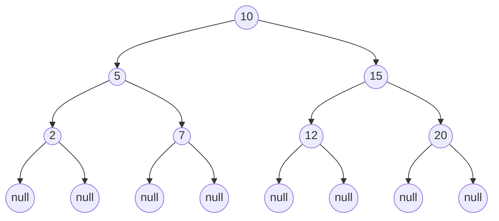

LeetCode <https://leetcode.cn/problems/binary-tree-inorder-traversal/>

```console
                10 == root
             /     \
            5       15 
          /   \    /   \
         2     7  12    20    
       /   \
     null  null
```



## Recursive

```java
/**
 * Definition for a binary tree node.
 * public class TreeNode {
 *     int val;
 *     TreeNode left;
 *     TreeNode right;
 *     TreeNode() {}
 *     TreeNode(int val) { this.val = val; }
 *     TreeNode(int val, TreeNode left, TreeNode right) {
 *         this.val = val;
 *         this.left = left;
 *         this.right = right;
 *     }
 * }
 */
class Solution {


    public List<Integer> inorderTraversal(TreeNode root) {

        List<Integer> result = new ArrayList<>();
        if (root == null) {
            return result;
        } 
        helper(root, result);

        return result;
    }

    private void helper(TreeNode root, List<Integer> result) {
        if (root == null) {
            return;
        }
        helper(root.left, result);
        result.add(root.val);
        helper(root.right, result);
    }
}
```


## Recursion without helper function

```java
/**
 * Definition for a binary tree node.
 * public class TreeNode {
 *     int val;
 *     TreeNode left;
 *     TreeNode right;
 *     TreeNode() {}
 *     TreeNode(int val) { this.val = val; }
 *     TreeNode(int val, TreeNode left, TreeNode right) {
 *         this.val = val;
 *         this.left = left;
 *         this.right = right;
 *     }
 * }
 */
class Solution {


    public List<Integer> inorderTraversal(TreeNode root) {

        List<Integer> result = new ArrayList<>();
        if (root == null) {
            return result;
        } 
        
        List<Integer> left = inorderTraversal(root.left);
        List<Integer> right = inorderTraversal(root.right);

        result.addAll(left);
        result.add(root.val);
        result.addAll(right);

        return result;
    }
}
```


**Complexity**

* Time = O(n) 
* Space = O(height) 


## Iterative

```java
/**
 * Definition for a binary tree node.
 * public class TreeNode {
 *     int val;
 *     TreeNode left;
 *     TreeNode right;
 *     TreeNode() {}
 *     TreeNode(int val) { this.val = val; }
 *     TreeNode(int val, TreeNode left, TreeNode right) {
 *         this.val = val;
 *         this.left = left;
 *         this.right = right;
 *     }
 * }
 */
class Solution {
    public List<Integer> inorderTraversal(TreeNode root) {
        List<Integer> result = new ArrayList<>();

        if (root == null) {
            return result;
        }

        Deque<TreeNode> stack = new LinkedList<>();
        TreeNode current = root;
        
        while (current != null || !stack.isEmpty()) {
            if (current != null) {
                stack.offerFirst(current);
                current = current.left;
            } else {
                current = stack.pollFirst();
                result.add(current.val);
                current = current.right;
            }
        }

        return result; 
    }
}
```

**Complexity**

* Time = O(n) 
* Space = O(n) 