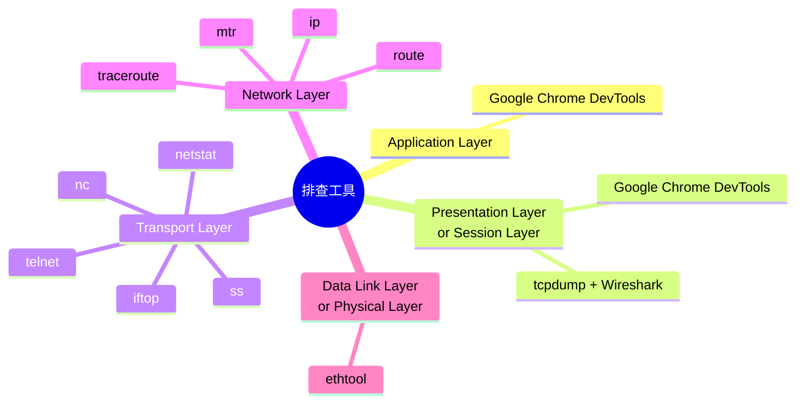

## 报文、帧、分组、段、数据包

报文（packet）：基本上每一层都可以用，“HTTP 报文”，“TCP 报文”，“IP 报文”

帧（frame）：第二层数据链路层的概念，表示第二层的报文，它包含帧头、载荷、**帧尾**。

分组是IP层报文，也就是侠义的 packet。

**段特指 TCP segment**，，也就是 TCP 报文。既然 segment 是“部分”的意思，那这个“整体”又是什么呢？它就是在应用层交付给传输层的消息（message）。当 message 被交付给传输层时，如果这个 message 的原始尺寸，超出了传输层数据单元的限制（比如超出了 TCP 的 MSS），它就会被划分为多个 segment。这个过程就是**分段**（segmentation），也是 TCP 层的一个很重要的职责。


Datagram 的中文叫**“数据报”**，但不是“数据包”。读音类似，但意思并不完全相同。前面说过，“数据包”是一个通用词，所以用“UDP 数据包”指代“UDP 数据报”并没有问题。但反过来，非 UDP 协议的数据包，比如 TCP 段，就不能叫“TCP 数据报”了，因为 TCP 不是 Datagram。


## 网络各层的排查工具



### 应用层

很多，HTTP 应用的排查工具，Google Chrome 的 F12

#### 找到有问题的服务端 IP

比如有用户报告死活访问不了你的网站，但是你很清楚这个网站的域名对应了很多 IP 地址，你怎么知道用户连的是哪个 IP 呢？

你可以这样做：让客户启用开发者工具，在 Network 页找到主页对象，在它的 Headers 部分，就能看到 Remote address，这里的 IP 就是当前连接的 IP，比如下面这样：


由于 DNS 解析，下次在此请求的地址可能就换了，**排查公网的访问问题**非常有用，流量大一点的都上 CDN 了，所以如果访问不了，需要检查这个地址再去排查。

#### 辅助排查网页慢的问题

访问页面感觉很慢，那么可以借助开发者工具的时间统计功能，，找到耗时较高的 HTTP 资源对象，再针对性排查。比如我觉得访问<https://github.com>很慢，那么可以先打开开发者工具，然后访问站点，等全部加载完成后，到 Network 页查看这些 HTTP 对象的加载时间。


不过，只能排查到是哪个资源对象耗时比较长，但更进一步的排查，比如“为什么这个对象的加载时间比别的对象长”这个问题❌。-> **抓包分析**

#### 解决失效 Cookie 带来的问题

有时候我们的 Cookie 过期了，导致无法正常登录站点，那么可以打开开发者工具，到 Application 页，找到 Storage -> Cookie，把对应的条目清除。这样下次你再访问这个站点，就已经“洗心革面”了。对站点来说，你就是一次新的访问，可以生成一次新的 Cookie 了。


当然，你通过删除浏览器缓存的方式也行。但开发者工具的优点是，可以细粒度到这个网站级别，而删除缓存的方式，删除的就是所有站点的 Cookie 了，这未必是你想要的。

## 表示层和会话层

第一种，还是基于浏览器做初步的检查，主要是围绕证书本身做检查。在浏览器的地址栏那里，有一个按钮，点开后就可以查看 TLS 证书等信息：


在上面的菜单中，继续点开 Connection is secure 按钮，进而点击 Certificate is valid 按钮，就能查看证书了。


另外，使用开发者工具的 Security 菜单，还可以查看更为详细的 TLS 信息，包括协议版本、密钥交换算法、证书有效期等等。


**第二种，关于 TLS 握手、密钥交换、密文传输等方面的排查，还是需要用 tcpdump 和 Wireshark 来做。**

在 Wireshark 中，可以更加全面地查看 TLS 细节。

各自展示的 Cipher suite，而在开发者工具里，我们只能看到协商过程中的各自展示的 Cipher suite，而在开发者工具里，我们只能看到协商完成后的选择。


Cipher suite 是一种用于网络通信中加密和解密数据的协议套件。它包含了一组加密算法、密钥交换算法和消息认证码（MAC）算法。当两个网络设备（如服务器和客户端）建立安全连接时，它们会协商选择一个适当的 cipher suite，用于加密数据以确保通信安全。

Cipher suite 通常由以下几个部分组成：

1. 加密算法（Encryption Algorithm）：用于加密通信中传输的数据。常见的加密算法包括对称加密算法（如AES）和非对称加密算法（如RSA）。

2. 密钥交换算法（Key Exchange Algorithm）：用于在通信开始时协商会话密钥。常见的密钥交换算法包括 Diffie-Hellman 和 ECDH。

3. 消息认证码算法（Message Authentication Code Algorithm）：用于验证数据的完整性和真实性，以防止数据被篡改。常见的 MAC 算法包括 HMAC 和 GCM。

通过协商选择合适的 cipher suite，通信双方可以确保数据在传输过程中得到加密保护，并且可以防止中间人攻击等安全威胁。


## 传输层

分场景介绍工具

#### 路径可达性测试

如果我们要测试 TCP 握手，我们有 telnet、nc 这俩。

1. telnet

```shell
# telnet www.baidu.com 443
Trying 183.2.172.185...
Connected to www.a.shifen.com.
Escape character is '^]'.
```

2. nc

测试连接到百度网站的443端口（HTTPS端口）

```
# nc -w 2 -zv www.baidu.com 443
Connection to www.baidu.com (183.2.172.185) 443 port [tcp/https] succeeded!
```

- `nc`: netcat命令的简称，是一个用于网络工具的多功能命令行工具。
- `-w 2`: 指定了超时时间。在这个例子中，`-w 2` 表示设置连接超时时间为2秒。如果连接在2秒内没有建立成功，则连接会超时。
- `-z`: 告诉 `nc` 命令执行端口扫描而不发送任何数据。它通常用于检查目标主机的特定端口是否处于监听状态。
- `-v`: 表示 `nc` 命令以详细模式（verbose mode）运行，会输出更多的信息，包括连接过程中的详细信息。
- `www.baidu.com`: 目标主机的域名。
- `443`: 目标主机的端口号，通常用于HTTPS连接。

#### 查看当前连接状况

经典命令`netstat`

显示当前系统上所有的 TCP 连接的状态

```
# netstat -ant
Proto Recv-Q Send-Q Local Address           Foreign Address         State
tcp        0      0 127.0.0.53:53           0.0.0.0:*               LISTEN
tcp        0      0 127.0.0.1:6010          0.0.0.0:*               LISTEN
tcp        0      0 127.0.0.1:22003         127.0.0.1:41220         ESTABLISHED
tcp        0      0 127.0.0.1:41220         127.0.0.1:22003         ESTABLISHED
tcp6       0      0 :::8090                 :::*                    LISTEN
tcp6       0      0 127.0.0.1:8000          :::*                    LISTEN

```

- `netstat`: 网络统计命令，用于显示网络连接、路由表和网络接口等信息。
- `-a`: 表示显示所有连接和侦听端口的信息。
- `-n`: 表示以数字形式显示地址和端口，而不进行主机名或端口号的解析，加快命令的执行速度。
- `-t`: 表示显示 TCP 连接的信息。

#### 查看当前连接的传输速率

网络跑的异常繁忙，但不知道是哪个连接占了大量带宽？

`iftop`这个命令需要安装

```
# sudo iftop
```


#### 查看丢包和乱序等的统计

其实，用 netstat 除了可以获取实时连接状况，还可以获取历史统计信息。比如，你怀疑一台机器的网络很不稳定，除了用 ping 做简单的测试，你还可以用`netstat -s`来获取更加详细的统计信息。比如，其中的 TCP 丢包和乱序计数值，就能帮助你判断传输层的状况。下面是我截取了一次 netstat -s 命令的输出：

```
# netstat -s
Ip:
    Forwarding: 2
    3853 total packets received
    0 forwarded
    0 incoming packets discarded
    3194 incoming packets delivered
    3210 requests sent out
Icmp:
    0 ICMP messages received
    0 input ICMP message failed
    ICMP input histogram:
    19 ICMP messages sent
    0 ICMP messages failed
    ICMP output histogram:
        destination unreachable: 19
IcmpMsg:
        OutType3: 19
Tcp:
    10 active connection openings
    1 passive connection openings
    0 failed connection attempts
    0 connection resets received
    2 connections established
    3148 segments received
    3146 segments sent out
    19 segments retransmitted
    0 bad segments received
    2 resets sent
Udp:
    27 packets received
    19 packets to unknown port received
    0 packet receive errors
    27 packets sent
    0 receive buffer errors
    0 send buffer errors
UdpLite:
TcpExt:
    2 TCP sockets finished time wait in fast timer
    41 delayed acks sent
    1188 packet headers predicted
    360 acknowledgments not containing data payload received
    1236 predicted acknowledgments
    TCPSackRecovery: 1
    1 congestion windows fully recovered without slow start
    TCPLostRetransmit: 12
    1 fast retransmits
    TCPTimeouts: 17
    TCPLossProbes: 2
    TCPBacklogCoalesce: 1
    TCPDSACKRecv: 1
    1 connections reset due to unexpected data
    1 connections aborted due to timeout
    TCPSackShiftFallback: 2
    TCPRcvCoalesce: 50
    TCPOFOQueue: 11
    TCPAutoCorking: 2
    TCPSynRetrans: 6
    TCPOrigDataSent: 1635
    TCPDelivered: 1639
    TcpTimeoutRehash: 16
    TCPDSACKRecvSegs: 1
IpExt:
    InOctets: 760833
    OutOctets: 407270
    InNoECTPkts: 3883
Sctp:
    0 Current Associations
    0 Active Associations
    0 Passive Associations
    0 Number of Aborteds
    0 Number of Graceful Terminations
    0 Number of Out of Blue packets
    0 Number of Packets with invalid Checksum
    0 Number of control chunks sent
    0 Number of ordered chunks sent
    0 Number of Unordered chunks sent
    0 Number of control chunks received
    0 Number of ordered chunks received
    0 Number of Unordered chunks received
    0 Number of messages fragmented
    0 Number of messages reassembled
    0 Number of SCTP packets sent
    0 Number of SCTP packets received
```

动态显示，并高亮变化数值

```
watch --diff netstat -s
```

#### 还有 ss ?

 `ss`命令是 Iproute2 包里的命令，也是 netstat 的“取代者”。它提供了对 socket 的丰富的统计信息。比如`ss -s`可以查看到当前连接的统计信息：

```
# ss -s
Total: 224
TCP:   6 (estab 2, closed 0, orphaned 0, timewait 0)

Transport Total     IP        IPv6
RAW       0         0         0
UDP       3         2         1
TCP       6         4         2
INET      9         6         3
FRAG      0         0         0
```

### 网络层

#### 查看网络路径状况

traceroute or tracepath ?

```
# traceroute www.baidu.com
traceroute to www.baidu.com (183.2.172.185), 30 hops max, 60 byte packets
 1  _gateway (192.168.10.1)  0.715 ms  0.787 ms  0.902 ms
 2  100.64.0.1 (100.64.0.1)  3.728 ms  3.858 ms  4.131 ms
 3  113.98.83.53 (113.98.83.53)  5.619 ms  5.666 ms  6.252 ms
 4  * * 14.147.4.237 (14.147.4.237)  8.876 ms
 5  113.96.4.242 (113.96.4.242)  12.039 ms 113.96.5.50 (113.96.5.50)  10.090 ms *
 6  * * *
 7  14.29.117.170 (14.29.117.170)  83.362 ms  83.356 ms  84.847 ms
 8  * * *
 9  * * *
10  * * *
11  * * *
12  * * *
13  * * *
14  * * *
15  * * *
16  * * *
17  * * *
18  * * *
19  * * *
20  * * *
21  * * *
22  * * *
23  * * *
24  * * *
25  * * *
26  * * *
27  * * *
28  * * *
29  * * *
30  * * *
```

后面某些跳就没地址了，。。

```
# traceroute www.baidu.com -I
traceroute to www.baidu.com (183.2.172.185), 30 hops max, 60 byte packets
 1  _gateway (192.168.10.1)  9.537 ms  9.528 ms  9.526 ms
 2  100.64.0.1 (100.64.0.1)  18.434 ms  18.433 ms  18.432 ms
 3  * * *
 4  237.32.63.58.broad.gz.gd.dynamic.163data.com.cn (58.63.32.237)  18.360 ms  18.130 ms  18.357 ms
 5  113.96.4.14 (113.96.4.14)  19.601 ms  19.600 ms  19.598 ms
 6  * * *
 7  14.29.117.170 (14.29.117.170)  9.712 ms  17.081 ms  27.280 ms
 8  * * *
 9  * * *
10  * * *
11  183.2.172.185 (183.2.172.185)  32.929 ms  32.927 ms  32.926 ms
```

背后的原理，就是 traceroute 默认是用 UDP 作为探测协议的，但是很多网络设备并不会对 UDP 作出回应。所以我们改成 ICMP 协议做探测后，网络设备就有回应了。其实，Windows 上的 tracert，就是默认用 ICMP，这一点跟 Linux 正好是反过来的。

tracepath - traces path to a network host discovering MTU along this path

```
# tracepath
1?: [LOCALHOST]                      pmtu 1500
 1:  DESKTOP-0VC22M5.mshome.net                            0.299ms
 1:  DESKTOP-0VC22M5.mshome.net                            0.128ms
 2:  192.168.3.1                                           2.564ms
 3:  192.168.2.1                                           3.127ms
 4:  192.168.1.1                                           4.477ms
 5:  192.168.1.1                                           4.263ms pmtu 1492
 5:  100.64.0.1                                            7.477ms
 6:  113.98.82.173                                        12.967ms
 7:  205.32.63.58.broad.gz.gd.dynamic.163data.com.cn       8.208ms
 8:  no reply
 9:  no reply
10:  14.29.117.178                                        14.720ms asymm 12
11:  14.29.117.178                                        15.377ms asymm 12
12:  no reply
13:  no reply
14:  no reply
15:  no reply
16:  no reply
17:  no reply
18:  no reply
19:  no reply
20:  no reply
21:  no reply
22:  no reply
23:  no reply
24:  no reply
25:  no reply
26:  no reply
27:  no reply
28:  no reply
29:  no reply
30:  no reply
     Too many hops: pmtu 1492
     Resume: pmtu 1492
```

`traceroute`有一个明显不足：它不能对这个路径做连续多次的探测。

于是，mtr 出现了，它可以说是 traceroute 的超集，除了 traceroute 的功能，还能实现丰富的探测报告。尤其是它对每一跳的丢包率的百分比，是用来定位路径中节点问题的重要指标。所以，当你在遇到“连接状况时好时坏的问题”的时候，单纯用一次性的 traceroute 恐怕难以看清楚，那就可以用 mtr，来获取更加全面和动态的链路状态信息了。

```
# mtr www.baidu.com -r -c 10
Start: 2024-04-04T14:26:17+0800
HOST: DESKTOP-0VC22M5             Loss%   Snt   Last   Avg  Best  Wrst StDev
  1.|-- DESKTOP-0VC22M5.mshome.ne  0.0%    10    0.4   0.3   0.3   0.4   0.0
  2.|-- 192.168.3.1                0.0%    10    2.0   4.6   1.2  23.0   6.8
  3.|-- 192.168.2.1                0.0%    10    1.5   4.0   1.5  11.2   3.0
  4.|-- 192.168.1.1                0.0%    10    2.5   5.8   2.4  20.5   5.5
  5.|-- 100.64.0.1                 0.0%    10    5.2   5.9   5.1   8.3   1.0
  6.|-- 113.98.82.173              0.0%    10   12.2  10.4   6.7  14.0   2.4
  7.|-- 205.32.63.58.broad.gz.gd.  0.0%    10   12.4   7.9   6.3  12.4   2.0
  8.|-- 113.96.5.42               20.0%    10    9.7  17.1   9.7  37.0   9.9
  9.|-- 113.96.4.210              50.0%    10   10.4   7.3   5.8  10.4   1.8
 10.|-- ???                       100.0    10    0.0   0.0   0.0   0.0   0.0
 11.|-- 14.29.117.170              0.0%    10    8.2  10.1   7.6  20.0   3.9
 12.|-- ???                       100.0    10    0.0   0.0   0.0   0.0   0.0
 13.|-- ???                       100.0    10    0.0   0.0   0.0   0.0   0.0
 14.|-- ???                       100.0    10    0.0   0.0   0.0   0.0   0.0
 15.|-- 183.2.172.185              0.0%    10    7.7   9.3   7.5  14.7   2.5
```

#### 查看路由

* route -n

```
Kernel IP routing table
Destination     Gateway         Genmask         Flags Metric Ref    Use Iface
0.0.0.0         192.168.10.1    0.0.0.0         UG    600    0        0 wlp0s20f3
2.0.0.0         0.0.0.0         255.255.255.0   U     0      0        0 utun7
10.1.72.0       0.0.0.0         255.255.248.0   U     0      0        0 utun7
10.1.80.0       0.0.0.0         255.255.240.0   U     0      0        0 utun7
10.1.96.0       0.0.0.0         255.255.224.0   U     0      0        0 utun7
10.1.128.0      0.0.0.0         255.255.128.0   U     0      0        0 utun7
10.2.0.0        0.0.0.0         255.254.0.0     U     0      0        0 utun7
10.4.0.0        0.0.0.0         255.252.0.0     U     0      0        0 utun7
10.8.0.0        0.0.0.0         255.248.0.0     U     0      0        0 utun7
10.16.0.0       0.0.0.0         255.240.0.0     U     0      0        0 utun7
10.32.0.0       0.0.0.0         255.224.0.0     U     0      0        0 utun7
10.64.0.0       0.0.0.0         255.192.0.0     U     0      0        0 utun7
10.140.0.31     0.0.0.0         255.255.255.255 UH    0      0        0 utun7
10.140.0.32     0.0.0.0         255.255.255.255 UH    0      0        0 utun7
```

* netstat -r

```
Kernel IP routing table
Destination     Gateway         Genmask         Flags   MSS Window  irtt Iface
default         _gateway        0.0.0.0         UG        0 0          0 wlp0s20f3
2.0.0.0         0.0.0.0         255.255.255.0   U         0 0          0 utun7
10.1.72.0       0.0.0.0         255.255.248.0   U         0 0          0 utun7
10.1.80.0       0.0.0.0         255.255.240.0   U         0 0          0 utun7
10.1.96.0       0.0.0.0         255.255.224.0   U         0 0          0 utun7
10.1.128.0      0.0.0.0         255.255.128.0   U         0 0          0 utun7
10.2.0.0        0.0.0.0         255.254.0.0     U         0 0          0 utun7
10.4.0.0        0.0.0.0         255.252.0.0     U         0 0          0 utun7
10.8.0.0        0.0.0.0         255.248.0.0     U         0 0          0 utun7
10.16.0.0       0.0.0.0         255.240.0.0     U         0 0          0 utun7
10.32.0.0       0.0.0.0         255.224.0.0     U         0 0          0 utun7
10.64.0.0       0.0.0.0         255.192.0.0     U         0 0          0 utun7
```

* ip route

```
default via 192.168.10.1 dev wlp0s20f3 proto dhcp metric 600 
2.0.0.0/24 dev utun7 proto kernel scope link src 2.0.0.1 
10.1.72.0/21 dev utun7 scope link 
10.1.80.0/20 dev utun7 scope link 
10.1.96.0/19 dev utun7 scope link 
10.1.128.0/17 dev utun7 scope link 
10.2.0.0/15 dev utun7 scope link 
10.4.0.0/14 dev utun7 scope link 
10.8.0.0/13 dev utun7 scope link 
10.16.0.0/12 dev utun7 scope link 
10.32.0.0/11 dev utun7 scope link 
10.64.0.0/10 dev utun7 scope link 
10.140.0.31 dev utun7 scope link 
10.140.0.32 dev utun7 scope link 
10.142.4.31 dev utun7 scope link 
10.142.4.202 dev utun7 scope link 
10.142.4.252 dev utun7 scope link 
10.142.43.88 dev utun7 scope link 
10.142.43.136 dev utun7 scope link 
10.142.43.171 dev utun7 scope link 
```

### 数据链路层和物理层

一般这层是专职的网络团队负责。

一个稳定的数据链路层乃至物理层，是网络可靠性的基石。

* ethtool

```
# ethtool -S wlp0s20f3
NIC statistics:
     rx_packets: 283710
     rx_bytes: 57632225
     rx_duplicates: 0
     rx_fragments: 170083
     rx_dropped: 1148
     tx_packets: 1834517
     tx_bytes: 952332878
     tx_filtered: 0
     tx_retry_failed: 24
     tx_retries: 17833
     sta_state: 4
     txrate: 960700000
     rxrate: 864800000
     signal: 206
     channel: 0
     noise: 18446744073709551615
     ch_time: 18446744073709551615
     ch_time_busy: 18446744073709551615
     ch_time_ext_busy: 18446744073709551615
     ch_time_rx: 18446744073709551615
     ch_time_tx: 18446744073709551615
```

它的原理，是网卡驱动会到内核中注册 ethtool 回调函数，然后我们用 ethtool 命令就可以查看这些信息了。

如果直接看到链路不稳定->找网络的人处理