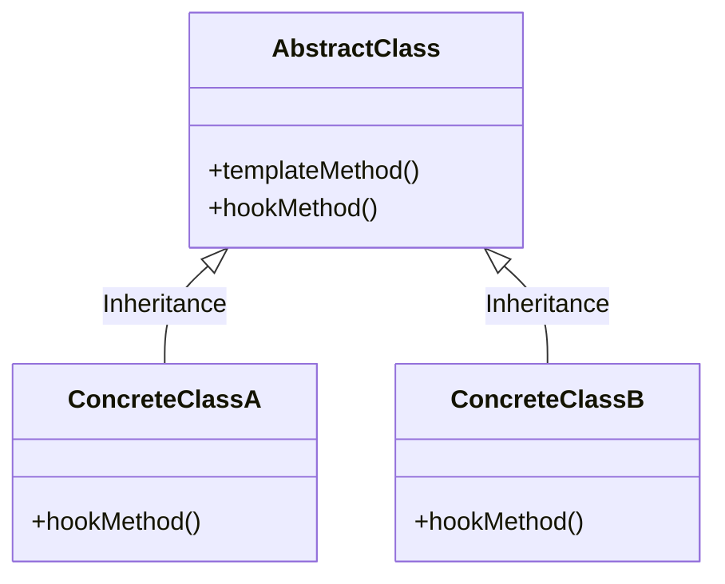

模板模式是类的行为模式。准备一个抽象类，将部分逻辑以具体方法的形式实现，然后声明一些抽象方法来迫使子类实现剩余的逻辑。不同的子类提供不同的方式实现这些抽象方法，从而对剩余的逻辑有不同的实现。模板模式的关键在于：**父类提供框架性的公共逻辑，子类提供个性化的定制逻辑。**

1. 模板模式的定义

在模板模式中，由抽象类定义模板方法和钩子方法，模板方法定义一套业务算法框架，算法框架中的某些步骤由钩子方法负责完成。具体的子类可以按需要重写钩子方法。模板方法的调用将通过抽象类的实例来完成。

模板模式所包含的角色有抽象类和具体类，二者之间的关系如图所示。

2. 模板方法和钩子方法

模板方法（Template Method）也常常被称为骨架方法，主要定义了整个方法需要实现的业务操作的算法框架。其中，调用不同方法的顺序因人而异，而且这个方法也可以做成一个抽象方法，要求子类自行定义逻辑流程。

钩子方法（Hook Method）是被模板方法的算法框架所调用的，而由子类提供具体的实现方法。在抽象父类中，钩子方法常被定为一个空方法或者抽象方法，需要由子类去实现。钩子方法的存在可以让子类提供算法框架中的某个细分操作，从而让子类实现算法中可选的、需要变动的部分。
