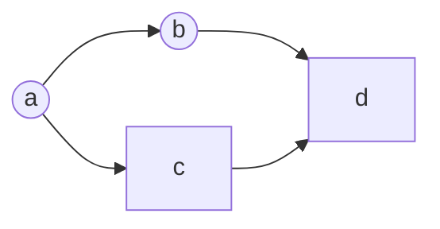
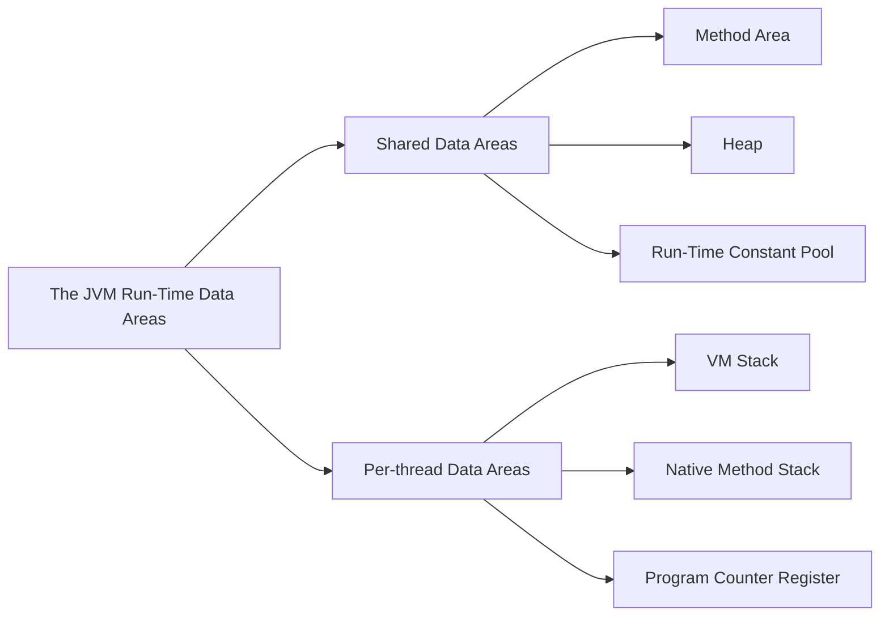
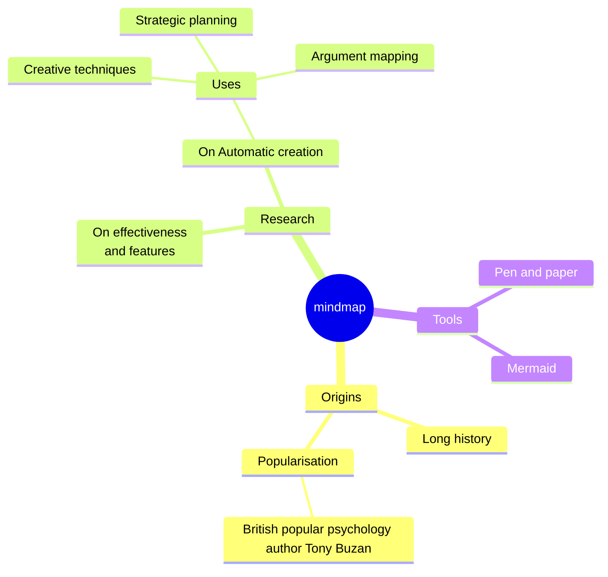
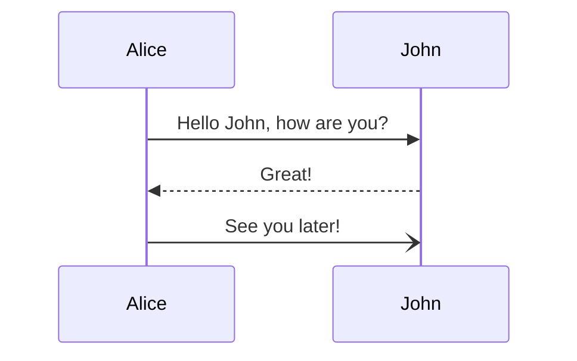
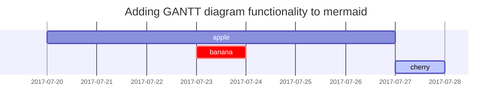

---
# the default layout is 'page'
icon: fas fa-info-circle
order: 4
mermaid: true
---

# yesterz.github.io
> 日常学习笔记记录，学习（狗头）互联网上的优秀博客笔记内化成自己的知识（欢迎围观~）<https://yesterz.github.io>
{: .prompt-tip }

<h1 class="mt-5">Getting Things DONE</h1>

### Todo
- [ ] 首页还需要设计
- [ ] 404 页面，现在404页面有一个跳转
- [ ] about 页面
  + [ ] 应该是修改博客主体为宽屏模式
  - [ ] 上传之前的一些笔记

  ### In Progress
  - [ ] 分布式知识笔记记录
  - [ ] Dubbo的知识
  - [ ] RPC的一些东西
  - [ ] to be continued
        
        ### Done ✓
        - [x] 页面的总体自适应宽屏幕（这个还没有头绪怎么，是不是要改CSS）
        - [x] 跑通流程 GitHub Pages 博客站点，提交并同步远程仓库
        - [x] 图片显示问题，用这种方式``来引用显示
          + [x] Meimaid渲染出流

  **Night watcher swear**  
   
  Night gathers, and now my watch begins.  
  It shall not end until my death.  
  I shall take no wife, hold no lands, father no children.  
  I shall wear no crowns and win no glory.  
  I shall live and die at my post.  
  I am the sword in the darkness.  
  I am the watcher on the walls.  
  I am the fire that burns against the cold,  
  the light that brings the dawn,  
  the horn that wakes the sleepers,  
  the shield that guards the realms of men.  
  I pledge my life and honor to the Night's Watch,  
  for this night and all the nights to come. 

> Add Markdown syntax content to file `_tabs/about.md`{: .filepath } and it will show up on this page.
{: .prompt-tip }

# yesterz.github.io
我的博客地址（欢迎围观~）：https://yesterz.github.io/ 
# Getting Things DONE

### Todo

- [ ] 首页还需要设计
- [ ] 404 页面，现在404页面有一个跳转
- [ ] about 页面
- [ ] 页面的总体自适应宽屏幕（这个还没有头绪怎么，是不是要改CSS）
  - [ ] 应该是修改博客主体为宽屏模式

### In Progress

- [ ] 分布式知识笔记记录
- [ ] Dubbo的知识
- [ ] RPC的一些东西
- [ ] to be continued
      

### Done ✓

- [x] 跑通流程 GitHub Pages 博客站点，提交并同步远程仓库
- [x] 图片显示问题，用这种方式``来引用显示
- [x] Meimaid渲染出流程图搞定

  **Night watcher swear**  
   
  Night gathers, and now my watch begins.  
  It shall not end until my death.  
  I shall take no wife, hold no lands, father no children.  
  I shall wear no crowns and win no glory.  
  I shall live and die at my post.  
  I am the sword in the darkness.  
  I am the watcher on the walls.  
  I am the fire that burns against the cold,  
  the light that brings the dawn,  
  the horn that wakes the sleepers,  
  the shield that guards the realms of men.  
  I pledge my life and honor to the Night's Watch,  
  for this night and all the nights to come. 

## 踩坑记录
* title 字符串中带空格就解析不出这篇文章，设置的分隔符的问题？待调查
* /workspaces/yesterz.github.io/_sass/minimal-mistakes/_page.scss 65行已注释，拉长页面宽度 X 这个办法不行

## 第一个图

## 第二个图

## 第三个图

## 第四个图

## 第五个图

